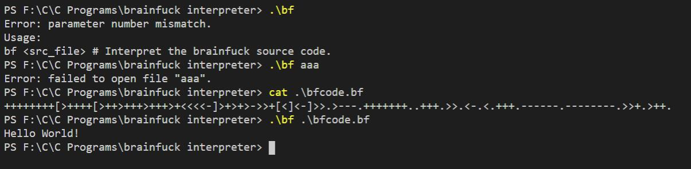
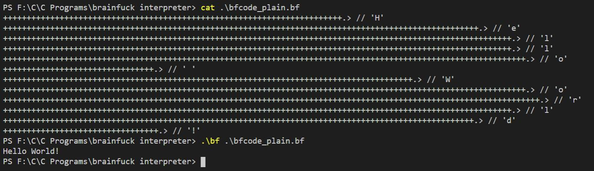
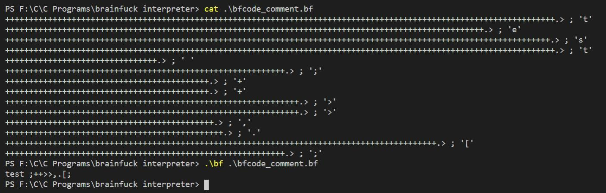

### 1. Brainfuck 简介

我在此假定本文读者了解图灵机的概念。

Brainfuck（以下简称 BF）是一门图灵完备的编程语言，也就是说，别的编程语言能做的事情 BF 都能做，甚至你可以用它来写一个操作系统。

来，先用一个 Hello World 来感受一下 BF 的画风：

```
++++++++[>++++[>++>+++>+++>+<<<<-]>+>+>->>+[<]<-]>>.>---.+++++++..+++.>>.<-.<.+++.------.--------.>>+.>++.
```

输出：

```
Hello World!
```

BF 的规则和语法我这里就不说了（懒得打字，这东西网上一查一大堆，我就不生产冗余信息了），本文重点是解释器的实现。

人们常开玩笑说，最底层的编程语言是 0 和 1（所谓的二进制编程）。实际上并不是这样的，因为 01 序列对应的还是指令，比如`01110100`实际上实现的是 MOV 指令的功能 ‬（举个栗子），指令少则几十个，多则上百个，各种分支跳转条件判断等等，跟 BF 相比还是显得很高级的。

我在此宣布：在软件界最底层的语言是 BF！（[esoteric programming languages](https://esolangs.org/wiki/Esoteric_programming_language)就不说了……不然没完没了）

为什么要加软件界这个定语呢？因为不限定这个的话，Verilog 会不服的。

### 2. 解释器的实现

因为我没有在网上找到让我满意的 BF 解释器，所以我就自己用 C 语言写了一个 BF 的解释器`bf.exe`。哈哈，听起来很装，其实不难，挺简单的，因为 BF 的语法本来就非常简单（虽然写起来很烧脑，这也是为什么这个语言叫 Brainfuck）。

在了解了 BF 的规则和语法之后，学过 C 语言的应该都能知道怎么写了，比如`>`就是`++p`，`+`就是`++*p`等等，不过循环部分需要仔细想一想，因为有嵌套的`[ ]`，不能直接做 match，需要有一个 counter。

话不多说，直接上代码吧：

```c
/************************************************************
  Copyleft
  File Name: bf.c
  Author: Chobits
  Date: 2021.04.25
  Description: Brainfuck interpreter implementation in C
  Version: 1.0.0
***********************************************************/

#include <stdio.h>

#define TAPE_SIZE 1024

void bf(FILE *fp);

int main(int argc, char const *argv[])
{
    if (argc != 2)
    {
        fprintf(stderr, "Error: parameter number mismatch.\n");
        fprintf(stderr, "Usage:\n");
        fprintf(stderr, "bf <src_file> # Interpret the brainfuck source code.\n");
        return 1;
    }

    FILE *fp = fopen(argv[1], "r");
    if (fp == NULL)
    {
        fprintf(stderr, "Error: failed to open file \"%s\".\n", argv[1]);
        return 2;
    }

    bf(fp);

    fclose(fp);

    return 0;
}

void bf(FILE *fp)
{
    int bracket_cnt;                     // count brackets
    signed char command;                 // current command character, signed because EOF
    unsigned char data[TAPE_SIZE] = {0}; // memory data
    unsigned char *dp;                   // memory data pointer

    // Move dp to middle of the data tape
    dp = &data[TAPE_SIZE / 2];

    signed char c;
    while ((command = getc(fp)) != EOF)
    {
        switch (command)
        {
            /* Move data pointer to next address */
            case '>':
                ++dp;
                break;

            /* Move data pointer to previous address */
            case '<':
                --dp;
                break;

            /* Increase value at current data cell by one */
            case '+':
                ++*dp;
                break;

            /* Decrease value at current data cell by one */
            case '-':
                --*dp;
                break;

            /* Output character at current data cell */
            case '.':
                putc(*dp, stdout);
                break;

            /* Accept one character from user and advance to next one */
            case ',':
                *dp = getc(stdin);
                break;

            /* When the value at current data cell is 0,
            advance to next matching ] */
            case '[':
                if (!*dp)
                {
                    for (bracket_cnt = 1; bracket_cnt; fseek(fp, 1, SEEK_CUR))
                    {
                        c = getc(fp);
                        fseek(fp, -1, SEEK_CUR);
                        if (c == '[')
                        {
                            bracket_cnt++;
                        }
                        else if (c == ']')
                        {
                            bracket_cnt--;
                        }
                    }
                }
                break;

            /* Moves the command pointer back to matching
            opening [ if the value of current data cell is not 0 */
            case ']':
                if (*dp)
                {
                    // Move command pointer just before ]
                    fseek(fp, -2, SEEK_CUR);
                    for (bracket_cnt = 1; bracket_cnt; fseek(fp, -1, SEEK_CUR))
                    {
                        c = getc(fp);
                        fseek(fp, -1, SEEK_CUR);
                        if (c == ']')
                        {
                            bracket_cnt++;
                        }
                        else if (c == '[')
                        {
                            bracket_cnt--;
                        }
                    }
                    // Advance pointer after loop to match with opening [
                    fseek(fp, 1, SEEK_CUR);
                }
                break;

            /* Ignore other characters */
            default:
                break;
        }
    }
}

```

真正实现解释器功能的核心代码不到一百行。

为了好看（装逼），注释都是英文的，英语四级过了的小伙伴应该都看得懂。

运行截图：



### 3. PlainCode

如果说那个 BF 的 Hello World 代码不容易看懂的话，那么可以利用 Python 搞一个 plain 版本的，也就是这样：

```python
def fun(ascii):
    return "+"*ascii + ".>"

string = "Hello World!"

print(''.join(list(map(fun, map(ord, string)))))

```

转换结果就是很 plain 的 BF 代码：

```
++++++++++++++++++++++++++++++++++++++++++++++++++++++++++++++++++++++++.>+++++++++++++++++++++++++++++++++++++++++++++++++++++++++++++++++++++++++++++++++++++++++++++++++++++.>++++++++++++++++++++++++++++++++++++++++++++++++++++++++++++++++++++++++++++++++++++++++++++++++++++++++++++.>++++++++++++++++++++++++++++++++++++++++++++++++++++++++++++++++++++++++++++++++++++++++++++++++++++++++++++.>+++++++++++++++++++++++++++++++++++++++++++++++++++++++++++++++++++++++++++++++++++++++++++++++++++++++++++++++.>++++++++++++++++++++++++++++++++.>+++++++++++++++++++++++++++++++++++++++++++++++++++++++++++++++++++++++++++++++++++++++.>+++++++++++++++++++++++++++++++++++++++++++++++++++++++++++++++++++++++++++++++++++++++++++++++++++++++++++++++.>++++++++++++++++++++++++++++++++++++++++++++++++++++++++++++++++++++++++++++++++++++++++++++++++++++++++++++++++++.>++++++++++++++++++++++++++++++++++++++++++++++++++++++++++++++++++++++++++++++++++++++++++++++++++++++++++++.>++++++++++++++++++++++++++++++++++++++++++++++++++++++++++++++++++++++++++++++++++++++++++++++++++++.>+++++++++++++++++++++++++++++++++.>
```

如果还看不明白的话，可以再人性化一点：

```python
def fun(ascii):
    return "+"*ascii + ".> // '" + chr(ascii) + "'\n"

string = "Hello World!"

print(''.join(list(map(fun, map(ord, string)))))

```

转换结果：

```
++++++++++++++++++++++++++++++++++++++++++++++++++++++++++++++++++++++++.> // 'H'
+++++++++++++++++++++++++++++++++++++++++++++++++++++++++++++++++++++++++++++++++++++++++++++++++++++.> // 'e'
++++++++++++++++++++++++++++++++++++++++++++++++++++++++++++++++++++++++++++++++++++++++++++++++++++++++++++.> // 'l'
++++++++++++++++++++++++++++++++++++++++++++++++++++++++++++++++++++++++++++++++++++++++++++++++++++++++++++.> // 'l'
+++++++++++++++++++++++++++++++++++++++++++++++++++++++++++++++++++++++++++++++++++++++++++++++++++++++++++++++.> // 'o'
++++++++++++++++++++++++++++++++.> // ' '
+++++++++++++++++++++++++++++++++++++++++++++++++++++++++++++++++++++++++++++++++++++++.> // 'W'
+++++++++++++++++++++++++++++++++++++++++++++++++++++++++++++++++++++++++++++++++++++++++++++++++++++++++++++++.> // 'o'
++++++++++++++++++++++++++++++++++++++++++++++++++++++++++++++++++++++++++++++++++++++++++++++++++++++++++++++++++.> // 'r'
++++++++++++++++++++++++++++++++++++++++++++++++++++++++++++++++++++++++++++++++++++++++++++++++++++++++++++.> // 'l'
++++++++++++++++++++++++++++++++++++++++++++++++++++++++++++++++++++++++++++++++++++++++++++++++++++.> // 'd'
+++++++++++++++++++++++++++++++++.> // '!'
```

其中的`//`只是为了强调这是注释，因为实际上在 BF 解释器里面任何那八种操作之外的字符都会被忽略：`default: break;`。

运行结果：



但是，写到这里，我突然发现，如果要是注释里面需要有那八个字符怎么办？

比如：

```
++++++++++++++++++++++++++++++++++++++++++++++++++++++++++++++++++++++++++++++++++++++++++++++++++++++++++++++++++++.> // 't'
+++++++++++++++++++++++++++++++++++++++++++++++++++++++++++++++++++++++++++++++++++++++++++++++++++++.> // 'e'
+++++++++++++++++++++++++++++++++++++++++++++++++++++++++++++++++++++++++++++++++++++++++++++++++++++++++++++++++++.> // 's'
++++++++++++++++++++++++++++++++++++++++++++++++++++++++++++++++++++++++++++++++++++++++++++++++++++++++++++++++++++.> // 't'
++++++++++++++++++++++++++++++++.> // ' '
+++++++++++++++++++++++++++++++++++++++++++++++.> // '/'
+++++++++++++++++++++++++++++++++++++++++++++++.> // '/'
+++++++++++++++++++++++++++++++++++++++++++.> // '+'
+++++++++++++++++++++++++++++++++++++++++++.> // '+'
++++++++++++++++++++++++++++++++++++++++++++++++++++++++++++++.> // '>'
++++++++++++++++++++++++++++++++++++++++++++++++++++++++++++++.> // '>'
++++++++++++++++++++++++++++++++++++++++++++.> // ','
++++++++++++++++++++++++++++++++++++++++++++++.> // '.'
+++++++++++++++++++++++++++++++++++++++++++++++++++++++++++++++++++++++++++++++++++++++++++.> // '['
```

那么程序就会出问题，因为任何出现在代码里面的那那八个字符都会被解释执行，除非……把`//`变成单行注释！

好吧，两个字符的单行注释不好写，用`;`当作单行注释吧！和汇编还吻合呢~

```
++++++++++++++++++++++++++++++++++++++++++++++++++++++++++++++++++++++++++++++++++++++++++++++++++++++++++++++++++++.> ; 't'
+++++++++++++++++++++++++++++++++++++++++++++++++++++++++++++++++++++++++++++++++++++++++++++++++++++.> ; 'e'
+++++++++++++++++++++++++++++++++++++++++++++++++++++++++++++++++++++++++++++++++++++++++++++++++++++++++++++++++++.> ; 's'
++++++++++++++++++++++++++++++++++++++++++++++++++++++++++++++++++++++++++++++++++++++++++++++++++++++++++++++++++++.> ; 't'
++++++++++++++++++++++++++++++++.> ; ' '
+++++++++++++++++++++++++++++++++++++++++++++++++++++++++++.> ; ';'
+++++++++++++++++++++++++++++++++++++++++++.> ; '+'
+++++++++++++++++++++++++++++++++++++++++++.> ; '+'
++++++++++++++++++++++++++++++++++++++++++++++++++++++++++++++.> ; '>'
++++++++++++++++++++++++++++++++++++++++++++++++++++++++++++++.> ; '>'
++++++++++++++++++++++++++++++++++++++++++++.> ; ','
++++++++++++++++++++++++++++++++++++++++++++++.> ; '.'
+++++++++++++++++++++++++++++++++++++++++++++++++++++++++++++++++++++++++++++++++++++++++++.> ; '['
+++++++++++++++++++++++++++++++++++++++++++++++++++++++++++.> ; ';'
```

BF 的代码是这样子的，那么，就需要在`bf.c`里面再加一个 case 了：

```c
            /* Single-line comment */
            case ';':
                while ((c = getc(fp)) != '\n' && c != EOF)
                {
                }
                break;
```

因为单行注释的结束有两种可能：一种是到下一行，一种是直接到文件结尾（没有换行符），所以需要那样写。一开始我只写了个`while ((c = getc(fp)) != '\n')`在最后就会引发一个无限循环的 bug。

测试：



注意，上图`.\bfcode_comment.bf`最后的`';'`后面是没有换行符的，这里换行的效果是 VS Code 终端的设置。

OK，完美~

咦？我好像不知不觉间给 BF 实现了单行注释的功能……啊哈哈哈

可能很多人会觉得这很无聊，觉得作者太闲了，做这些有什么用呢？这些确实没有什么用，我并不是为了实用性而写的，也不能说是完全为了学习而写，其实做这些更像是一种娱乐吧。这有点像小孩子玩积木一样，全心全意地把自己的注意力放在积木上面。日常的生活中，其实有很多的烦恼和苦闷，而当我沉浸在计算机世界里的时候，能够让自己的心沉浸在这小小的天地中，能够体会到宁静和满足，就足够了。
