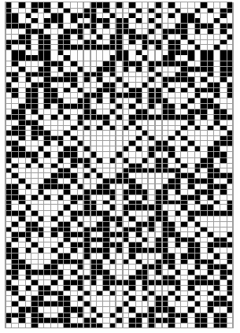
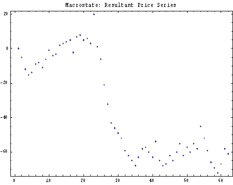
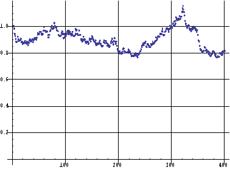
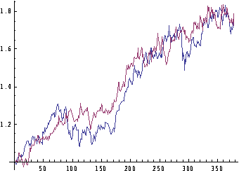

这篇文章的灵感来源于[释放比特自由](http://swarmagents.cn.13442.m8849.cn/vm/articles/freebits.htm)

原文片段节选：

> ### CA模拟股市
> 
> 可能更多的人关心的是Wolfram的新科学有什么用呢？这的确是一个很有争议的问题，因为你既可以说NKS非常有用，也可以说它什么都不能做。
> 
> 我们都知道，简单程序可以模拟自然界的生长现象，例如雪花的形成、树的生长、动物表面上的花纹等等。运用细胞自动机还可以模拟自然界的一些复杂的非线性过程，例如复杂的流体、交通流等。然而，这些应用其实又回到了一般计算机模拟的老路上，即针对具体问题，赋予每一个比特一定的意义，然后让系统去演化。
> 
> 然而，NKS强调的是忘掉模拟和比特的意义。这样一种哲学会给我们带来什么好处呢？下面这个简单的应用会给我们耳目一新的感觉。
> 
> 该应用研究是想用CA生成一个时间序列曲线，然后用这个曲线去拟合股票的价格波动，它是由Wolfram公司的研究员Jason做出的。
> 
> 考虑一个特定的细胞自动机，例如CA90（对1维的、邻居为两个的细胞自动机的编号，确定了一个编号就确定了它的一组规则），它形成的图形和一个时间序列曲线，如下图：
> 
> 
> 
> 
> 上面的是CA90的运行情况，下面的是它生成的时间序列曲线
> 
> 这个时间序列曲线的具体做法是，将每一步CA90生成的黑细胞方格作为1，白细胞方格作为-1，然后对所有方格求和，得到该时刻的总的数值s(t)，然后在下一时刻，同样求得这样一个总和数，把这个数加上s(t)，得到s(t+1)，这样反复不停的运用这一方法就能得到一个上图所示的时间序列曲线。
> 
> 进一步，Jason考虑由两个细胞自动机混合得到的时间序列。例如给定两个细胞自动机CA90和CA110，然后我们把它们进行一定比例的混合。例如混合比例是3:7。具体做法是，从任意一个随机初始条件开始演化3步CA90，然后再演化7步CA110，这样我们得到一个混合的细胞自动机，Jason叫它ICA，用同样的方法，可以画出这个ICA生成的时间序列曲线：
> 
> 
> 
> 下面，Jason就用这个生成的时间序列曲线去拟合真实的股票价格数据。具体方法可以是通过调节两种细胞自动机的混合比例，例如从3:7调到8:2，使得生成的序列能够和真实数据在均方误差的条件下拟合的很好，如下图：
> 
> 
> 
> Jason试了很多种两两细胞自动机组合的情况，都能够得到较好的拟合曲线。然而，很奇怪的是，这个方法并没有对股市建立任何显式的模型。
> 
> 这个研究的意义在于，即使我们完全忘掉股市运行的内在规则，我们仍然可以找到拟合股票数据的方法。这反过来说明了复杂的行为并不一定需要复杂的微观机制。仍然是那个观点：从某种意义上说，行为的复杂性增加到一定程度就停止增长了。

---

我的想法：

黑和白可以认为是两种力量：黑代表 混乱/暴力/邪恶/深邃/冷峻，白代表 秩序/和平/善良/天真/温暖。这两种力量在CA90的规则下演化。

为什么要两种规则呢？要知道，股市其实是各方利益集团博弈后的一个综合结果，而股市的规则是顶层的那些组织制定的，组织是由人组成的，而人会变，组织的核心利益也会随之改变，股市规则也就随之改变了。

CA90和CA110可以认为是两种顶层力量（规则制定者）的博弈，这种博弈会在一个较短的时间内保持平衡，当比例恰好符合现实中的博弈结果后，自然大体上也就符合真实的股市了。

---
