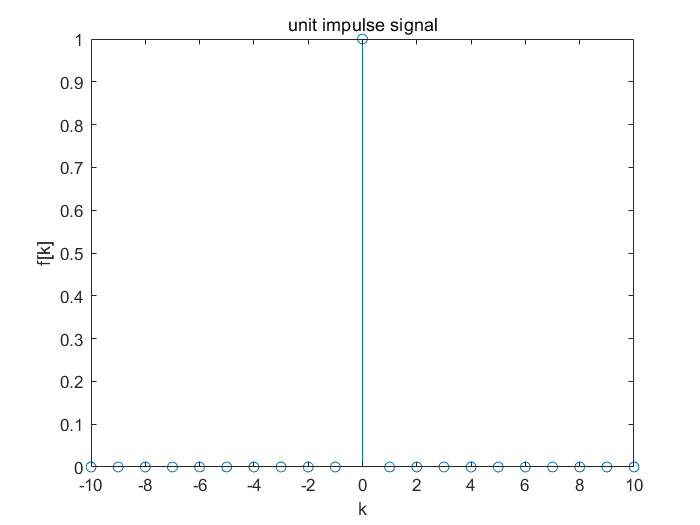
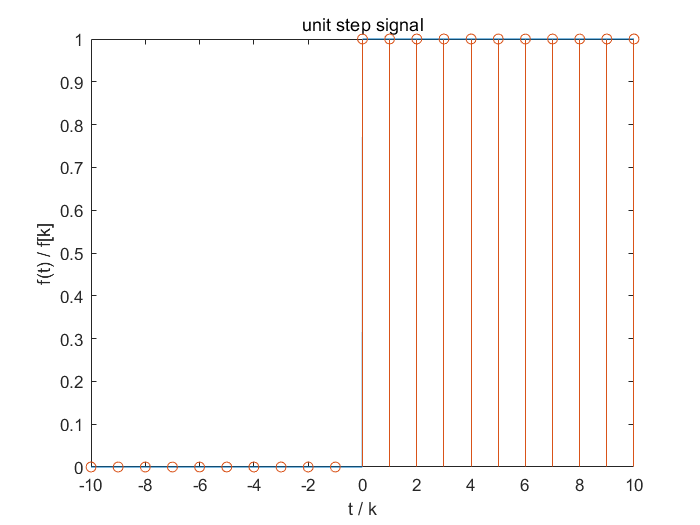
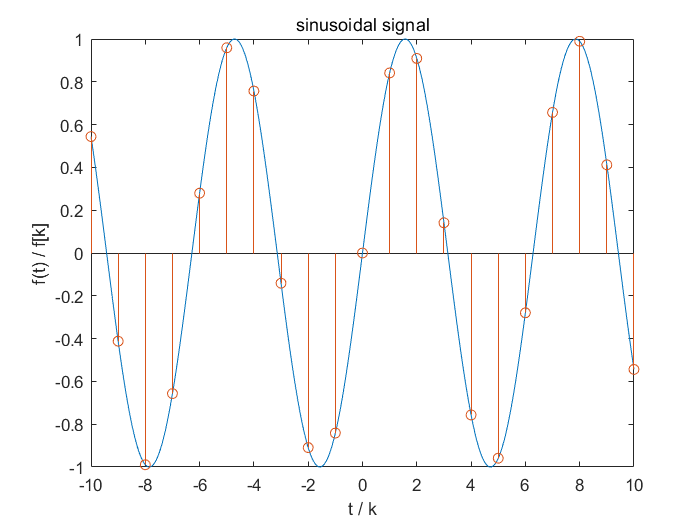
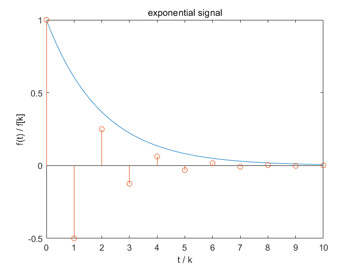
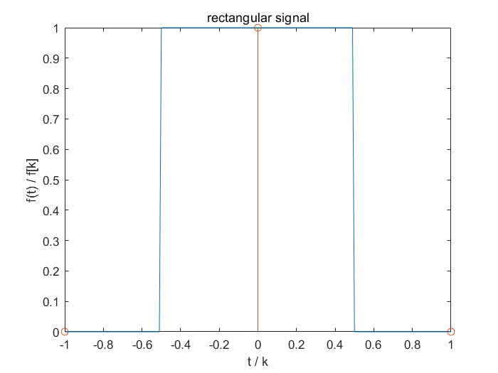
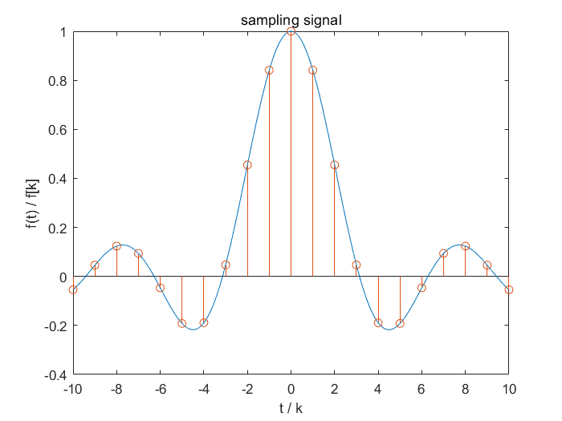

再开一个系列，这个系列主要展示一下MATLAB画信号。

---

众所周知，MATLAB是一款功能强大的科学计算软件。

我就不做具体介绍了，基本操作也略过，这些网上一搜一大把。

---

安装包网上有很多，当然你不想去找的话可以用我的 R2018B 版本的：

链接：[MATLAB2018b](https://pan.baidu.com/s/1Pkhyq0kg2iseSOqGGKigCw) 提取码：`o3xp`

该资源仅供学习之用。

---

### 1. 单位冲激信号

单位冲激信号（unit impulse signal）是最基本的信号，定义如下：

$$
\begin {cases} \delta(t) = 0, t \ne 0 \\ \int_{-\infty}^{\infty}\delta(t)dt = 1\end{cases}
\\
\delta[k] = \begin {cases} 1 & \text{k = 0} \\ 0 & \text k \ne 0 \end{cases}
$$

代码：

```matlab
k = -10 : 10;
yd = (k == 0);
stem(k, yd);

xlabel('k');
ylabel('f[k]');
title('unit impulse signal');
```


图形：



`stem()` 函数是用来画离散信号图的，第一个参数表示横轴刻度， 第二个参数表示幅度。与之对应的 `plot()` 函数是用来画连续信号图的，马上就会看到。

---

### 2. 单位阶跃信号

单位阶跃信号（unit step signal）也是一个很重要的信号，定义如下：

$$
\varepsilon(t) = \begin {cases} 1 & \text t \gt 0 \\ 0 & \text t \lt 0 \end{cases}
\\
\varepsilon[k] = \begin {cases} 1 & \text k \ge 0 \\ 0 & \text k \lt 0 \end{cases}
$$

代码：

```matlab
t = -10 : 0.01 : 10;
ya = stepfun(t, 0);
plot(t, ya);

hold on;

k = -10 : 10;
yd = stepfun(k, 0);
stem(k, yd);

xlabel('t / k');
ylabel('f(t) / f[k]');
title('unit step signal');
```


图形：



这里我把两张图画在一起了，蓝色的代表连续信号，橙色的代表离散信号。代码中 t 表示连续时间，k 表示离散取样，下同。

---

### 3. 正弦信号

正弦或余弦类信号这里统称为正弦信号（sinusoidal signal），因为他们只是相位差 $\pi/2$ 的关系。定义如下：

$$
f(t) = Asin(\omega t +\varphi)
\\
f[k] = Asin(\omega k +\varphi)
$$

代码：

```matlab
t = -10 : 0.01 : 10;
ya = sin(t);
plot(t, ya);

hold on;

k = -10 : 10;
yd = sin(k);
stem(k, yd);

xlabel('t / k');
ylabel('f(t) / f[k]');
title('sinusoidal signal');
```


图形：



这里提一下，蓝色的连续信号其实并不“连续”，因为 `plot()` 函数其实只是把那些点连成了一条曲线而已。MATLAB无法画出真正的连续信号图，本质是因为冯·诺依曼结构的计算机是一个离散的系统。

---

### 4. 指数信号

指数信号（exponential signal）几乎是最常用的信号了，各种变换中随处可见。定义如下：

$$
f(t) = Ae^{\alpha t}
\\
f[k] = A\alpha^k
$$

代码：

```matlab
a = -0.5;

t = 0 : 0.01 : 10;
ya = exp(a * t);
plot(t, ya);

hold on;

k = 0 : 10;
yd = a .^ k;
stem(k, yd);

xlabel('t / k');
ylabel('f(t) / f[k]');
title('exponential signal');
```


图形：



可以看到，他们并没有重合，看代码就知道，因为指数信号在连续系统和离散系统中定义不一样。

---

### 5. 矩形信号

矩形信号（rectangular signal）也是一个基本信号，定义如下：

$$
g_{\tau}(t) = \begin {cases} 1,& \text  |t| \lt \frac{\tau}{2} \\ 0 & \text |t| \gt \frac{\tau}{2} \end{cases}
\\
g_{\tau}[k] = \begin {cases} 1,& \text  |k| \lt \frac{\tau}{2} \\ 0 & \text |k| \gt \frac{\tau}{2} \end{cases}
$$

代码：

```matlab
t = -1 : 0.01 : 1;
ya = rectpuls(t);
plot(t, ya);

hold on;

k = -1 : 1;
yd = rectpuls(k);
stem(k, yd);

xlabel('t / k');
ylabel('f(t) / f[k]');
title('rectangular signal');
```


图形：



当宽度为 1 的单位矩形信号进行 T = 1 的抽样时得到的离散信号是单位冲激信号……

---

### 6. 方波信号

方波信号（square wave signal）可看作是周期性的矩形信号。

代码：

```matlab
w = 1;

t = -10 : 0.01 : 10;
ya = square(w * t);
plot(t, ya);

hold on;

k = -10 : 10;
yd = square(w * k);
stem(k, yd);

xlabel('t / k');
ylabel('f(t) / f[k]');
title('square wave signal');
```


图形：


---

### 7. 抽样信号

抽样信号（sampling signal）定义如下：

$$
Sa(t) = \frac{sin(t)}{t}
\\
Sa[k] = \frac{sin(k)}{k}
$$

代码：

```matlab
t = -10 : 0.01 : 10;
ya = sinc(t / pi);
plot(t, ya);

hold on;

k = -10 : 10;
yd = sinc(k / pi);
stem(k, yd);

xlabel('t / k');
ylabel('f(t) / f[k]');
title('sampling signal');
```


图形：



在MATLAB中抽样信号是 `sinc()` 函数，定义为：$sinc(t) = \frac{sin(\pi t)}{\pi t}$，故系数要除以一个$\pi$。

---
