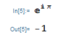

我怀着激动的心情写下这篇文章，行文风格可能比较飘 ~(￣ ▽ ￣)~\*

事实上，这几天我一直都怀着激动的心情，因为我体会到了 Mathematica 强大的符号计算能力。Mathematica 是一款科学计算软件，用的是一种基于规则的函数式编程语言——Wolfram Language。好吧，我知道你们可能都没听说过这个语言，很正常，这不是唯一的名称，因为 Stephen Wolfram 花了三十多年开发它，花了二十多年给它取名……


[What Should We Call the Language of Mathematica?](https://blog.stephenwolfram.com/2013/02/what-should-we-call-the-language-of-mathematica/)

话说回来，Wolfram 语言当然也是和 C、Python 等语言一样是图灵完备的。说到图灵完备啊，印象中有好多计算机领域的名词都是以图灵为名，比如图灵机、图灵测试、图灵奖等等，就像有好多数学领域的名词都是以高斯为名。有一种说法说甚至苹果的 Logo——那一口就是图灵咬的，是为了纪念图灵，但实际上这是误传。具体可看《史蒂夫·乔布斯传》第六章。然而我觉得某种程度上这个误传美好胜过事实。

这不是一篇 Mathematica 的教程，因为 Mathematica 自带的参考资料就是最好的教程。我只是想让更多人认识 Mathematica 这个神器。

Talk is cheap, Show the code!

---

先来看看最简单的求导：

$$
\partial_x(3x^2)
$$

```mathematica
 D[3*x^2, x]
```


Good，算出来了，不过重点不是这个。注意到输入的表达式很易于阅读，是的，输入代码后快捷键格式化一下（格式化是为了好看，不管格式化与否都能运行，都是代码）就自动转为这种 Mathematica 里面的标准格式了，可以复制、粘贴、修改、运行等等，有点像 LaTex。

再来一个积分：

$$
\int 3x^2 dx
$$

```mathematica
Integrate[3*x^2, x]
```


接下来看看自然常数的定义式：

$$
\lim_{n \rightarrow \infty}{(1+\frac{1}{n})^n}=e
$$

```mathematica
Limit[(1 + 1/n)^n, n -> Infinity]
```


再来一个很常见的极限：

$$
\lim_{x \rightarrow 0}{\frac{sin(x)}{x}}=1
$$

```mathematica
Limit[Sin[x]/x, x -> 0]
```


不用函数，直接计算一个欧拉公式：

$$
e^{i \pi}+1=0
$$

```mathematica
E^(I*Pi)
```



不搞计算了，看看作图怎么样？

```mathematica
Table[Plot[f[x], {x, -Pi, Pi}], {f, {Sin, Cos, Tan, Cot, Sec, Csc}}]
```

这句意思是说生成一个表，表的内容是画的图，图的内容是 f[x]，其中 f 是后面的表。


嗯……Nice！值得注意的是，在 Mathematica 里面，图片和代码是等价的，一样可以被粘贴、复制、修改或运行。

有个东西叫做 Tetration，简单来说就是继加，乘，幂之后的第四种运算，大概长这样：

$$
x^{x^{x^{x...}}}
$$

知乎上有篇文章讲得比较好，可以先看一下那篇文章：

[由根号 2 的根号 2 的根号 2...次方次方引发的讨论](https://zhuanlan.zhihu.com/p/25150820)

当无限个 $\sqrt2$ 套娃的时候，它是收敛于 2 的吗？

用 Knuth's up-arrow notation 表示的话就是这样：

$$
\sqrt2 \uparrow \uparrow \omega
$$

用 Conway chained arrow notation 表示的话就是这样：

$$
\sqrt2 \rightarrow \omega \rightarrow 2
$$

来用程序验证一下：

```mathematica
N[Sqrt[2]^Sqrt[2]^Sqrt[2]^Sqrt[2]^Sqrt[2]^Sqrt[2]^Sqrt[2]^Sqrt[2]^Sqrt[2]]
```


不太令人满意，幂塔写多了又难看，定义一个函数来计算吧：

```mathematica
tetration[1] = Sqrt[2];
tetration[n_] := Sqrt[2]^tetration[n - 1];
N[tetration[100]]
```

这样我们就能算任意幂塔的具体数值了。


嗯……是 2，不过总觉得少了点什么……少了点什么呢？对！少了画图！

```mathematica
ListPlot[Table[tetration[n], {n, 100}], PlotRange -> All]
```


Perfect！

好了，最后再看一个例子。Mathematica 的符号计算能力体现在哪里呢？

```mathematica
Solve[a*x^2 + b*x + c == 0, x]
```


大概就体现在这里。

“一切都是符号”，这和 Lisp 在某种层面有类似的神韵。

---

这仅仅是五千多个内置“函数”（在函数式编程语言中，函数这个概念与 C 这种过程式语言和 Java 这种面向对象的语言不太一样，但意思懂了就好）的冰山一角。Mathematica 的所有内置函数都是以完整的首字母大写的单词作为函数名，主要是统一格式，看起来很规范，顺便避免了虚数单位被自定义的循环变量覆盖掉。（想起了 MATLAB 某些不查文档根本看不懂的函数名和写循环时一不小心就把虚数单位覆盖了……）啊，我没有说 MATLAB 不好的意思，各有所长，而且 MATLAB 很多拿来即用的工具箱也是很不错的。

Mathematica 的能力对我来说可以用震撼来形容。我是学 EE（Electronic Engineering）而不是 CS（Computer Science）的，所以平时主要写写 C 语言，搞搞单片机，再底层一点还要搞组合逻辑电路，基本就是看着以字节为单位的数据流控制一些芯片实现很简单的功能。所以你能想象这种震撼吗？

虽然再大的震撼，都会随着时间以 $Ae^{-\alpha t}$ 的形式被抚平。但人生的意义，不就是由时域中一个个的冲激串构造出来的吗？（突然跑偏）

---

和 Mathematica 有关的，还有 Wolfram | Alpha、元胞自动机、《A New Kind of Science》等等……

这些都和一个人有关：Stephen Wolfram

可以看看他在 TED 的演讲：[【TED 演讲】Stephen Wolfram：计算万物的理论](https://www.bilibili.com/video/av1019197)

对了，想下载 Mathematica 吗？请去官网或者贴吧下载~

---
