请欣赏一下 Mathematica 绘制的漂亮的函数图~ヾ(^▽^)

---

```mathematica
Plot[{(1 + 1/n)^n, Evaluate[Limit[(1 + 1/n)^n, n -> Infinity]]}, {n, 0, 100}, PlotLegends -> "Expressions"]
```

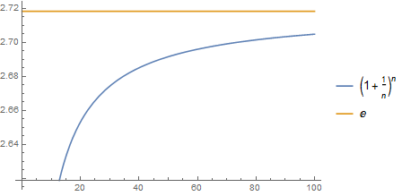

形象地展示了 $\lim\limits_{n \rightarrow \infty}{(1+\frac{1}{n})^n}=e$ 的过程。

---

```mathematica
Plot[{n^(1/n), Evaluate[Limit[n^(1/n), n -> Infinity]]}, {n, 0, 1000}, PlotLegends -> "Expressions"]
```

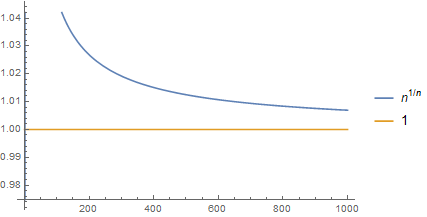

形象地展示了 $\lim\limits_{n \rightarrow \infty}{n^{\frac{1}{n}}}=1$ 的过程。

---

```mathematica
Plot[{Sin[x]/x, Evaluate[Limit[Sin[x]/x, x -> 0]]}, {x, -4*Pi, 4*Pi}, PlotLegends -> "Expressions"]
```

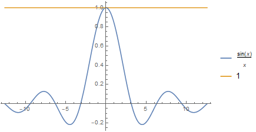

形象地展示了 $\lim\limits_{x \rightarrow 0}{\frac{sin(x)}{x}}=1$ 的过程。

---

```mathematica
Plot[{x*Sin[1/x], x, -x}, {x, -0.1, 0.1}, PlotRange -> 0.1, AspectRatio -> 1, Filling -> Axis]
```

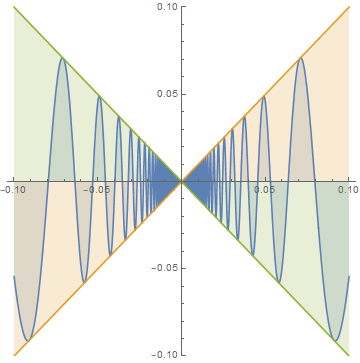

形象地展示了 $\lim\limits_{x \rightarrow 0}{(x\ sin(\frac{1}{x}))}=0$ 的过程。(⊙o⊙)

---

```mathematica
t = Table[Plot[f[x], {x, -2*Pi, 2*Pi}, PlotRange -> 2*Pi, AspectRatio -> 1, ExclusionsStyle -> Dashed, PlotLabel -> f], {f, {Sin, Cos, Tan, Cot, Sec, Csc}}];
GraphicsGrid[{t[[{1, 3, 5}]], t[[{2, 4, 6}]]}, ImageSize -> Large]
```

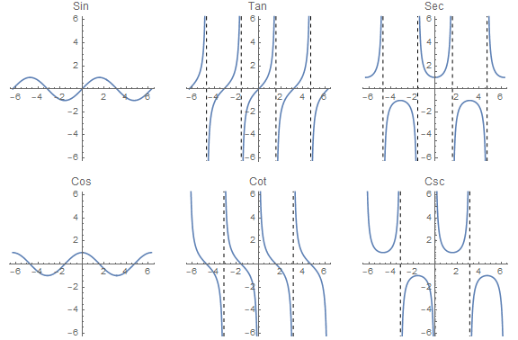

上篇文章中的例子，加了渐近线和标签，坐标轴等比例化，再将列表组合成一张图，好看一些。

---

```mathematica
ParametricPlot[{u*Sin[u], u*Cos[u]}, {u, 0, 100}]
```

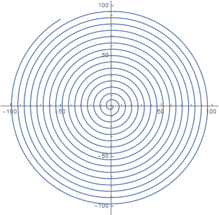

添加一点选项：

```mathematica
ParametricPlot[{u*Sin[u], u*Cos[u]}, {u, 0, 100}, PlotPoints -> 125, Axes -> False, MaxRecursion -> 0, ColorFunction -> "Rainbow"]
```

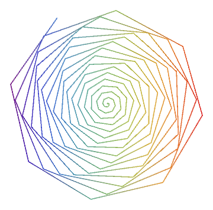

像一朵花。

---

```mathematica
Plot3D[x^2 - y^2, {x, -1, 1}, {y, -1, 1}, BoxRatios -> {1, 1, 1}]
```

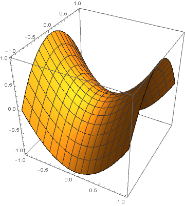

画一个马鞍面。

---

```mathematica
ParametricPlot3D[{Sin[t], Cos[t], t}, {t, 0, 100}, BoxRatios -> {1, 1, 1}, ColorFunction -> "Rainbow"]
```

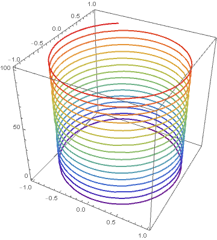

画一个彩色弹簧。

---

```mathematica
PolarPlot[Sin[6*t] + 0.1*RandomReal[], {t, 0, 2*Pi}, ColorFunction -> Hue, Axes -> False]
```

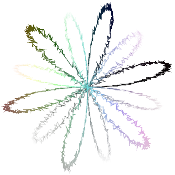

---

```mathematica
f = Sin[Range[0, 12*Pi, 0.1]];
ListPolarPlot[{f, 0.8*f, 0.6*f, 0.4*f}, Joined -> True, Axes -> False, PlotStyle -> {Purple, Red, Orange, Yellow}]
```

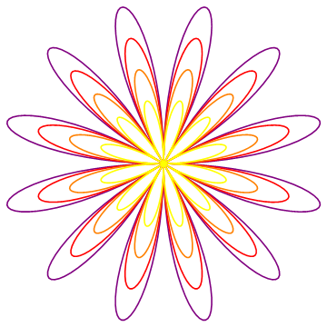

漂亮的花。

---

```mathematica
ListPointPlot3D[Table[{r*Cos[t], r*Sin[t], Sinc[r]}, {r, 0, 3*Pi, 0.1}, {t, 0, 2*Pi, 0.1}], Boxed -> False, Axes -> False]
```

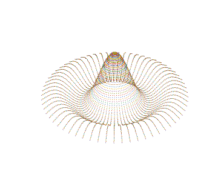

草帽~

---

```mathematica
Graphics[Table[{Hue[t/25], Circle[{Cos[(2*Pi*t)/25], Sin[(2*Pi*t)/25]}]}, {t, 25}]]
```

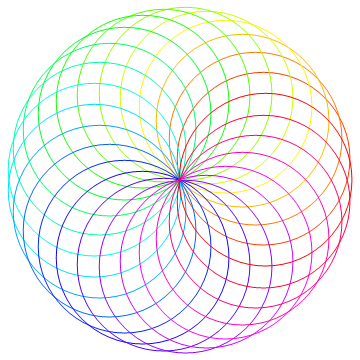

---

```mathematica
Graphics3D[{Red, Ball[{0, 0, 2}], Blue, Cuboid[{-1, -1, -1}, {1, 1, 1}]}, Boxed -> False]
```

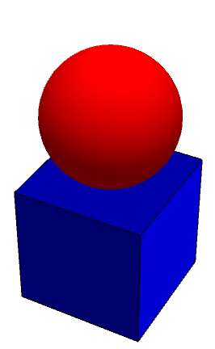

还可以练素描。

---

```mathematica
RegionPlot3D[x^2 + z^2 <= 1 && y^2 + z^2 <= 1, {x, -1, 1}, {y, -1, 1}, {z, -1, 1}, PlotPoints -> 40, Mesh -> None, Boxed -> False]
```

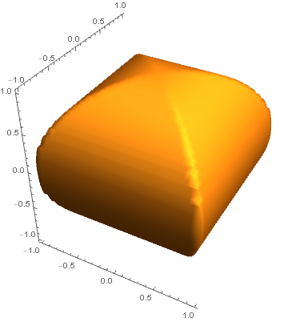

牟合方盖。

---

```mathematica
Animate[Plot[Evaluate[{Sin[x], Normal[Series[Sin[x], {x, 0, n}]]}], {x, -5, 5}, PlotRange -> 5, AspectRatio -> 1, PlotLegends -> "Expressions"], {n, 1, 10, 2}]
```

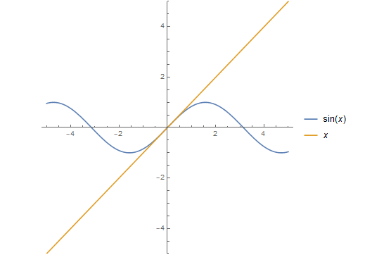

泰勒级数的可视化。

---

```mathematica
Animate[Plot[(x^n & )[x, n], {x, -10, 10}, PlotRange -> 10, AspectRatio -> 1], {n, -5, 5, 0.1}]
```

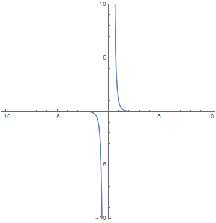

幂函数的可视化。

---

```mathematica
Animate[Plot3D[Sin[Sqrt[x^2 + y^2] + 2*Pi*t], {x, -8*Pi, 8*Pi}, {y, -8*Pi, 8*Pi}, PlotRange -> 10, PlotPoints -> 50, AspectRatio -> 1, Boxed -> False, Mesh -> None, Axes -> False], {t, 0, 2}]
```

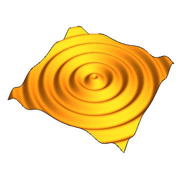

水面波纹效果~

---

```mathematica
MandelbrotSetPlot[]
```

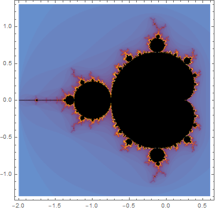

Mathematica 内置了许多函数图，曼德勃罗集合图是其中之一。这被称为“上帝的指纹”。

---
