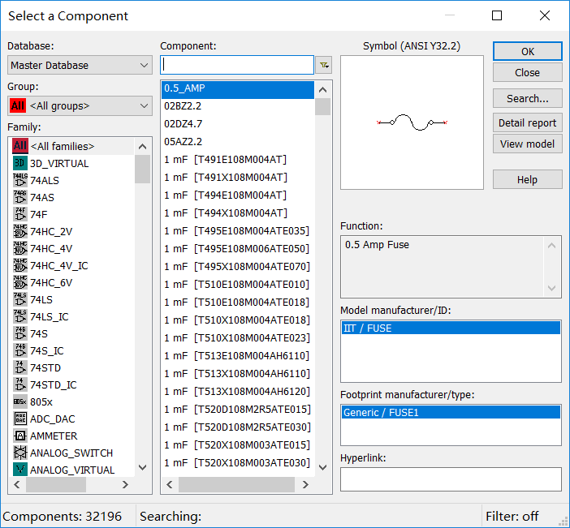
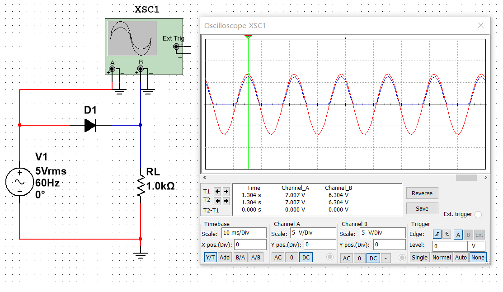

update 2024.06.23: 合并两篇关于 Multisim 的文章

---

## 基础电路

一篇文章简单讲一下用 Multisim 进行基础的电路仿真实验。

首先，我简单介绍一下 Multisim。

Multisim 是一款功能强大的电路仿真软件。

介绍完毕。(￣ ▽ ￣)"

安装包建议去 NI 官网下载。

然后，有一个工具叫做 NI License Activator。

### 0. 准备工作

这一长串是万用表、示波器以及电源、地线等等：

如果你没有看到这个的话，在 View 里把它点上就行了。

这里就只介绍待会儿要用的。第一个是万用表，第四个是双踪示波器，下面蓝色部分的第一个是交流电源，第二个是直流电源，第四个是地线。其他的就不再介绍了，毕竟搜索引擎是个好东西。

<kbd>Ctrl</kbd>+<kbd>W</kbd>或者右键菜单放置元件就会弹出元件数据库：

这里元件真的挺多的……

好了，下面我们做三个基本电路来熟悉一下 Multisim。

### 1. 电阻串联电路

我们验证一个很简单的现象：串联分压。

两个万用表，两个理想电阻器，一个直流电源，一个地，搭建电路如图所示：

可以看到，串联的两个电阻之比为 1：2 的电阻器分得的电压之比也为 1：2。

### 2. 电阻并联电路

我们再验证一个很简单的现象：并联分流。

两个万用表，两个理想电阻器，一个直流电源，一个地，搭建电路如图所示：

可以看到，并联的两个电阻之比为 1：2 的电阻器分得的电流之比为 2：1。

### 3. 电阻电容串联电路

这里我们看一看电容对电压相位的影响，这就要用到示波器了。

一个双踪示波器，一个理想电阻器，一个理想电容器，一个交流电源，一个地，搭建电路如图所示：

改变导线颜色即改变对应波形颜色。可以看到，电容这一条支路相对于电阻确实相移了 $-\pi/2$ 。

## 基本元件

接下来探索一下二极管和三极管的基本特性。

众所周知，二极管和三极管是现代整个工业体系的基础，作为工科学生，认识一下它们也是有必要的。

### 1. 二极管

搭建电路如图所示：

可以看到，二极管具有单向导电性。注意到仍然有大约 0.7V 的压降，可以推测这是一只硅二极管。

### 2. 稳压管

由二极管的伏安特性可以知道，当二极管工作在反向击穿区的时候，即使电流 $\Delta I$ 变化量较大，电压变化量 $\Delta U$ 却很小。稳压管实质上是一种通常工作在反向击穿区的二极管。

搭建电路如图所示：

当电源电压或负载电阻变化时，负载电压能基本稳定在稳压管的稳定电压左右，故称“稳压管”。

### 3. 双极型三极管

双极型三极管属于流控流器件（Current Controlled Current），通常用在模拟电路中。

搭建电路如图所示：

当基极电流 $\Delta I_{b}$ 增加 0.05mA 时，集电极电流 $\Delta I_{c}$ 随之增加 5mA 。可以得出，这个三极管的电流放大系数 $\beta=100$ 。

### 4. 场效应三极管

场效应三极管属于压控流器件（Voltage Controlled Current），通常用在数字电路中。

搭建电路如图所示：

场效应管有许多类型，其中绝缘栅型场效应管应用很广泛。它由金属、氧化物、半导体制成，所以又称 MOSFET（Metal-Oxide-Semiconductor Field-Effect Transistor）。

## 更多

网上有很多关于 Multisim 的学习资料，这篇文章只是自己刚开始学习电路仿真时的一篇笔记，如果真的能帮到谁，那算是意外之喜了。
