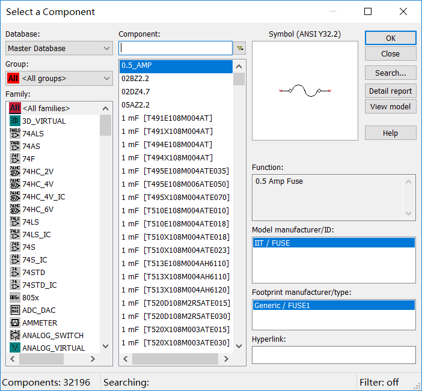
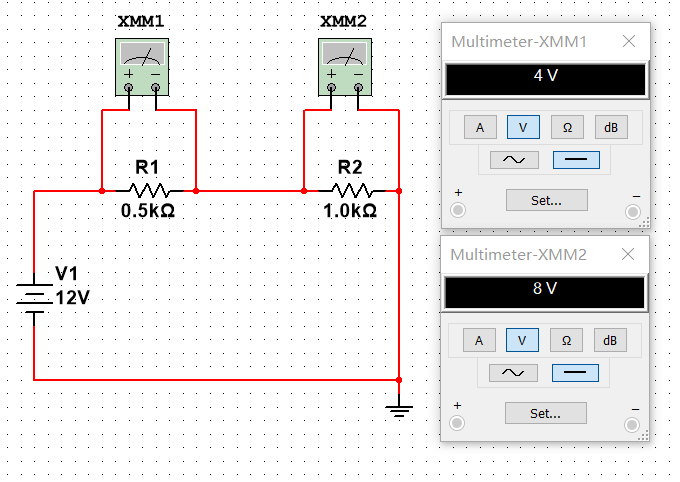
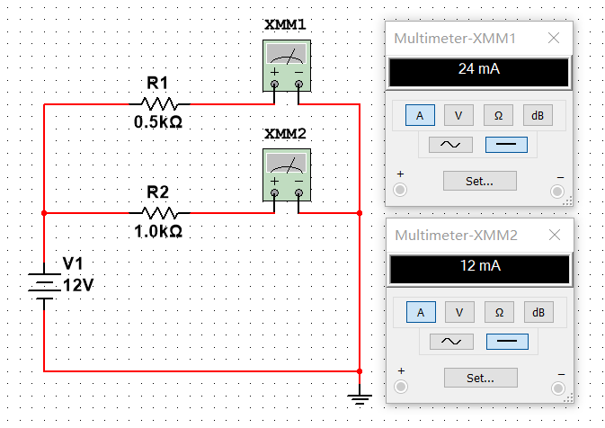
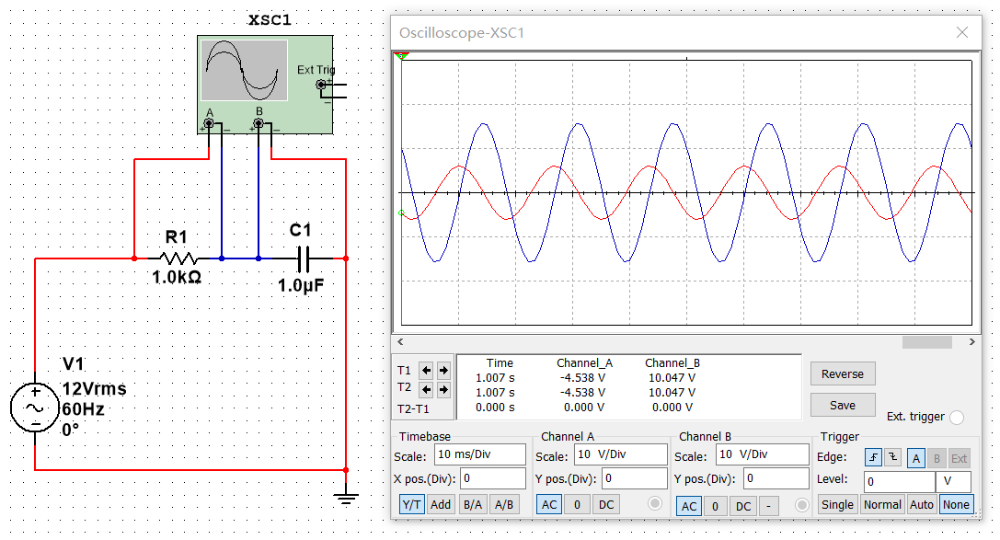

开一个系列，这个系列主要讲用Multisim进行电路仿真实验。

---

首先，我简单介绍一下Multisim。

Multisim是一款功能强大的电路仿真软件。

介绍完毕。(￣▽￣)"

---

安装包建议去NI官网下载。

[NI License Activator 1.2](https://pan.baidu.com/s/1_YuUe5tEpzFiAYDfyFZaKg) 提取码：`5244`

---

### 0. 准备工作

这一长串是万用表、示波器以及电源、地线等等：

如果你没有看到这个的话，在View里把它点上就行了。

这里就只介绍待会儿要用的。第一个是万用表，第四个是双踪示波器，下面蓝色部分的第一个是交流电源，第二个是直流电源，第四个是地线。其他的就不再介绍了，毕竟搜索引擎是个好东西。

<kbd>Ctrl</kbd>+<kbd>W</kbd>或者右键菜单放置元件就会弹出元件数据库：

这里元件真的挺多的……

好了，下面我们做三个基本电路来熟悉一下Multisim。

---

### 1. 电阻串联电路

我们验证一个很简单的现象：串联分压。

两个万用表，两个理想电阻器，一个直流电源，一个地，搭建电路如图所示：

可以看到，串联的两个电阻之比为1：2的电阻器分得的电压之比也为1：2。

---

### 2. 电阻并联电路

我们再验证一个很简单的现象：并联分流。

两个万用表，两个理想电阻器，一个直流电源，一个地，搭建电路如图所示：

可以看到，并联的两个电阻之比为1：2的电阻器分得的电流之比为2：1。

---

### 3. 电阻电容串联电路

这里我们看一看电容对电压相位的影响，这就要用到示波器了。

一个双踪示波器，一个理想电阻器，一个理想电容器，一个交流电源，一个地，搭建电路如图所示：

改变导线颜色即改变对应波形颜色。可以看到，电容这一条支路相对于电阻确实相移了 $-\pi/2$ 。

---
