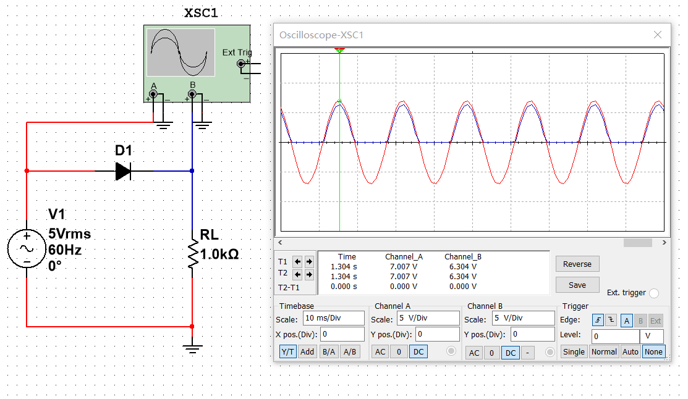
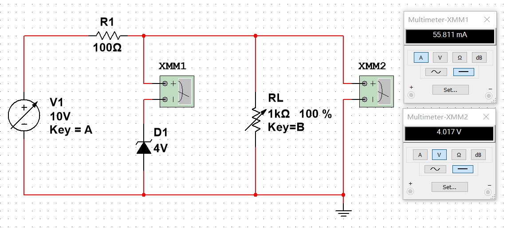
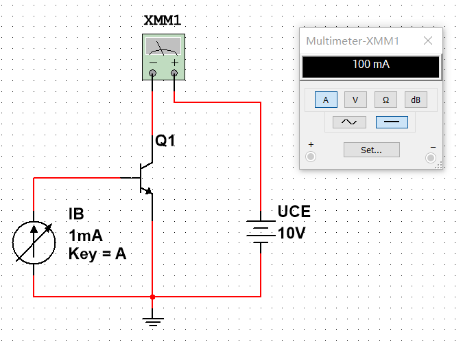
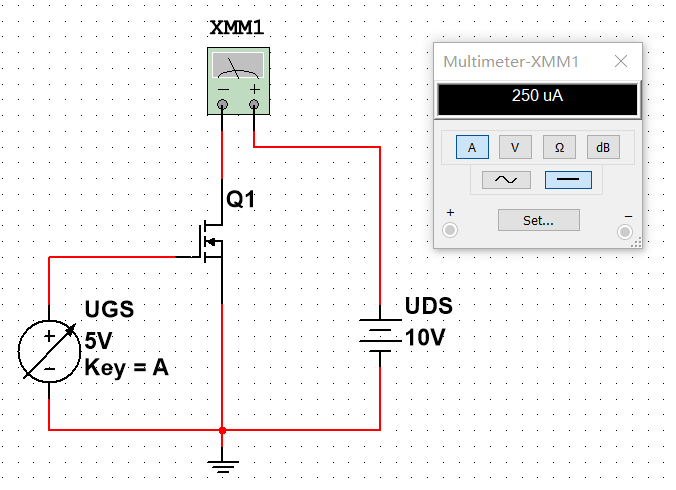

今天来探索一下二极管和三极管的基本特性。

---

众所周知，二极管和三极管是现代整个工业体系的基础，作为工科学生，认识一下它们也是有必要的。

---

### 1. 二极管

搭建电路如图所示：

可以看到，二极管具有单向导电性。注意到仍然有大约 0.7V 的压降，可以推测这是一只硅二极管。

---

### 2. 稳压管

由二极管的伏安特性可以知道，当二极管工作在反向击穿区的时候，即使电流 $\Delta I$ 变化量较大，电压变化量 $\Delta U$ 却很小。稳压管实质上是一种通常工作在反向击穿区的二极管。

搭建电路如图所示：

当电源电压或负载电阻变化时，负载电压能基本稳定在稳压管的稳定电压左右，故称“稳压管”。

---

### 3. 双极型三极管

双极型三极管属于流控流器件（Current Controlled Current），通常用在模拟电路中。

搭建电路如图所示：

当基极电流 $\Delta I_{b}$ 增加 0.05mA 时，集电极电流 $\Delta I_{c}$ 随之增加 5mA 。可以得出，这个三极管的电流放大系数 $\beta=100$ 。

---

### 4. 场效应三极管

场效应三极管属于压控流器件（Voltage Controlled Current），通常用在数字电路中。

搭建电路如图所示：

场效应管有许多类型，其中绝缘栅型场效应管应用很广泛。它由金属、氧化物、半导体制成，所以又称MOSFET（Metal-Oxide-Semiconductor Field-Effect Transistor）。

---
