### NetLogo是什么？

NetLogo是一个可以模拟自然现象和社会现象的建模环境。

NetLogo特别适合对复杂系统进行建模。

NetLogo编程语法非常简单，功能却非常强大。

NetLogo有丰富的文档、教程以及模型库。

[NetLogo主页](http://ccl.northwestern.edu/netlogo/)

---

### 1. 渗流模型（seepage model）

假如有一片原始森林，某日突然着火了，火势将会如何蔓延？忽略动物、风向等因素，只考虑树木密度，那么火势的蔓延程度与树木的密度有什么关系？不妨建个模型试试看~

如下图：这是这个模型的界面部分。

- density表示树木密度，是一个可以由用户拖动的滑块，默认值是50%。
- setup是初始化函数按钮，代码后面会说。点一下就初始化了。
- go是循环执行的函数按钮，点一下就开始执行。（右下角的标志表示循环执行）
- 右边黑漆漆的是观察窗口，由100x100个patch组成。

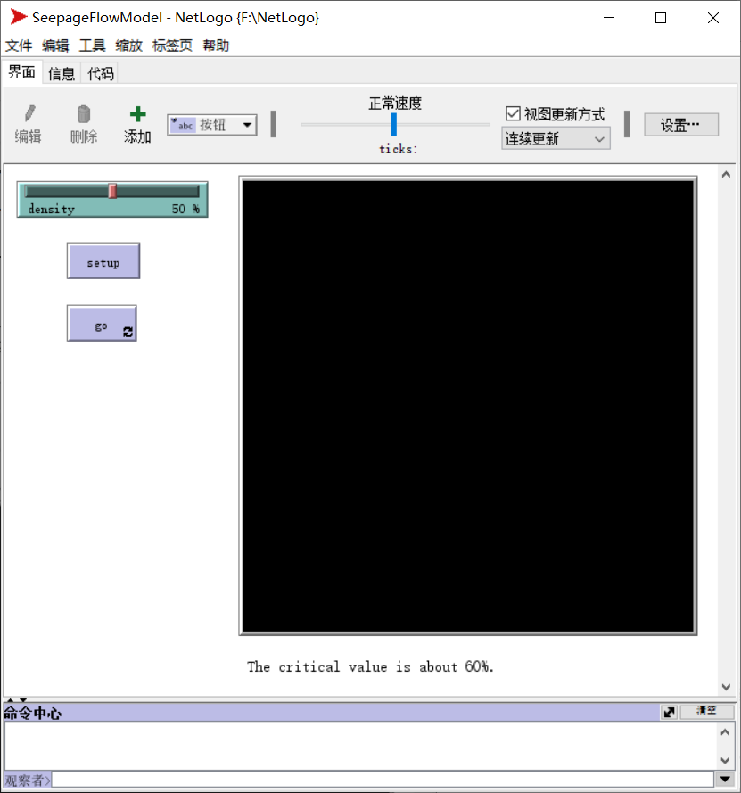

这是这个模型的代码部分：

```
to setup
  clear-all
  reset-ticks
  ask patches with [(random 100) < density] [
    set pcolor green
  ]
  ask patches with [pxcor = min-pxcor] [
    set pcolor red
  ]
end

to go
  ask patches with [pcolor = green] [
    if (count neighbors4 with [pcolor = red] > 0) [
      set pcolor red
    ]
  ]
  tick
end
```

代码很简单就不细说了，相信有编程基础的人都能看懂。

代码分为两部分：setup和go，正好对应界面部分的setup和go按钮。setup部分主要就是根据密度设置树木（黑色代表空地，绿色代表树木，红色代表着火的树木），并且把最左边一列变成着火的树木。go部分是一个执行周期，就是遍历每个树木，如果上下左右四个领域中存在着火的树木那么它自己也着火。规则很简单，但是结果却不简单。

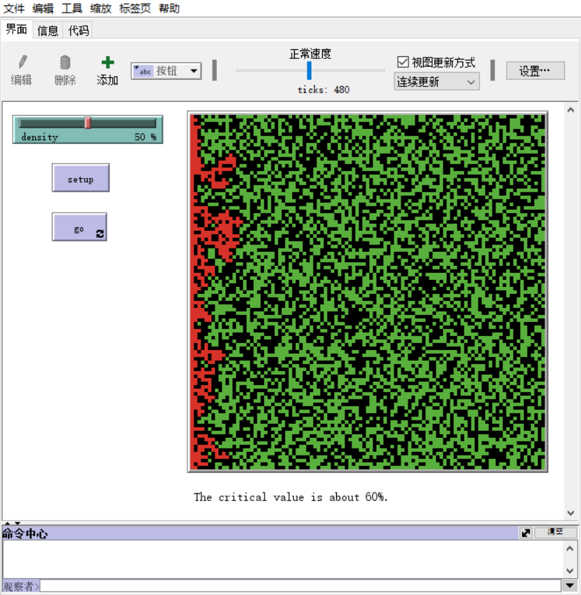

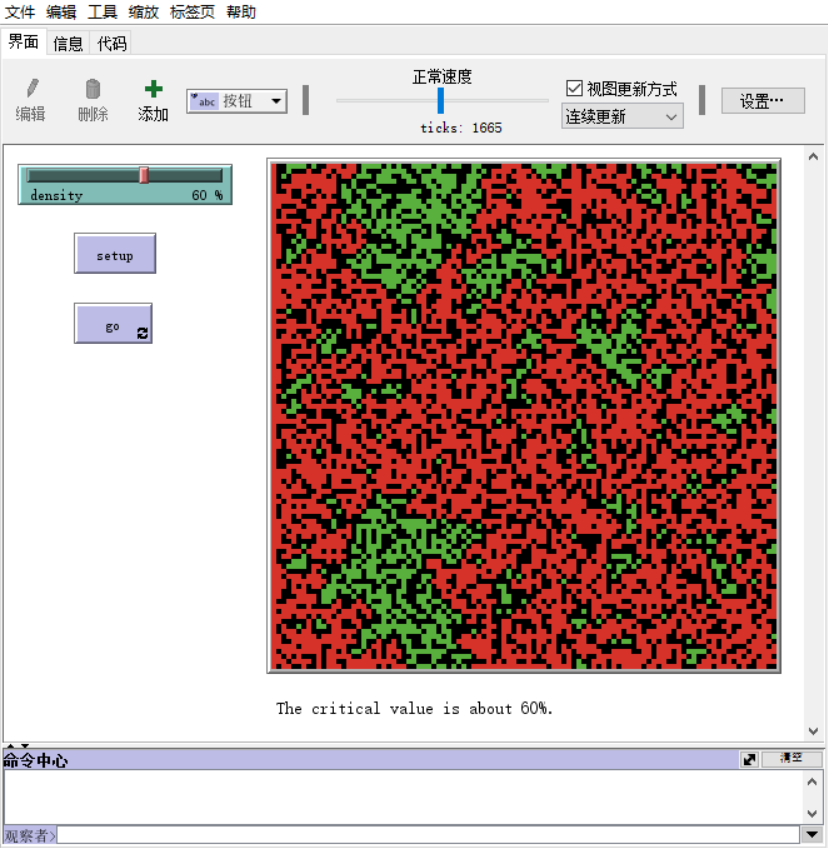

这里我选取了两个平均后的结果：density = 50% 和 density = 60%。

可以看到，当density = 50%的时候火势并没有蔓延到最右边，而当density = 60%的时候火势就蔓延到了最右边。

经过多次实验，可以发现60%是一个临界值，火势蔓延程度在density约等于60%的时候发生了突变。如果把density作为横坐标，树木被烧的比例为纵坐标，画出来大概就类似生物数量增长的S型曲线。

模型库里面也有这个模型：

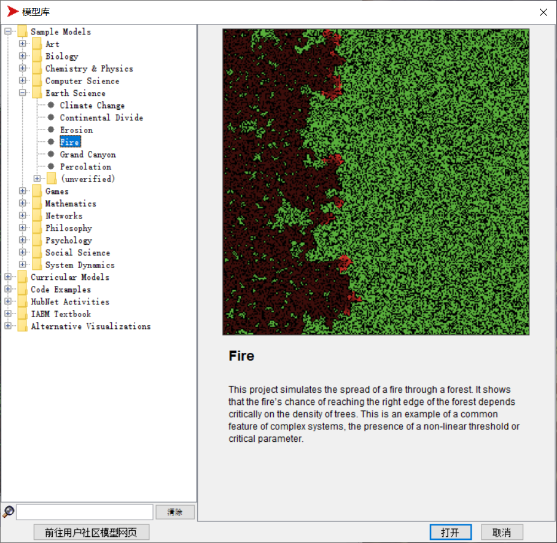

程序几乎是一样的，只是界面不同。我们来看看当density分别等于57%、60%、63%的时候的情况：

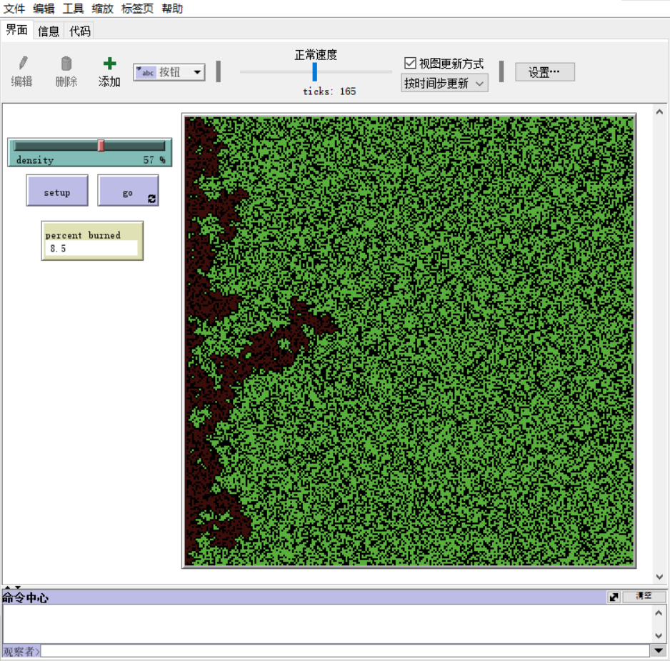

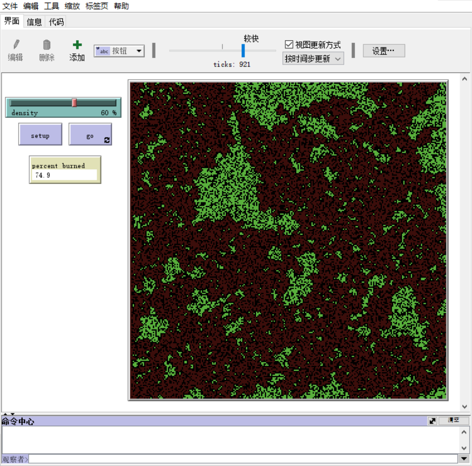

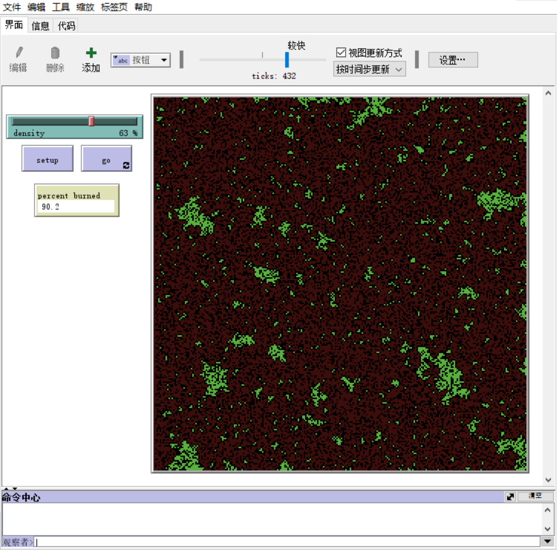

当density = 57%的时候大约有9%的树木被烧了，而当density = 63%的时候大约有90%的树木被烧。再次印证了临界值存在并且约等于0.6。

这个模型还可以解释很多现象。比如我们知道在空气比较潮湿的情况下不要靠近暴露的电线，原理就可以用这个模型来解释：把水分子看作树木，导电的水分子看作着火的树木，干燥的空气看作空地，那么就很容易理解了。而且这个水分子密度大约在60%的时候，导电半径会急剧扩大。

### 2. 沙堆模型（sandpile model）

沙堆模型也很简单，但是背后蕴含的秘密可不简单。

沙堆模型具体我就不细说了，网上可查。直接上结果：

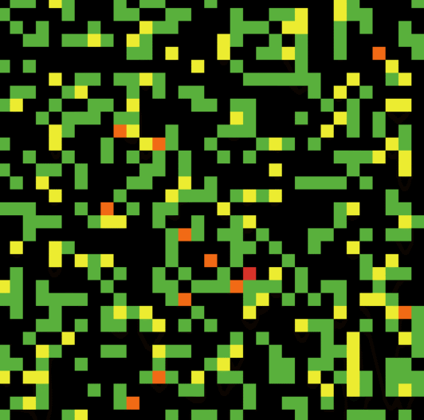

代码：

```
patches-own [value]

to setup
  clear-all
  reset-ticks
  ask patches [
    set value 0
    color-it
  ]
end

to go
  ask one-of patches [
    set value (value + 1)
  ]
  ask patches [
    judge-cascading
  ]
  ask patches [
    color-it
  ]
  tick
end

to color-it
  if (value = 0) [
    set pcolor black
  ]
  if (value = 1) [
    set pcolor green
  ]
  if (value = 2) [
    set pcolor yellow
  ]
  if (value = 3) [
    set pcolor orange
  ]
  if (value = 4) [
    set pcolor red
  ]
end

to judge-cascading
  if (value > 4) [
    set value (value - 4)
    ask neighbors4 [
      set value (value + 1)
    ]
  ]
end
```

可以看到，后期一粒沙子可以导致大范围的改变，就像雪崩一样。因此形象地把这种现象称之为“雪崩”。如果把“雪崩”次数当作横坐标，每次“雪崩”的尺度当作纵坐标，再把坐标轴取双对数，可以发现曲线趋近一条直线，说明这符合幂律分布。

模型库里面也有这个模型。打开运行一段时间之后：

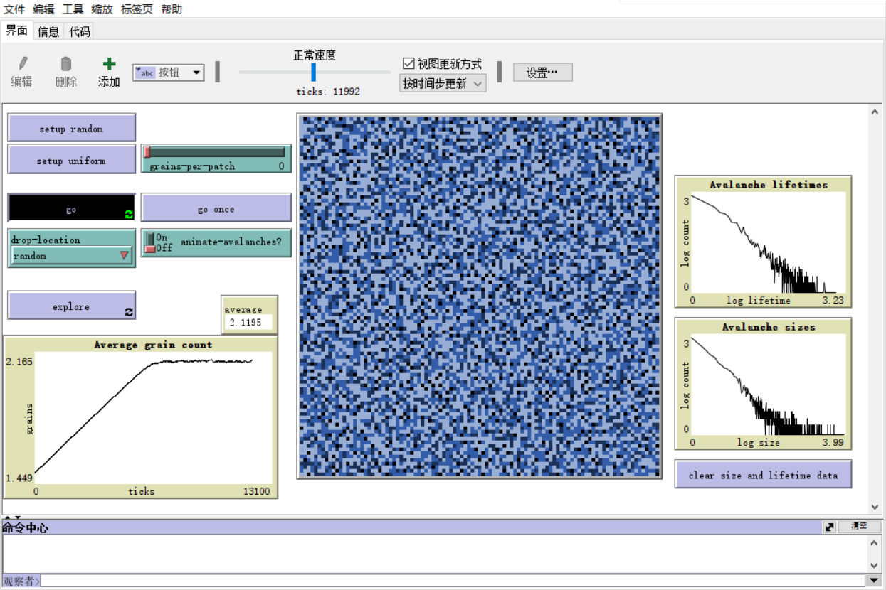

可以看到，在简单的规则之下，系统可以自发地达到临界状态。并且“雪崩”的尺度与次数符合幂律分布；每次“雪崩”的时间长度与次数也符合幂律分布。

地震，暴动等等皆可用这个模型来解释，因为本质都是能量的积累与释放。

### 3. 生态模型（ecological model）

说白了就是羊吃草。很简单的一个模型，直接上结果：

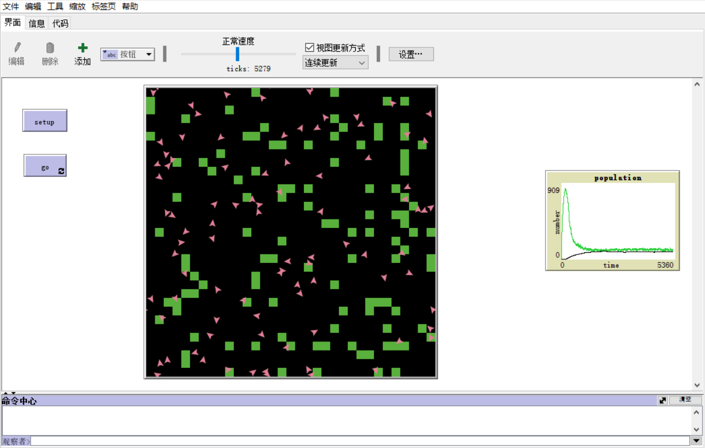

代码：

```
turtles-own [energy]

to setup
  clear-all
  reset-ticks
  ask patches [
    ifelse ((random-float 1) < 0.2) [
      set pcolor green
    ] [
      set pcolor black
    ]
  ]
  create-turtles 1 [
    setxy random-xcor random-ycor
    set heading (random 360)
    set energy 100
  ]
end

to go
  addfood
  ask turtles [
    turtle-move
    turtle-breed
    turtle-die
  ]
  tick
end

to addfood
  let i 0
  while [i < 10] [
    let grass-x random-pxcor
    let grass-y random-pycor
    ask patches with [pxcor = grass-x and pycor = grass-y] [
      set pcolor green
    ]
    set i (i + 1)
  ]
end

to turtle-move
  if (pcolor = green) [
    set pcolor black
    set energy (energy + 10)
  ]
  forward 1
  if ((random-float 1) < 0.1) [
    set heading (random 360)
  ]
  set energy (energy - 1)
end

to turtle-breed
  if (energy > 500) [
    set energy (energy / 2)
    hatch 1 [
      forward 1
      set energy 100
    ]
  ]
end

to turtle-die
  if (energy <= 0) [
    die
  ]
end
```

重点是右边的population统计图表，绿色的曲线代表草的数量，黑色的曲线代表羊的数量。我设定的一开始只有一只羊，以0.2的概率随机分布草。其他参数都在代码里了我懒得说了:-P，然后结果就是草和羊的数量保持一种动态平衡。

如果改变一些参数比如羊吃到草增加的能量或者草每个周期再生的数量等等，那么平衡曲线也会发生改变，甚至失衡。如果再加入一种动物比如狼，那么结果就会有趣得多，不过模型库里面已经有这个模型了：

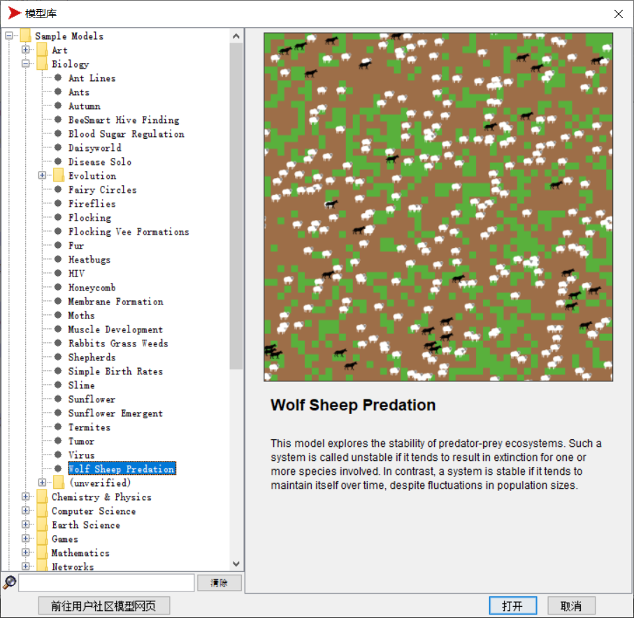

用默认参数运行一段时间之后：

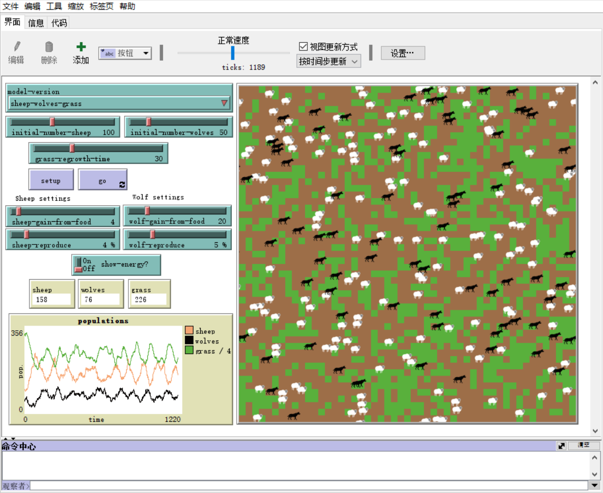

看左下角的图，为什么是这样的呢？因为羊少草就多狼就少（狼饿死了），狼少羊就多，羊多草就少且狼就多，草少且狼多羊就少，一直循环，生态稳定。

如果改变一些参数，比如让狼吃到羊增加的能量变多和狼产崽变多，其他不变，那么……

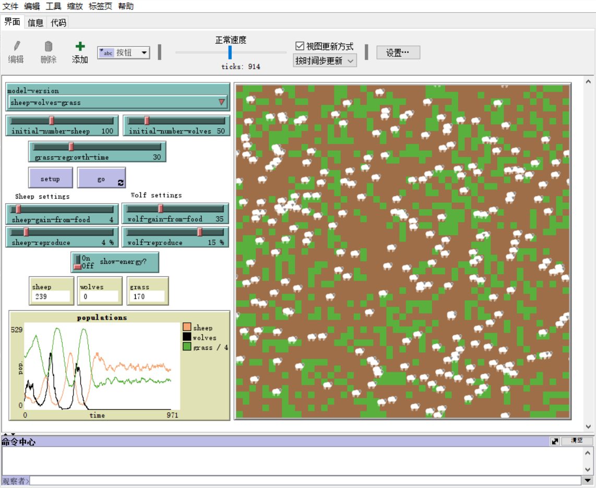

狼灭绝了，羊和草愉快地保持着动态平衡……

为什么会这样？看time大约等于400的那段时间，羊几乎快灭绝了，狼就饿死得差不多了，可有一小部分羊在狼没找到的地方幸存了下来直到狼饿死光光……

### 4. 生命游戏（Game of Life）

大名鼎鼎的生命游戏，不多说，上结果：

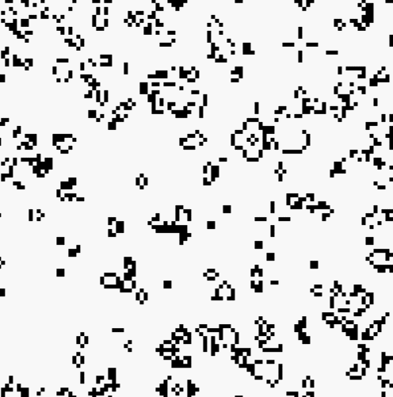

代码：

```
patches-own [living]

to setup
  clear-all
  ask patches [
    ifelse ((random-float 1) < 0.2) [
      set pcolor black
    ] [
      set pcolor white
    ]
  ]
end

to go
  ask patches [
    set living count neighbors with [pcolor = black]
  ]
  ask patches [
    ifelse (pcolor = black) [
      if (living > 3 or living < 2) [
        set pcolor white
      ]
    ] [
      if (living = 3) [
        set pcolor black
      ]
    ]
  ]
end
```

生命游戏我用C语言写过，用Python写过，用MATLAB写过，现在看来，用NetLogo写这种是最简单的~

### 5. 兰顿蚂蚁（Langton's ant）

不那么大名鼎鼎的兰顿蚂蚁，也不多说，上结果：

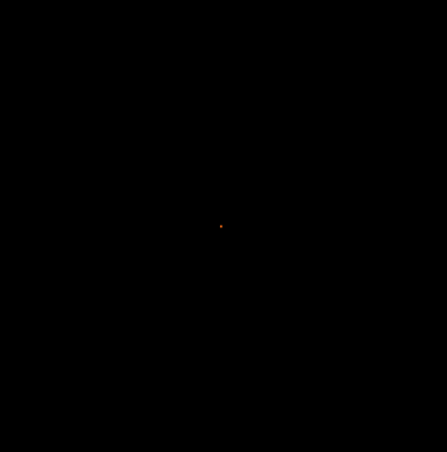

代码：

```
to setup
  clear-all
  reset-ticks
  create-turtles 1 [
    set heading ((random 4) * 90)
  ]
end

to go
  ask turtles [
    let degree 0
    ifelse (pcolor = black) [
      set degree (-90)
      set pcolor white
    ] [
      set degree 90
      set pcolor black
    ]
    right degree
    forward 1
  ]
  tick
end
```

---

### 结语

以上五个模型都很简单也很有趣，可作为入门练习，写完成就感满满~

生命游戏和兰顿蚂蚁都属于很经典的元胞自动机，说到元胞自动机就不得不提到golly这个软件和Stephen Wolfram这个天才（虽然这两者没什么直接联系）。前者是专门运行元胞自动机的软件，很有趣；后者在国内比较出名可能是因为Wolfram是Mathematica这个软件的作者。Mathematica我在上两篇文章中写过，是一个神奇的软件。

值得一提的是，NetLogo官方支持和Mathematica互联：


话说复杂系统这个学科在国内太冷了，据我所知只有北师大的张江教授开设这个课程。

- 生命游戏（Game of Life）
- golly
- 兰顿蚂蚁（Langton's ant）
- 元胞自动机（cellular automata）
- Stephen Wolfram
- Mathematica
- 复杂系统（complex system）
- 复杂性（complexity）
- 张江
- 计算机模拟（computer simulation）
- 分形（fractal）
- 临界值（critical value）
- 自组织（self-organization）
- NetLogo
- 幂律分布（power-law distribution）

似乎可以织成一张复杂的网……

以前我很讨厌“复杂”这个词，喜欢“简单”。但现在，“复杂”于我而言有了一层新的含义：“复杂”不是冗杂，也不是繁杂，而是原理精简却现象复杂。复杂性思维，就是通过复杂的现象发现精简的内在规律，并为我所用，造福生命。而且只有足够“复杂”，才能产生恢弘和瑰丽。

---
