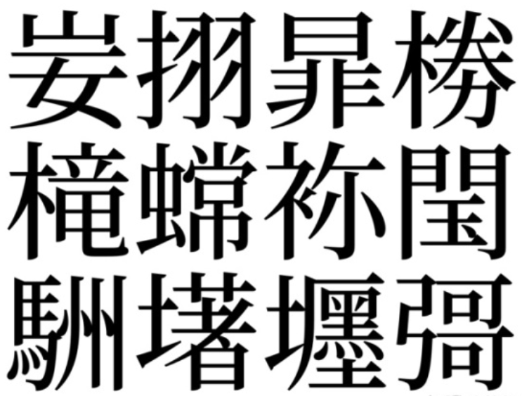

这个白日梦主要分为两部分：字符集和键盘布局。

## 字符集

希望联合国协同各国政府精简优化 Unicode。

把前 127 个字符重新设计一下，比如：

- 将 `$` （U+0024，Dec:36）移到第 127 之后，和各国货币符号放一起，别搞特殊化。
- 把乘除运算符（是 `×` 而不是 `*` ，是 `÷` 而不是 `/` ）、积分微分运算符移到前 127 个里面（微分运算符最好用一个特殊符号表示而不是英文字母 d ，避免和变量 d 混淆），因为数学是永恒的。
- 把希腊字母移到前 127 个里面，剩下（26 x 2 + 24 x 2 = 100 < 127）

去掉 Unicode 中的幽灵字符

> 1978 年，日本行政机关发布了一套编码系统，即后来的 JIS X 0208。这份编码系统对日本后来的所有编码系统都影响深远。但是就在这份编码系统发布后，大家发现其中的几个字符很奇特——没人知道它们从何而来、什么意思、怎么发音。这就是所谓的幽灵字符。 很长一段时间，这些幽灵文字虽然奇特，但是无人解释，也被大多数人遗忘。但在 1997 年，日本人终于坐不住了，发起一个大型的调查来研究这些文字的来龙去脉。 一般来说，收录到 JIS 标准的字符都有具体来源记录。即使来源不甚清楚，也会说明在哪些文档。所以，你可能认为会很容易追溯到这些字符的根源，但是我们可能得谈谈“文档”的定义——这些幽灵字符的一个常见来源是《国土行政区划总览》，包含了所有的日本地名。你可能和我一样，认为这仅仅是普通的地图册，一本几百页的大书。但事实是，那是一套七卷本，每本大概都九百页。想象一下在这里面一个一个地查找字符，而且还不知道在哪一页！ 尽管如此，日本人还是做到了：他们发现了这些幽灵字符的来源——至少是最可能的来源。通过询问那些参加标准制定的索引员们，调查员们发现一些幽灵字符其实是在索引过程中错误地制造出来的。例如，“妛”这个字本来是用来表示“上山下女”的另外一个字，一个在日本非常著名地点用到的字(因此值得收入到 JIS 标准)。在当时，因为没有这字，所以没有办法打印这个字，所以索引员单独打印了“山”和“女”，然后剪切粘贴在一张纸上，最后扫描复制。但是后来的索引员读到这个复印件，把两个字中间粘缝产生的横线认为是一划，于是错误地造了这个字。讽刺的是，本来想表示的那个字直到最近才加入到 JIS 和后来的 Unicode 文档，导致很多网站都无法显示这个字(冤……)。 调查之后，所有的幽灵字符中只有一个字符没明确来源：“彁”。最有可能的解释是：这是另一个字符“彊”的错写，但没在其他文档发现这种错法。 由于 JIS 标准的广泛接受，在 CJK 合并过程的时候，这些幽灵字符也被 Unicode 收录。 所以，1978 年的一系列错误无中生有地制造了幽灵字符。当我们发现这个错误的时候，为时已晚，幽灵已经嵌入整个系统。现在这些字符——至少有可能——成为全世界所有电脑的一部分，徘徊在字符表的黑暗角落。 照此下去，它们将与人类共存亡，永远。

幽灵字符：妛挧暃椦槞蟐袮閠駲墸壥彁

编码方案用 UTF-8 或 UTF-32，前者利于传输，后者解析方便。

各国统一默认使用这个优化之后的 Unicode（别把它叫做 Unicode 2，Unicode 就是 Unicode），别再各自搞那些字符集啦。当然特殊场合可以用特定的编码方案和字符集。

## 键盘布局

把键盘上的字母按顺序重新安排一下，英文字母的排列别再沿用这个不合适的设计了。

> 为什么要将键盘规范成现在这样的“QWERTY”键盘按键布局呢？ 这是因为最初，打字机的键盘是按照字母顺序排列的，而打字机是全机械结构的打字工具，因此如果打字速度过快，相邻键的组合很容易出现卡键问题，于是 Christopher Sholes 发明了 QWERTY 键盘布局。他将最常用的几个字母安置在相反方向。众所周知，这种键盘主要的设计目的是使击键的速度不至太快而导致卡住。不过在很多文章中的说法有一个小小的错误，就是这种键盘的键位设计并不是要“使击键的速度不至太快而导致卡住”，而是“在不至卡住的前提下尽量提高打字速度”。 Christopher Sholes 在 1868 年申请专利，1873 年使用此布局的第一台商用打字机成功投放市场。正如很多事情一样，习惯的力量是难以抵挡的，这就是为什么有今天键盘的排列方式。这不得不说是一个历史遗留问题。

可以考虑把加减乘除模幂等单独拿出来放一起，每次输入乘法运算符还要 Shift 真的不方便。

右 Shift 或其他更合理的按键可以切换英文字母和希腊字母（英文字母比希腊字母多出来的那两个键位可再具体安排），Caps 仍然切换大小写。这样一来，28 个键位（26 个字母键位+2 个切换键位）就可以方便地打出大小写的英文字母和大小写的希腊字母。

---

技术上真的不难，主要是人们不愿意去改变旧有的习惯。

如果真要在统一字符集和编码上下功夫，可能会让现在的软件行业停滞好几年，完成之后各种兼容性问题会层出不穷，但越往后，改变的成本越大。

啊，不知道有生之年能不能看到。
