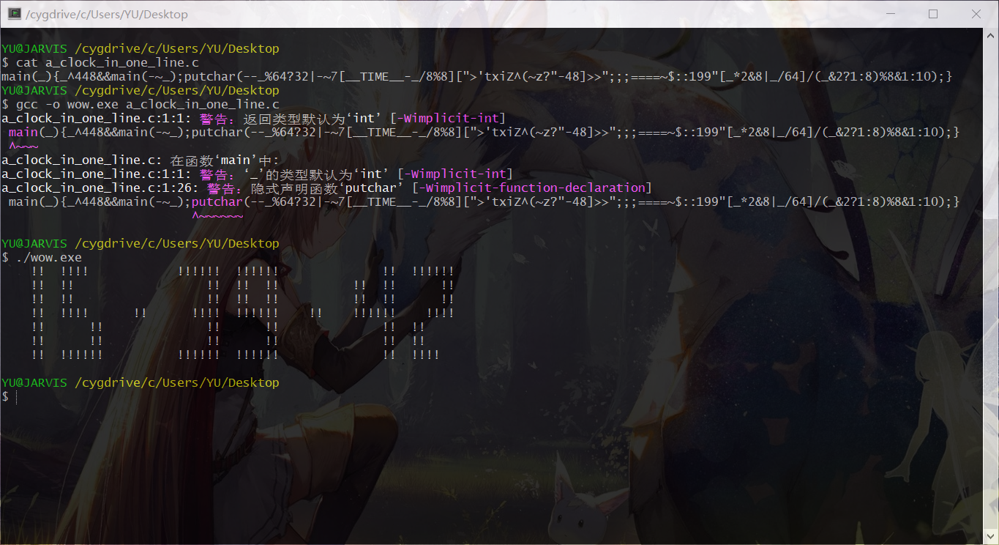
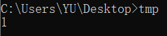
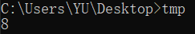

有个“国际C语言混乱代码大赛”，简称IOCCC，画风简直鬼畜。其中有个获奖代码是这样的：

```c
main(_){_^448&&main(-~_);putchar(--_%64?32|-~7[__TIME__-_/8%8][">'txiZ^(~z?"-48]>>";;;====~$::199"[_*2&8|_/64]/(_&2?1:8)%8&1:10);}
```

这段代码直接复制粘贴编译运行就输出了当前时间！



C语言果然是强大而灵活。QAQ

注意到源码中有 `__TIME__` ，这是预处理器定义的特殊宏，它能扩展为一个字符串，内容为预处理器运行的时间，格式为 `"HH:MM:SS"`。

好奇心驱使着我想要一探究竟。

---

首先，格式化代码并加入头文件及返回值：

```c
#include <stdio.h>

int main(_)
{
    _ ^ 448 && main(-~_);
    putchar(--_ % 64 ? 32 | -~7[__TIME__ - _ / 8 % 8][">'txiZ^(~z?" - 48] >> ";;;====~$::199"[_ * 2 & 8 | _ / 64] / (_ & 2 ? 1 : 8) % 8 & 1 : 10);

    return 0;
}
```

展开逻辑与的短路特性，引入变量并化简：

```c
#include <stdio.h>

int main(int i)
{
    if (i ^ 448)
        main(-~i);
    if (--i % 64)
    {
        char a = -~7[__TIME__ - i / 8 % 8][">'txiZ^(~z?" - 48];
        char b = ";;;====~$::199"[i * 2 & 8 | i / 64] / (i & 2 ? 1 : 8) % 8;
        char c = a >> b;
        putchar(32 | (c & 1));
    }
    else
        putchar(10);

    return 0;
}
```

接下来展开各种位运算并用字符 `'\n'` 代替其ASCII码值 `10` ：

- `if (i ^ 448)` 等价于 `if (i != 448)`
- `-~i` 等价于 `i + 1`

```c
#include <stdio.h>

int main(int i)
{
    if (i != 448)
        main(i + 1);
    i--;
    if (i % 64)
    {
        char a = 1 + 7[__TIME__ - i / 8 % 8][">'txiZ^(~z?" - 48];
        char b = ";;;====~$::199"[i * 2 & 8 | i / 64] / (i & 2 ? 1 : 8) % 8;
        char c = a >> b;
        putchar(32 | (c & 1));
    }
    else
        putchar('\n');

    return 0;
}
```

递归化为循环，这个有点烧脑：

```c
#include <stdio.h>

int main(void)
{
    for (int i = 447; i >= 0; i--)
        if (i % 64)
        {
            char a = 1 + 7[__TIME__ - i / 8 % 8][">'txiZ^(~z?" - 48];
            char b = ";;;====~$::199"[i * 2 & 8 | i / 64] / (i & 2 ? 1 : 8) % 8;
            char c = a >> b;
            putchar(32 | (c & 1));
        }
        else
            putchar('\n');

    return 0;
}
```

注意到 `putchar(32 | (c & 1))` 取决于 `c` 的奇偶性，32的二进制表示为 ‭`0010 0000‬` ，若 c 为奇数则 `putchar(33)` 否则`putchar(32)` 。再分别用字符替换其ASCII码值，得到：

```c
#include <stdio.h>

int main(void)
{
    for (int i = 447; i >= 0; i--)
        if (i % 64)
        {
            char a = 1 + 7[__TIME__ - i / 8 % 8][">'txiZ^(~z?" - 48];
            char b = ";;;====~$::199"[i * 2 & 8 | i / 64] / (i & 2 ? 1 : 8) % 8;
            char c = a >> b;
            if (c % 2)
                putchar('!');
            else
                putchar(' ');
        }
        else
            putchar('\n');

    return 0;
}
```

接下来，开始分析最长的那两行！

C语言中 `a[b]` 等价于 `b[a]` ，这是C语言指针的基础知识，于是有：

```C
char a = 1 + (__TIME__ - i / 8 % 8)[7][">'txiZ^(~z?" - 48]; // 第一次嵌套
char a = 1 + (">'txiZ^(~z?" - 48)[(__TIME__ - i / 8 % 8)[7]]; // 第二次嵌套
```

得到：

```c
#include <stdio.h>

int main(void)
{
    for (int i = 447; i >= 0; i--)
        if (i % 64)
        {
            char a = (">'txiZ^(~z?" - 48)[(__TIME__ - i / 8 % 8)[7]] + 1;
            char b = ";;;====~$::199"[i * 2 & 8 | i / 64] / (i & 2 ? 1 : 8) % 8;
            char c = a >> b;
            if (c % 2)
                putchar('!');
            else
                putchar(' ');
        }
        else
            putchar('\n');

    return 0;
}
```

注意到 `(i & 2 ? 1 : 8)` 取决于 `i & 2` 的值，展开得到：

```c
#include <stdio.h>

int main(void)
{
    for (int i = 447; i >= 0; i--)
        if (i % 64)
        {
            char a = (">'txiZ^(~z?" - 48)[(__TIME__ - i / 8 % 8)[7]] + 1;
            char b = ";;;====~$::199"[i * 2 & 8 | i / 64];
            if ((i & 2) == 0)  //i & 2 一定要加括号
                b /= 8;
            b %= 8;
            char c = a >> b;
            if (c % 2)
                putchar('!');
            else
                putchar(' ');
        }
        else
            putchar('\n');

    return 0;
}
```

这里 `char a` 这一行很奇怪，字符串减去一个整数再取下标？！先写两个demo看看是什么情况（当前时间 18:47）：

```c
#include <stdio.h>

int main(void)
{
    char a = (__TIME__ - 7)[7];
    printf("%c\n", a);
    return 0;
}
```

编译通过！运行发现：



`__TIME__`的第一位字符？

```c
#include <stdio.h>

int main(void)
{
    char a = (__TIME__ - 6)[7];
    printf("%c\n", a);
    return 0;
}
```



`__TIME__`的第二位字符？

所以，`(__TIME__ - i)[7]` 等价于 `(__TIME__)[7 - i]` ？

事实上，这里不能把源代码中的字符串看成数组而应该看成指针。

下标操作默认是 `a[i] = *(a + i)` 实现的，当然也就有 `(a + n)[i]` 等价于 `a[i + n]`。

至此，程序分析到这一步：

```c
#include <stdio.h>

int main(void)
{
    for (int i = 447; i >= 0; i--) // 一共7行，每行64个字符，一共循环7x64=448次
        if (i % 64) // 每输出64个字符就换行
        {
            char a = ">'txiZ^(~z?"[__TIME__[7 - i / 8 % 8] - 48] + 1;
            char b = ";;;====~$::199"[i * 2 & 8 | i / 64];
            if ((i & 2) == 0)
                b /= 8;
            b %= 8;
            char c = a >> b;
            if (c % 2)
                putchar('!');
            else
                putchar(' ');
        }
        else
            putchar('\n');

    return 0;
}
```

分析不下去了。

---

上网找吧，找到了一篇分析得比较好的文章：[StackOverflow](https://stackoverflow.com/questions/15393441/obfuscated-c-code-contest-2006-please-explain-sykes2-c)

---

**更新：**

时隔两年……我更新了！

写这篇文章的时候我才大二，不是不更新，而是觉得那篇英文回答已经说清楚了。现在毕业了，看到评论居然还有催更的……虽然现在也很忙，但是我试着把这代码最困难的部分用我的方式分析一下吧，可能需要有一定的C语言基础才能理解。就当感谢给我点赞、收藏和评论的人。

首先把可读性提高一点：

```C
#include <stdio.h>

int main(void)
{
    const int chars_per_line = 64; // The number of characters per line
    const int chars_total = chars_per_line * 7; // There are 448 characters in total

    for (int i = chars_total - 1; i >= 0; i--) // i: 447, 446, 445, ..., 2, 1, 0.
    {
        if (i % chars_per_line) // Wrap every 64 characters
        {
            char t = __TIME__[7 - i / 8 % 8]; // char: "0123456789:" -> ASCII: 48-58
            char a = ">'txiZ^(~z?"[t - '0'] + 1; // '0'->'>', '1'->''', '2'->'t'......, ':'->'?'
            char b = ";;;====~$::199"[((i * 2) & 8) | (i / chars_per_line)];
            if ((i & 2) == 0)
            {
                b >>= 3; // Shift right 3 bits
            }
            b &= 7; // Get lower 3 bits
            char c = a >> b;
            putchar((c & 1) ? '!' : ' ');
        }
        else
        {
            putchar('\n');
        }
    }

    return 0;
}
```

可以看到重点是`a b`两个变量，先来分析`a`。

写一段Python程序来分析一下 `char a = ">'txiZ^(~z?"[t - '0'] + 1;` 的结果：

```Python
for time_digit in "0123456789:":
    a = ord(">'txiZ^(~z?"[ord(time_digit) - ord('0')]) + 1
    print("'{}' -> ".format(time_digit)+"{:0>8b}".format(a)[:4]+" "+"{:0>8b}".format(a)[4:])
```

输出：

```
'0' -> 0011 1111
'1' -> 0010 1000
'2' -> 0111 0101
'3' -> 0111 1001
'4' -> 0110 1010
'5' -> 0101 1011
'6' -> 0101 1111
'7' -> 0010 1001
'8' -> 0111 1111
'9' -> 0111 1011
':' -> 0100 0000
```

注意到最高位都是0，剩下七位暂时看不出规律，应该需要结合`b`进行分析，先放在这。

再写一段Python程序看一下 `char b = ";;;====~$::199"[((i * 2) & 8) | (i / chars_per_line)];` 的结果：

```Python
i = 0
for b in ";;;====~$::199\0":
    print("[{:0>2}] {:2} -> ".format(i, (b if b != '\0' else "\\0")) +
          "{:0>8b}".format(ord(b))[:4]+" "+"{:0>8b}".format(ord(b))[4:])
    i += 1
```

输出：

```
[00] ;  -> 0011 1011
[01] ;  -> 0011 1011
[02] ;  -> 0011 1011
[03] =  -> 0011 1101
[04] =  -> 0011 1101
[05] =  -> 0011 1101
[06] =  -> 0011 1101
[07] ~  -> 0111 1110
[08] $  -> 0010 0100
[09] :  -> 0011 1010
[10] :  -> 0011 1010
[11] 1  -> 0011 0001
[12] 9  -> 0011 1001
[13] 9  -> 0011 1001
[14] \0 -> 0000 0000
```

注意到最高位仍然都是0，其他的暂时看不出明显的规律，继续。

```C
if ((i & 2) == 0)
{
    b >>= 3; // Shift right 3 bits
}
b &= 7; // Get lower 3 bits
```

这几行是根据`i`的值对`b`进行取位操作。

如果`i`的次低位为0则取`b`的中间三位（3、4、5位），否则取低三位（0、1、2位）。

再写一段Python程序看一下`b`最后的结果：

```Python
chars_per_line = 64
chars_total = chars_per_line * 7
for i in range(chars_total-1, 0-1, -1):
    b = ord(";;;====~$::199\0"[((i * 2) & 8) | (i // chars_per_line)])
    if (i & 2) == 0:
        b >>= 3
    b &= 7
    print(b, end="")
    if i % 64 == 0:
        print()
```

输出：

```
0000557700005577000055770000557700005577000055770000557700005577
1177557711775577117755771177557711775577117755771177557711775577
1177557711775577117755771177557711775577117755771177557711775577
1166557711665577116655771166557711665577116655771166557711665577
2277337722773377227733772277337722773377227733772277337722773377
2277337722773377227733772277337722773377227733772277337722773377
4444337744443377444433774444337744443377444433774444337744443377
```

有眉目了！都是重复的7行8列的某种bitmap。

取其中一组来看：

```
00005577
11775577
11775577
11665577
22773377
22773377
44443377
```

还记得前面的最高位都是0吗？最高位也就是第7位（从0开始数），如果我们把7换成空格，当当当当！

```
000055
11  55
11  55
116655
22  33
22  33
444433
```

很明显了，七段数码管。

七段数码管显示数字是靠的是一些段亮，一些段不亮，比如，如果要显示0，那么上面这个七段数码管的012345都要亮，而6不能亮：

```
000055
11  55
11  55
11  55
22  33
22  33
444433
```

所以，`a`只可能是段选，回去验证一下，`'0' -> 0011 1111`，正好是012345位置一，第6位（从最低位第0位开始数）置零！

再比如要显示9，那么应该是这样的：

```
000055
11  55
11  55
116655
    33
    33
444433
```

除最高位外，第二位置零，其他位置一，而前面`a`的输出：`'9' -> 0111 1011`。Yes！

好了，最主要的部分就分析到这里为止了。

我在源代码里以注释的形式进行了详细的分析。如果没分析到的那就是一些细枝末节的小问题，我相信如果都看到这里了那些小问题肯定不在话下，所以我就不再赘述了（才不是因为懒）。

全部源码附注释：

```C
#include <stdio.h>

int main(void)
{
    const int chars_per_line = 64; // The number of characters per line
    const int chars_total = chars_per_line * 7; // There are 448 characters in total

    for (int i = chars_total - 1; i >= 0; i--) // i: 447, 446, 445, ..., 2, 1, 0.
    {
        if (i % chars_per_line) // Wrap every 64 characters
        {
            char time_digit = __TIME__[7 - i / 8 % 8]; // char: "0123456789:" -> ASCII: 48-58

            char selector = ">'txiZ^(~z?"[time_digit - '0'] + 1; // '0'->'>', '1'->''', '2'->'t'......, ':'->'?'
            /*
            for example:
            if time_digit is '0':
                then (time_digit - '0') is 0,
                get '>', which in ASCII is 62(0011 1110),
                add 1 to get 63(0011 1111),
                so, '0' -> 0011 1111.

            ```Python
            for time_digit in "0123456789:":
                selector = ord(">'txiZ^(~z?"[ord(time_digit) - ord('0')]) + 1
                print("'{}' -> ".format(time_digit)+"{:0>8b}".format(selector)[:4]+" "+"{:0>8b}".format(selector)[4:])
            ```

            selector table:

            '0' -> 0011 1111
            '1' -> 0010 1000
            '2' -> 0111 0101
            '3' -> 0111 1001
            '4' -> 0110 1010
            '5' -> 0101 1011
            '6' -> 0101 1111
            '7' -> 0010 1001
            '8' -> 0111 1111
            '9' -> 0111 1011
            ':' -> 0100 0000
            */

            char bitmap = ";;;====~$::199"[((i * 2) & 8) | (i / chars_per_line)];
            /*
            ((i * 2) & 8):
                if i = 4,5,6,7 + 8*k (k is integer):
                    result is 8
                else i = 0,1,2,3 + 8*k (k is integer):
                    result is 0

            (i / chars_per_line):
                result from 6 to 0

            ((i * 2) & 8) | (i / chars_per_line):
                result in integer closed interval [14, 0]

            So bitmap is in range '\0'(0000 0000) and ';'(0011 1011)

            ```Python
            i = 0
            for bitmap in ";;;====~$::199\0":
                print("[{:0>2}] {:2} -> ".format(i, (bitmap if bitmap != '\0' else "\\0")) +
                      "{:0>8b}".format(ord(bitmap))[:4]+" "+"{:0>8b}".format(ord(bitmap))[4:])
                i += 1
            ```

            ";;;====~$::199" in ASCII:

            [00] ;  -> 0011 1011
            [01] ;  -> 0011 1011
            [02] ;  -> 0011 1011
            [03] =  -> 0011 1101
            [04] =  -> 0011 1101
            [05] =  -> 0011 1101
            [06] =  -> 0011 1101
            [07] ~  -> 0111 1110
            [08] $  -> 0010 0100
            [09] :  -> 0011 1010
            [10] :  -> 0011 1010
            [11] 1  -> 0011 0001
            [12] 9  -> 0011 1001
            [13] 9  -> 0011 1001
            [14] \0 -> 0000 0000
            */

            if ((i & 2) == 0)
            {
                bitmap >>= 3; // Shift right 3 bits
            }
            bitmap &= 7; // Get lower 3 bits
            /*
            if i = 0,1,4,5 + 8*k (k is integer):
                get middle 3 bits(5,4,3) of bitmap
            else i = 2,3,6,7 + 8*k (k is integer):
                get lower 3 bits(2,1,0) of bitmap

            for example:
            if i is 447(‭1 1011 1111‬):
                ((i * 2) & 8) is 8
                (i / chars_per_line) is 6
                ((i * 2) & 8) | (i / chars_per_line) is 14
                get '\0'(0000 0000)
                (i & 2) is 1
                get lower 3 bits 000
                so bitmap is 0

            if i is 0(‭‭0000 0000):
                ((i * 2) & 8) is 0
                (i / chars_per_line) is 0
                ((i * 2) & 8) | (i / chars_per_line) is 0
                get ';'(0011 1011)
                (i & 2) is 0
                get middle 3 bits 111
                so bitmap is 7

            So, with i is 447, 446, 445, ..., 2, 1, 0:
                bitmap is 0, 0, 0, ..., 3, 7, 7.

            ```Python
            chars_per_line = 64
            chars_total = chars_per_line * 7
            for i in range(chars_total-1, 0-1, -1):
                bitmap = ord(";;;====~$::199\0"[((i * 2) & 8) | (i // chars_per_line)])
                if (i & 2) == 0:
                    bitmap >>= 3
                bitmap &= 7
                print(bitmap, end="")
                if i % 8 == 0:
                    print(" ", end="")
                    if i % 64 == 0:
                        print()
            ```

            00005577 00005577 00005577 00005577 00005577 00005577 00005577 00005577
            11775577 11775577 11775577 11775577 11775577 11775577 11775577 11775577
            11775577 11775577 11775577 11775577 11775577 11775577 11775577 11775577
            11665577 11665577 11665577 11665577 11665577 11665577 11665577 11665577
            22773377 22773377 22773377 22773377 22773377 22773377 22773377 22773377
            22773377 22773377 22773377 22773377 22773377 22773377 22773377 22773377
            44443377 44443377 44443377 44443377 44443377 44443377 44443377 44443377

            bitmap table:

            00005577
            11775577
            11775577
            11665577
            22773377
            22773377
            44443377

            seven-segment display, 7 is blank

            000055
            11  55
            11  55
            116655
            22  33
            22  33
            444433

            Wow!

            So, if time_digit is '0', then the selector is 0011 1111, means bits/segments 0,1,2,3,4,5 set.
                000055
                11  55
                11  55
                11  55
                22  33
                22  33
                444433

            If time_digit is '9', then the selector is 0111 1011, means bits/segments 0,1,3,4,5,6 set.
                000055
                11  55
                11  55
                116655
                    33
                    33
                444433

            That's interesting!
            */
            char c = selector >> bitmap;
            putchar((c & 1) ? '!' : ' ');
        }
        else
        {
            putchar('\n');
        }
    }

    return 0;
}
```
