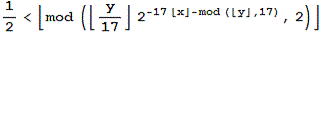
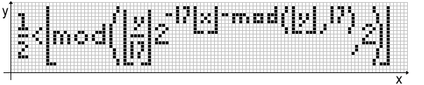
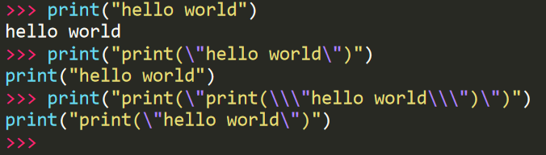

好久没写文章了，因为我逐渐从细枝末节的技术细节中抽离出来了，想从一个更全面，更本质的层面去看待这世界，而那些东西很难写成文章。

不过今天看到一个有意思的东西，试着写写，写的不好请见谅，因为我是在失眠的状态下写的。

其实开始写的时候我想删了，感觉没什么好写的，因为这篇文章——[《自指机器的奥秘》](https://swarma.org/?p=3128)已经写得够详细了。

但是基于以下两点：

1. 想让更多人了解到这些有趣的知识
2. 我想用较为感性的方式而非理性的论述来表达

这么想着，我还是水一篇文章吧，哈哈哈哈。

---

我们知道，$y=x$ 能在平面上表示为一条直线，而 $y<x$ 则表示这条直线的右下侧区域，对吧。

那么，猜猜这个函数画出来是什么样子呢？



……

……

……

……

……

事实上，这个函数画出来是这样的：



就是它自身，神奇吗？我也觉得神奇。关于这个函数的细节，我就懒得写了，互联网嘛，能引用链接就引用链接：[Tupper 自我指涉公式：图象里竟然包含式子本身](http://www.matrix67.com/blog/archives/301)

这种**自我复制**的函数还不太好构造，不过我们可以用编程来搞搞~

自我复制嘛，用编程来搞就是写一段能输出自身源代码的代码。

首先，最简单的，比如要输出一句“hello world”用 Python 是这样写：

```python
print("hello world")
```

运行结果就是：

```
hello world
```

那么，要输出源代码，就得这样写：

```python
print("print(\"hello world\")")
```

运行结果就是：

```
print("hello world")
```

而要输出这句的源代码，就得再嵌套一层：

```python
print("print(\"print(\\\"hello world\\\")\")")
```

如此循环下去，无穷无尽……



~~(禁止套娃)~~

那么，就没有办法了吗？

办法肯定是有的，不然我也不会写这篇文章。

实际上，办法就在[《自指机器的奥秘》](https://swarma.org/?p=3128)这篇文章的后半段里，我懒得写就直接引用链接了~~（事实上我也不太懂）~~。

不过运用自己对编程语言的知识，网上查一下，照葫芦画瓢还是能搞出来的（还搞了两个）：

Python 语言版本：

```python
I='I=%r;print(I%%I)';print(I%I)
```

C 语言版本：

```c
#include <stdio.h>
char *I="#include <stdio.h>%cchar *I=%c%s%c;%cint main(){printf(I,10,34,I,34,10);}";
int main(){printf(I,10,34,I,34,10);}
```

运行之后得到的输出结果就是源代码本身，一模一样的。

代码的具体分析不难，无非就是通过精巧设计占位符和格式化的字符串来实现，但如果想要系统地在任意语言上都实现这种效果需要了解一下[Quine](<https://en.wikipedia.org/wiki/Quine_(computing)>)。

---

我本来是想着沿着 **自我复制->自我描述->自指->递归、分形、无穷->自我意识** 这条逻辑链写下去的，但是[《自指机器的奥秘》](https://swarma.org/?p=3128)这篇文章其实已经写得很详细了，我再写就画蛇添足了。

最后，说说我自己的一些想法吧。

关于意识，关于宇宙，关于爱，关于永恒的真理，我以前觉得理性至上、科学至上，只想寻找真理，喜欢严谨的公式，对“不懂科学技术”的人不屑一顾，比较高傲……但我现在觉得理智的思考是一方面，感情的体验也是不可或缺的。与其说对真理不再追逐了，倒不如说我相信“真理就在心中”，语言无法描述，只可意会不可言传，毕竟道可道，非常道。

耳得之而为声，目遇之而成色。外在的物质/能量/信息也都是真理的一部分/一方面的某种形式化/扭曲化的体现/显现。

仰望过星空吗？当看见那些穿越广袤浩瀚的宇宙的星光时，内心是否会有某种触动？

那不过是一些特定频率的电磁波进入眼睛经过大脑视觉神经元转译形成的图像而已，这样想着，是不是感觉缺了什么呢？

听音乐时，当那些旋律挑动你的心弦时，是否仿佛闻到了冬天校园里的味道？亦或夏天燥热的街道的味道？

那不过是一些特定频率的声波振动鼓膜经过大脑听觉神经元转译后激活相关记忆神经元的联想而已，是这样吗？

走在夜晚回家的路上时，栀子花或夜来香的味道沁入心脾时，会想起以前做过的那个朦胧的奇妙的梦吗？

那不过是一些特定结构的分子接触鼻腔黏膜经过大脑嗅觉神经元转译后激活相关记忆神经元的联想而已，仅此而已？

---
