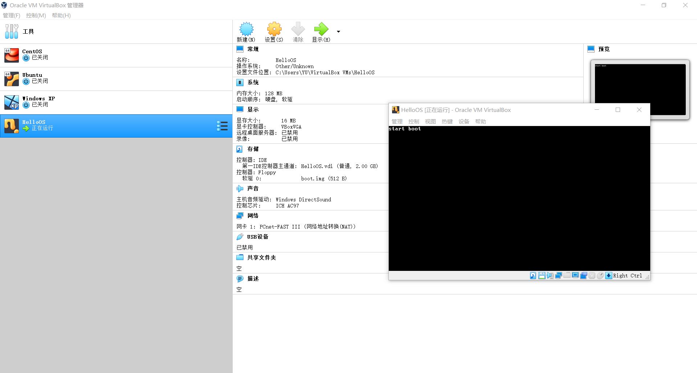
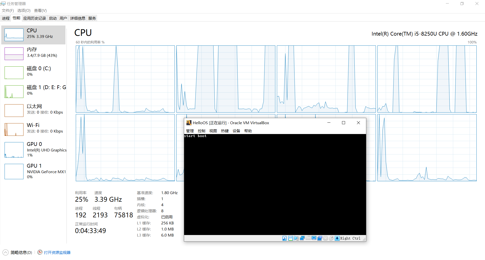
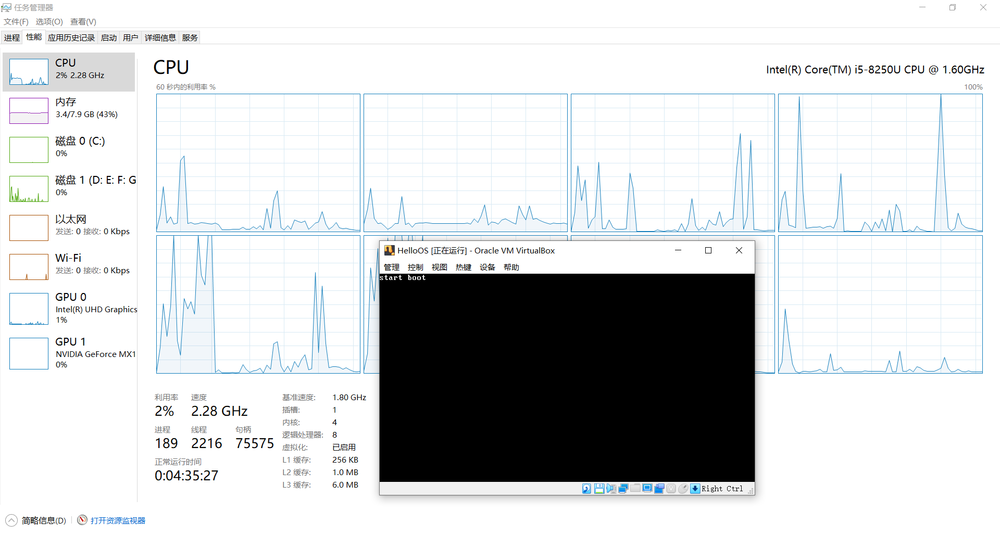

### HelloOS

虽然说我是电子信息工程专业的，平时学的基本是硬件和MCU，但我比较偏向软件，思来想去，写一个操作系统算是比较贴近这个专业，而且应该也挺有意思的。

写这个操作系统并不是拿来用的，我想没人会使用一个本科生写出来的操作系统吧。写这个操作系统的主要目的是学习计算机底层原理，把计算机知识融会贯通，还可以拿来做毕设。

不是在Linux内核上删删改改，而是真正的从零开始写一个“麻雀虽小，五脏俱全”的64位操作系统出来。

写应用程序可以借助丰富的库函数支持，而写操作系统则一切从零开始。为此，我进一步学习了计算机组成原理、操作系统、x86 Assembly、ANSI C和GNU C。

因为遇到不会的地方还得现学，平时还要上课、做项目等等，所以开发速度会很慢很慢很慢……

对了，我的操作系统得有个名字吧？就叫**HelloOS**吧！灵感来源于HelloWorld。

### 开发环境

写操作系统需要nasm汇编器和bochs虚拟机，因为微软的masm汇编器在64位Win10下已经不能用了，并且bochs能调试虚拟机内的操作系统，那就重新安装一个CentOS虚拟机专门拿来写操作系统吧。登陆官网一看，居然CentOS 8都出来了！安装！安装完之后发现屏幕分辨率总是800x600，太小了，更改了设置之后重启还是800x600，更改设置然后重启了几次都是这个分辨率，上网查发现是xrandr配置问题，毕竟这是CentOS 8的第一个版本，可能还有bug，那就换成之前的CentOS 7吧。CentOS 7我没安装GUI，而bochs虚拟机最好需要一个GUI，于是乎我开始安装GUI，Gnome感觉太臃肿了，最后决定用Xfce，然而似乎安装不了，源出了一点问题，又换源，换成阿里的折腾半天感觉太麻烦，索性不用CentOS了！我还有个Ubuntu，开启Ubuntu安装nasm和bochs很顺利，然而因为bochs的配置是基于命令行的，我又是自制操作系统，虚拟硬件环境配置问题很多，于是乎，卡在了第一步……

想了想，主要是虚拟机软件和汇编器这两个软件，虚拟机软件有现成的VirtualBox，汇编器就比较麻烦，微软官方的masm已经不能运行在64位的Win10下了，emu8086又不支持一些我需要用到的伪指令，最后抱着试一试的心态上网一查，欸嘿！nasm居然有64位Windows版本的！太好了！终于可以开始写操作系统了！

### BootLoader

写操作系统不是一件容易的事儿，因此我需要找一本适合开发操作系统的参考书。一开始找的是川合秀实写的《30天自制操作系统》这本书，写得是很不错，最后完成了一个多任务带窗口的32位操作系统。但问题是这本书年代有点久远了，工具链早就更新换代了，而电脑也早已进入64位的时代了。我想最后能写一个64位的操作系统，于是又找找找，找到了田宇写的《一个64位操作系统的设计与实现》，感觉还不错，于是就用这本书当参考书了。

当然，还是得从16位的8086实模式到32位的保护模式再到64位的IA-32e，不能一步登天。

同理，一开始我用虚拟软盘而不是虚拟硬盘，因为软盘的逻辑比较简单。这里选用3.5英寸的标准软盘格式，2个磁头，每个面80个磁道，每个磁道18个扇区，每个扇区512字节，所以初始容量是`2 x 80 x 18 x 512 B = 1474560 B = 1440 KB`

简单说一下计算机启动过程：首先，计算机上电后主板BIOS进行硬件自检以及初始化，然后查找并调用显卡BIOS程序，显卡BIOS进行初始化，这时候屏幕就有画面了。接着主板BIOS会查找其它设备的BIOS程序，找到之后同样要调用这些BIOS程序来初始化这些设备。一系列初始化完成之后CPU的CS:IP被设置指向逻辑地址`0000:7c00`处的指令，开始执行`0000:7c00`处的程序（为什么是`0000:7c00`，这要问当年Intel的BIOS工程师们）。通常这里的程序被称为BootLoader，还不是kernel。BootLoader和kernel的关系就像运载卫星的火箭与被火箭运载的卫星之间的关系一样。

第一个BootLoader程序如下：

```nasm
    org 0x7c00

start:
    mov ax, cs
    mov ds, ax
    mov es, ax
    mov ss, ax
    mov sp, 0x7c00

    ; clear screen
    mov ax, 0x0600
    int 0x10

    ; set focus
    mov ax, 0x0200
    mov bx, 0x0000
    mov dx, 0x0000

    ; display
    mov ax, 0x1301
    mov bx, 0x000f
    mov cx, 10
    mov dx, ds
    mov es, dx
    mov dx, 0x0000
    mov bp, StartBootMessage
    int 0x10

    ; reset floppy
    xor ah, ah
    xor dl, dl
    int 0x13

    jmp $

StartBootMessage:
    db "start boot"

    times 510 - ($ - $$) db 0x00
    db 0x55
    db 0xaa
```

这个程序只实现了Boot没实现Loader，先看看能不能运行。编译出来只有512B，一开始我总想着要填满1440KB因为软盘容量就是1440KB，然而当我抱着试一试的心态把这个512字节的程序加载进虚拟机开机运行的时候，奇迹出现了！



成功运行~

从开始写这篇文章（9月10日）到今天（10月13日），一个多月过去了，期间上课写作业做项目然后断断续续地学习操作系统相关知识，到今天总算能在虚拟机里面看见我写的程序成功运行了。感觉万里长征终于走完了第一步……

---

上面那个程序是参考的书上的，但那个`jmp $`让我感觉很不好，因为会占用CPU，应该换成`hlt`更好。实验了一下，果然如此：


这是`jmp $`版本的结果。可以看到，CPU 1（从0开始计数），就是被VBOX选中执行HelloOS的那个，跑到了100%，电脑上的风扇不一会儿就转得更快了。


这是`hlt`版本的结果。可以看到，几乎不耗费任何CPU资源。

---

*待续*

---
