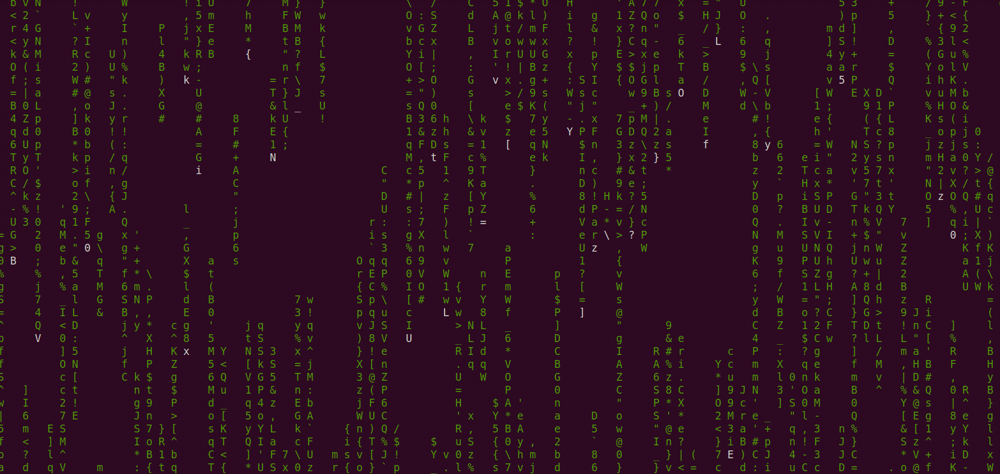

Linux系统上有许多有趣的命令，这里以Ubuntu为例，看看效果。

---

### 1. bb

这个命令叫bb，很奇怪对吧，其实他前面还有一个aa，意即“ASCII art”，详见[ASCII art - Wikipedia](https://en.wikipedia.org/wiki/ASCII_art)。简单来说就是只用ASCII字符做出动画……

这个GIF只截取了前面一小部分，这个甚至还有BGM，听着很燃的BGM看完这个艺术品心中只想感叹一句 厉害！

---

### 2. cmatrix

黑客帝国既视感。cmatrix，我猜应该是character matrix的缩写，意即“字符矩阵”。

---

### 3. cowsay

cow say，意即“奶牛说”。很无聊对吧……

---

### 4. hollywood

好莱坞电影黑客入侵既视感。

---

### 5. moo

moo……

---

### 6. oneko

一只小猫，它会跟着你的鼠标跑，很可爱。

---

### 7. sl

当你想输ls却不小心输入了sl，一节火车呼啸而过……

---

### 8. toilet

我不知道为啥很多命令的名字很奇怪，比如这个toilet，明明是洗手间的意思……

---
