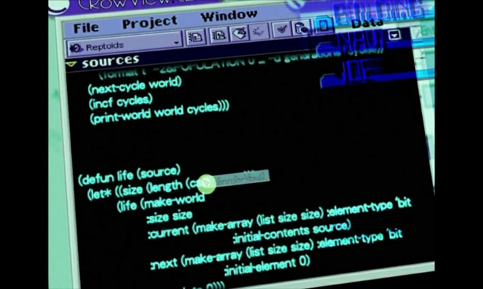

### 前言

我怎么开始搞函数式编程了呢？其实两年前就开始接触所谓的函数式编程了，当时是看了那本《黑客与画家》然后就产生了“LISP好厉害，我要学LISP”的想法……但是呢，当时就只是随便玩玩，根本就没入门，只是会使用一些map或者filter之类的东西。

两年后，看了一部动漫：《玲音（Serial Experiments: Lain）》，赛博朋克和意识流的佳作，里面也有函数式编程：



后来，不知道是什么缘分，知乎上有个人找到我，问我会不会Racket编程语言，能不能给她的孩子补习一下Racket，我想我也会一点Racket，就说好的，然后就谈妥了开始一对一网课。

妈呀，不上不知道，一上吓一跳，他们的Racket怎么这么不一样啊，map呢？filter呢？怎么全是cons？噢，滑铁卢大学的CS 135……好吧，马上学习！吭哧吭哧学下来，我大概算是摸清了滑铁卢的套路。不得不说滑铁卢的CS 135真的有点意思，打个比方就是说，学校只教会你使用最基本的拼音和汉字以及最基础的语法，然后就让你写出一首押韵的回文诗。

这篇文章只是用几个非常基本的小例子来展示一下函数式编程的样子，主要是与过程式编程和面向对象编程区别开来，因此并不能完全地体现出函数式编程的特性。

话不多说，开始。

---

### 1. len

len()函数应该是在各大编程语言中很常见的一个内置函数了，它的基本作用是求一个列表（list）的长度（length），即列表中元素的个数。那么，怎么用函数式编程的方式来实现len()这么一种函数呢？

注意，函数式编程一般不会用循环，因此如果直接循环遍历每一个结点然后cnt++这样是不合适的。

能用的只有两个基本特性：条件判断和递归。当然，基本的算术运算符肯定还是要用的。

这里用Racket语言当作例子。Racket是Scheme的一个分支，而Scheme是由LISP而来。

```scheme
;; (my-len l) Returns the number of elements in list.

;; my-len: (listof Any) -> Num
(define (my-len l)
  (cond
    [(empty? l) 0]
    [else (+ 1 (my-len (rest l)))]))

;; Examples:
(my-len '(1 2 3 4)); => 4
```

简单说一下

- cond表达式，它会依次计算参数列表中每个参数的第一个表达式，如果结果为真则计算该参数的第二个表达式，然后结束，如果都没有真，则计算else分支的表达式。整个cond也是一个表达式，因为在函数式编程里，任何子句都是纯粹的表达式。这个cond可以简单理解为C语言中的switch。
- empty?表达式，它会计算参数是否为空，返回布尔值。
- l（代表list，列表）是形参，其实参本质上是一个链表。
- rest表达式，它会返回除开链表头结点之后的剩余链表。

OK，再简单说一下这个函数是怎么算出列表长度的。

- 递归两大要素：基例和链条。基例就是，当列表为空时，返回0给上一层。
- 链条就是，每次递归到下一层时，最顶层表达式加1。递归到下一层传进去的实参是`(rest l)`，这样一直递归下去直到基例，当到达基例的时候，在最顶层看来就已经加了总元素个数那么多个1了，于是返回到最顶层的时候累加起来就得到了结果。

不理解没关系，因为这需要一定的前置知识的铺垫。没搞过函数式编程的话应该是看不懂的……

嘛，大概就是这样，就算出了一个列表的长度。

上面那个是最简单的版本，时间复杂度比较高，可以改进一下：

```scheme
; Tail Recursion version
(define (my-len-TR l)
  (define (iter l len)
    (cond
      [(empty? l) len]
      [else (iter (rest l) (+ len 1))]))
  (iter l 0))

;; Examples:
(my-len-TR '(1 2 3 4)); => 4
```

嗯……尾递归版本，要快一些。

### 2. map

map()函数是函数式编程的一个很常用的函数了，Python里面也有。简单来说就是把一个函数当成参数作用到后面列表的每一个元素上。

```scheme
;; (my-map f l) Constructs a new list by applying a function to each item on list. 

;; my-map: func (listof Any) -> (listof Any)
(define (my-map f l)
  (cond
    [(empty? l) empty]
    [else (cons (f (first l)) (my-map f (rest l)))]))

;; Examples:
(my-map string-upcase '("ready" "set" "go")); => '("READY" "SET" "GO")
```

尾递归版本：

```scheme
; Tail Recursion version
(define (my-map-TR f l)
  (define (iter l backward-result)
    (cond
      [(empty? l) (reverse backward-result)]
      [else (iter (rest l) (cons (f (first l)) backward-result))]))
  (iter l empty))

;; Examples:
(my-map-TR string-upcase '("ready" "set" "go")); => '("READY" "SET" "GO")
```

### 3. filter

filter()函数是函数式编程的一个很常用的函数了，Python里面也有。

```scheme
;; (my-filter p? l) Constructs a list from all those items on a list for which the predicate holds.

;; my-filter: func (listof Any) -> (listof Any)
(define (my-filter p? l)
  (cond
    [(empty? l) empty]
    [(p? (first l)) (cons (first l) (my-filter p? (rest l)))]
    [else (my-filter p? (rest l))]))

;; Examples:
(my-filter odd? '(0 1 2 3 4 5 6 7 8 9)); => '(1 3 5 7 9)
(my-filter even? '(0 1 2 3 4 5 6 7 8 9)); => '(0 2 4 6 8)
```

### 4. min/max

min()/max()这两个函数也是非常常用的，顾名思义，取出一个列表中的最小值/最大值。

```scheme
;; (my-min l) Determines the smallest number.

;; my-min: (listof Num) -> Num
(define (my-min l)
  (cond
    [(empty? (rest l)) (first l)]
    [(< (first l) (my-min (rest l))) (first l)]
    [else (my-min (rest l))]))

;; Examples:
(my-min '(1 2 3 4)); => 1


;; (my-max l) Determines the largest number.

;; my-max: (listof Num) -> Num
(define (my-max l)
  (cond
    [(empty? (rest l)) (first l)]
    [(> (first l) (my-max (rest l))) (first l)]
    [else (my-max (rest l))]))

;; Examples:
(my-max '(1 2 3 4)); => 4
```

### 5. sum

sum()这个函数也是非常常用的，顾名思义，对列表求和，前提是该列表的元素是数字。

```scheme
;; (my-sum l) Returns the summation of elements in list.

;; my-sum: (listof Num) -> Num
(define (my-sum l)
  (cond
    [(empty? l) 0]
    [else (+ (first l) (my-sum (rest l)))]))

;; Examples:
(my-sum '(1 2 3 4)); => 10
```

### 6. index

index()这个函数的作用是取出该列表中指定索引（index）的值。本质上就是查找一个链表中指定位置结点的值。

```scheme
;; (my-index l n) Extracts the n-th element from list. 

;; my-index: (listof Any) Num -> Any
(define (my-index l n)
  (cond
    [(zero? n) (first l)]
    [else (my-index (rest l) (- n 1))]))

;; Examples:
(my-index '(1 2 3 4) 3); => 4
```

---

### 运行结果

```scheme
(my-len '(1 2 3 4)); => 4
(my-len-TR '(1 2 3 4)); => 4

(my-map string-upcase '("ready" "set" "go")); => '("READY" "SET" "GO")
(my-map-TR string-upcase '("ready" "set" "go")); => '("READY" "SET" "GO")

(my-filter odd? '(0 1 2 3 4 5 6 7 8 9)); => '(1 3 5 7 9)
(my-filter even? '(0 1 2 3 4 5 6 7 8 9)); => '(0 2 4 6 8)

(my-min '(1 2 3 4)); => 1
(my-max '(1 2 3 4)); => 4

(my-sum '(1 2 3 4)); => 10

(my-index '(1 2 3 4) 3); => 4
```

以上。

---