### 前言

说是初探，其实我并不是想写一个入门的教程，因为网上关于排序算法的学习资料已经足够多了，我不想再增加无谓的冗余。

这篇文章主要是简单的梳理和总结，并对各个排序算法的时间复杂度做一个直观的认识，但不分析时间复杂度。

但是如果直接起名为“总结八大排序算法”的话未免看起来有点“排序算法学完了”的意思。之所以叫“初探”，是因为把这些排序算法梳理总结之后才算是刚刚入门吧。

### 排序算法

为了对各个排序算法的时间复杂度有一个直观的认识，这里我借助了[PTA](https://pintia.cn/)上的OJ来测试。

测试题目如下：
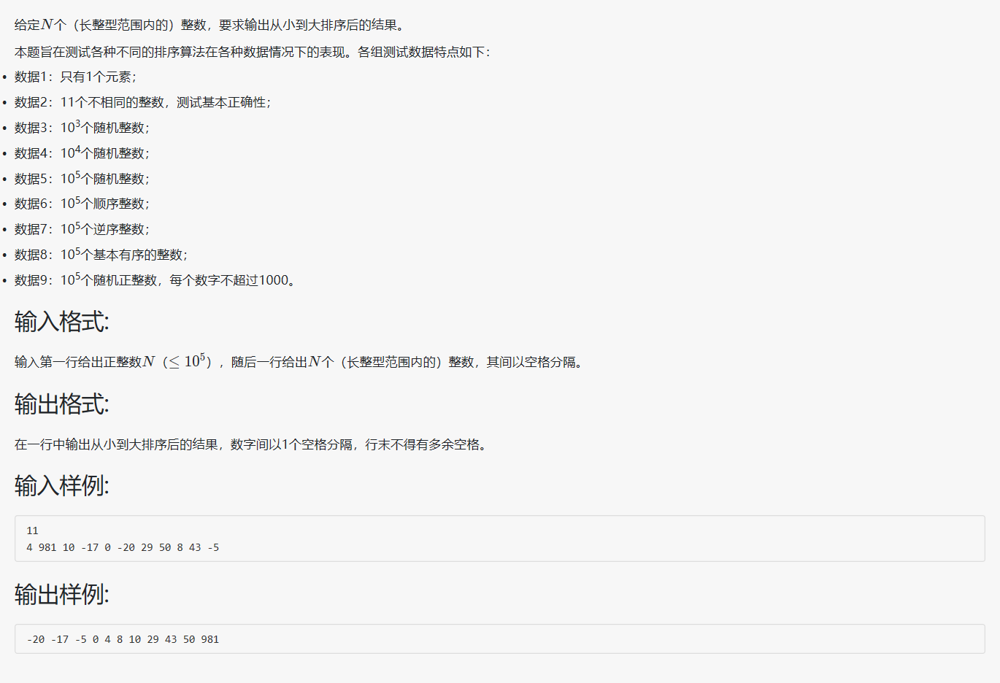

测试程序框架如下：
```c
#include <stdio.h>
#include <stdlib.h>

typedef long item_t;

void XXX_Sort(item_t arr[], int n)
{
    // Code...
}

int main(void)
{
    int n;
    scanf("%d", &n);
    item_t arr[n];
    for (int i = 0; i < n; i++)
    {
        scanf("%ld", &arr[i]);
    }

    XXX_Sort(arr, n);

    for (int i = 0; i < n; i++)
    {
        if (i != 0)
        {
            printf(" ");
        }
        printf("%ld", arr[i]);
    }

    return 0;
}
```

#### 冒泡排序

冒泡排序，一般学的第一个排序算法就是这个吧，不多说。

代码：
```c
void Bubble_Sort(item_t arr[], int n)
{
    int flag;
    item_t tmp;
    for (int i = 1; i < n; i++)
    {
        flag = 0;
        for (int j = 0; j < n - i; j++)
        {
            if (arr[j] > arr[j + 1])
            {
                tmp = arr[j];
                arr[j] = arr[j + 1];
                arr[j + 1] = tmp;
                flag = 1; // Identity swapped
            }
        }
        if (flag == 0)
        {
            break;
        }
    }
}
```

效率：
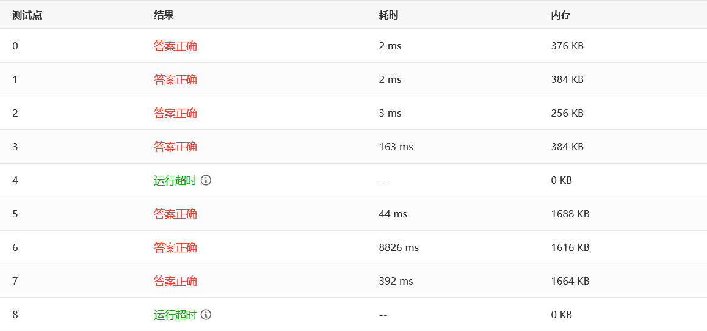

可以看到，测试点4和8直接运行超时了，测试点6用了八秒多，我们来看下一个。

#### 插入排序

插入排序，也叫直接插入排序，以区别于改进的插入排序（希尔排序）。想象你打扑克牌，每次从乱牌中摸一张出来插入到手中的有序序列中，这就是插入排序了。

代码：
```c
void Insertion_Sort(item_t arr[], int n)
{
    int i, j;
    item_t tmp;
    for (i = 1; i < n; i++)
    {
        tmp = arr[i];
        for (j = i; j > 0 && arr[j - 1] > tmp; j--)
        {
            arr[j] = arr[j - 1];
        }
        arr[j] = tmp;
    }
}
```

效率：
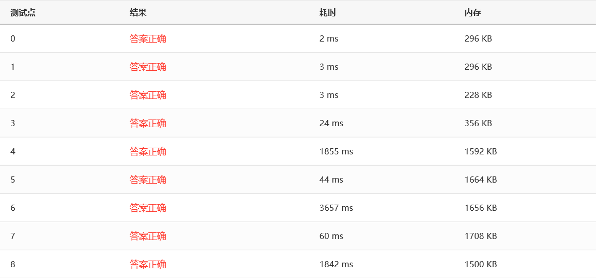

可以看到，所有测试点都通过了，最慢的测试点6用了三秒多，看起来比冒泡快了不少。

#### 希尔排序

希尔排序就是改进的插入排序，插入排序是每次两两相邻的比较，希尔排序是每次隔一段距离比较，这个距离取决于增量序列，不同的增量序列有不同的排序效率。这里我采用的是实际效果比较好的Sedgewick增量序列。

代码：
```c
int *Sedgewick(int n)
{
    static int sedgewick[Sedgewick_SIZE] = {0};
    for (int i = 0; i < Sedgewick_SIZE; i += 2)
    {
        sedgewick[i] = 9 * pow(4, i) - 9 * pow(2, i) + 1;
        sedgewick[i + 1] = pow(4, i + 2) - 3 * pow(2, i + 2) + 1;
    }
    return sedgewick; // {s[0]=1, s[1]=5, s[2]=19, s[3]=41, ..., s[Sedgewick_SIZE-1]}
}

void Shell_Sort(item_t arr[], int n)
{
    int *sedgewick = Sedgewick(n);

    int i, j, si;
    item_t tmp;

    for (si = Sedgewick_SIZE - 1; sedgewick[si] >= n; si--)
        ;

    for (int step = sedgewick[si]; si != -1; step = sedgewick[--si])
    {
        for (i = step; i < n; i++)
        {
            tmp = arr[i];
            for (j = i; j >= step && arr[j - step] > tmp; j -= step)
            {
                arr[j] = arr[j - step];
            }
            arr[j] = tmp;
        }
    }
}
```

效率：
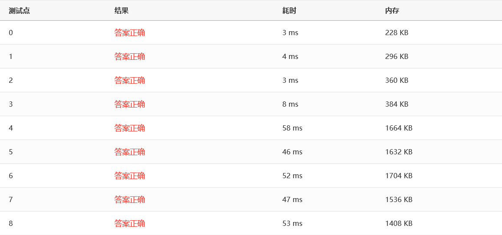

没有比较就没有伤害呀，可以看到，采用Sedgewick增量序列的Shell排序在所有的测试点表现都非常出色，最慢也不过是10ms这个数量级。

#### 选择排序

选择排序，顾名思义，就是每次都扫描一遍待排序序列然后选择最小/最大的一个元素移动到已排序序列的末端。

代码：
```c
void Selection_Sort(item_t arr[], int n)
{
    for (int i = 0; i < n - 1; i++)
    {
        int minPosition = i;
        for (int j = i + 1; j < n; j++)
        {
            if (arr[j] < arr[minPosition])
            {
                minPosition = j;
            }
        }
        if (minPosition != i)
        {
            item_t tmp = arr[i];
            arr[i] = arr[minPosition];
            arr[minPosition] = tmp;
        }
    }
}
```

效率：
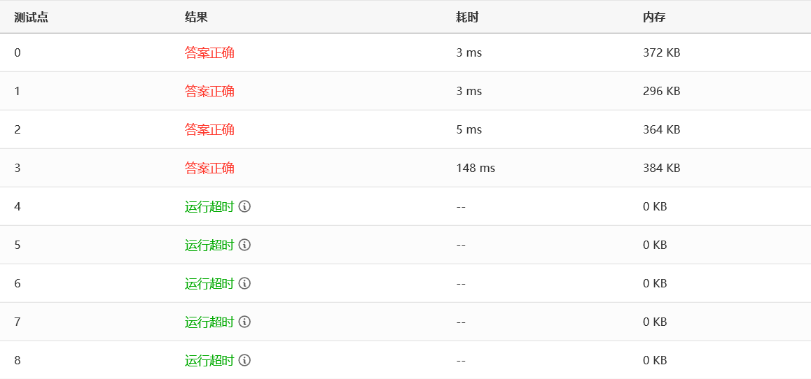

囧……比冒泡还慢……不过，幸好它还有一个改进版，请看下面。

#### 堆排序

既然选择排序是选择最小/最大的元素然后移动，主要耗费的时间其实在选择元素那里，因为每次都要扫描一遍，那么这时候堆(Heap)就派上用场啦。因为最小堆/最大堆的堆顶元素始终是最小/最大的那一个，而关于堆的构造是有一个线性时间复杂度的算法，因此使用堆可以大大提高选择排序的效率，这种排序就叫堆排序。

代码：
```c
void PercDown(item_t arr[], int r, int n)
{
    /* 将n个元素的数组中以arr[r]为根的子堆调整为最大堆 */
    int parent, child;
    item_t tmp;

    tmp = arr[r];
    for (parent = r; (parent * 2 + 1) < n; parent = child)
    {
        child = parent * 2 + 1;
        if ((child != n - 1) && (arr[child] < arr[child + 1]))
        {
            child++;
        }
        if (tmp >= arr[child])
        {
            break;
        }
        else
        {
            arr[parent] = arr[child];
        }
    }
    arr[parent] = tmp;
}

void Heap_Sort(item_t arr[], int n)
{
    for (int i = n / 2 - 1; i >= 0; i--)
    {
        PercDown(arr, i, n);
    }

    for (int i = n - 1; i > 0; i--)
    {
        item_t tmp = arr[0];
        arr[0] = arr[i];
        arr[i] = tmp;

        PercDown(arr, 0, i);
    }
}
```

效率：
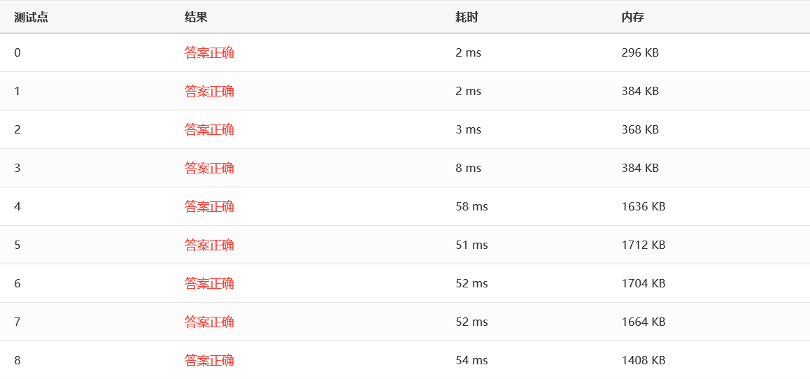

表现非常出色！所有测试点都在10ms这个数量级。而且理论上，堆排序确实是很优秀的一种算法。

#### 归并排序

归并排序，其实核心思想就是把两个已排序的序列归并成一个已排序的序列，然后递归罢了。说起来简单，实现起来并不简单……

代码：
```c
void Merge(item_t arr[], item_t tmpArr[], int left, int mid, int right)
{
    int tmp = left;
    int start = left, end = right;
    int leftEnd = mid - 1;

    while (left <= leftEnd && mid <= right)
    {
        if (arr[left] <= arr[mid])
        {
            tmpArr[tmp++] = arr[left++];
        }
        else
        {
            tmpArr[tmp++] = arr[mid++];
        }
    }

    while (left <= leftEnd)
    {
        tmpArr[tmp++] = arr[left++];
    }
    while (mid <= right)
    {
        tmpArr[tmp++] = arr[mid++];
    }

    for (int i = start; i <= end; i++)
    {
        arr[i] = tmpArr[i];
    }
}

void Merge_Pass(item_t arr[], item_t tmpArr[], int n, int length)
{
    int i;

    for (i = 0; i <= n - 2 * length; i += 2 * length)
    {
        Merge(arr, tmpArr, i, i + length, i + 2 * length - 1);
    }

    if (i + length < n)
    {
        Merge(arr, tmpArr, i, i + length, n - 1);
    }
    else
    {
        for (int j = i; j < n; j++)
        {
            tmpArr[j] = arr[j];
        }
    }
}

void Merge_Sort(item_t arr[], int n)
{
    int length = 1;
    item_t *tmpArr = malloc(n * sizeof(item_t));
    if (tmpArr != NULL)
    {
        while (length < n)
        {
            Merge_Pass(arr, tmpArr, n, length);
            length *= 2;
            Merge_Pass(tmpArr, arr, n, length);
            length *= 2;
        }
        free(tmpArr);
    }
    else
    {
        fprintf(stderr, "ERROR: There was not enough memory.\n");
        exit(-2);
    }
}
```

效率：
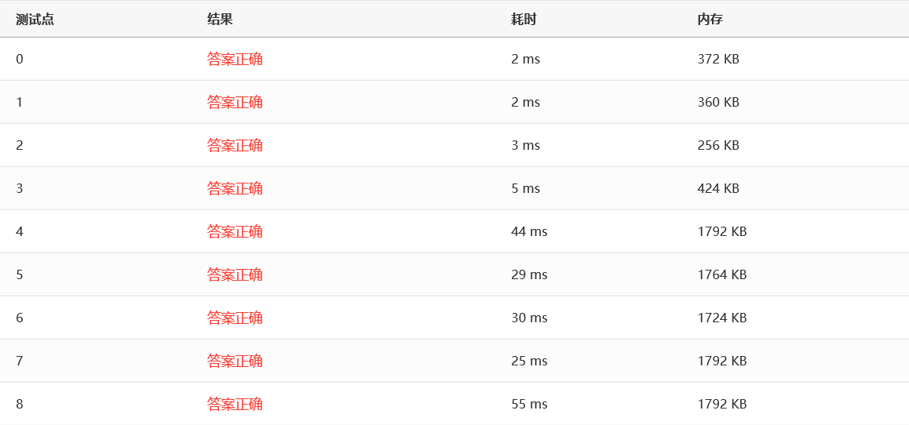

可以看到，归并排序也非常优秀。

（喂喂喂，就这么简短吗！）

#### 快速排序

接下来，终于到了传说中的，实际应用中最快的一种算法——快速排序算法！听名字就知道，快速排序非常快，嗯，让我们来看看到底有多快。

首先关于这个快速排序算法的几点，我需要说明一下：

1. 我这里参考了中国大学MOOC浙大的陈越老师的课程设置了一个快排阈值 CUTOFF ，当待排序的元素数量大于这个阈值时才进入快排，否则调用简单排序（这里我用的选择排序，冒泡排序也可以）。因为快速排序会频繁递归，当待排序的元素数量充分小时，快速排序可能还不如简单排序快。
2. 一般来说，快排的参数都有三个：待排序的元素首地址、左边起始下标、右边结束下标，网上的快排程序大多都是这样的。这里我把它简化到了两个参数：待排序的元素首地址、待排序的元素个数。因为快排会频繁地递归，所以原始版本会push push push…… pop pop pop……，这个版本就是push push…… pop pop……，总的来说，就是减少了大概三分之一的函数调用开销。我一开始以为会增加程序的复杂度，降低可读性，但是写完之后发现似乎并没有降低可读性，如果懂了快排的话那么这个程序应该还是很容易看懂的。并且这样刚好符合 void XXX_Sort(item_t arr[], int n) 这样的函数接口，就不用再重新写一个符合接口的函数然后再调用递归了。

代码：
```c
void swap(item_t *a, item_t *b)
{
    item_t tmp = *a;
    *a = *b;
    *b = tmp;
}

item_t median(item_t arr[], int n)
{
    int left = 0, right = n - 1;
    int center = (left + right) / 2;

    if (arr[left] > arr[center])
    {
        swap(&arr[left], &arr[center]);
    }
    if (arr[left] > arr[right])
    {
        swap(&arr[left], &arr[right]);
    }
    if (arr[center] > arr[right])
    {
        swap(&arr[center], &arr[right]);
    }

    swap(&arr[center], &arr[right - 1]);

    return arr[right - 1];
}

void Quick_Sort(item_t arr[], int n)
{
    if (n > CUTOFF)
    {
        int pivot, low, high;

        pivot = median(arr, n);
        low = 0;
        high = n - 2;

        while (1)
        {
            while (arr[++low] < pivot)
                ;
            while (arr[--high] > pivot)
                ;
            if (low < high)
            {
                swap(&arr[low], &arr[high]);
            }
            else
            {
                break;
            }
        }

        swap(&arr[low], &arr[n - 2]);

        Quick_Sort(arr, low);
        Quick_Sort(arr + low + 1, n - low - 1);
    }
    else
    {
        Insertion_Sort(arr, n);
    }
}
```

效率：
1. CUTOFF = 10 时
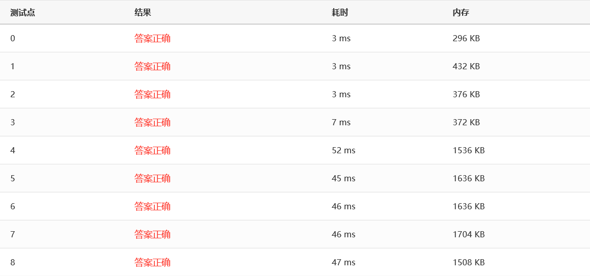
2. CUTOFF = 100 时
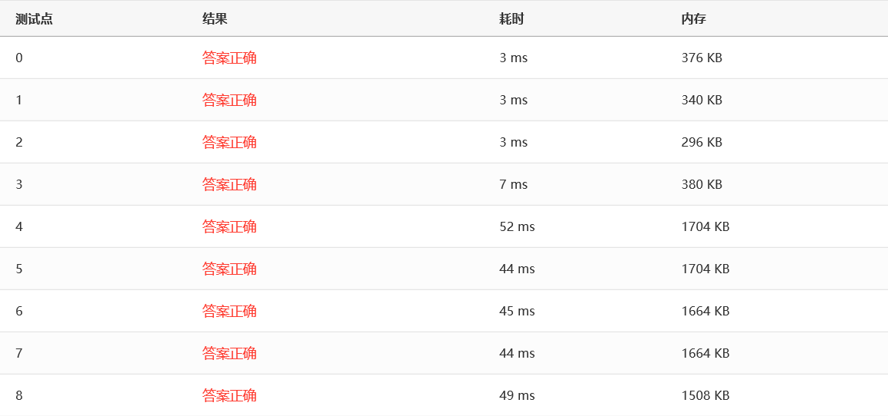
3. CUTOFF = 1000 时
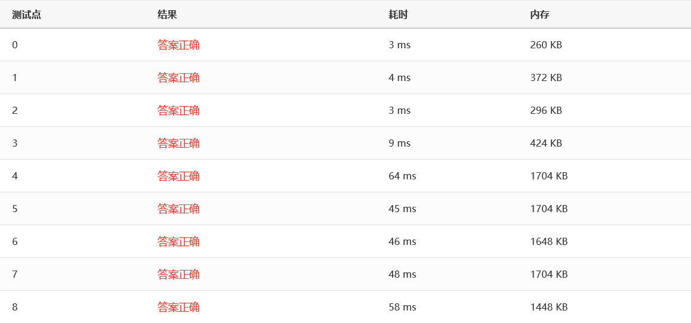

可以看到，当CUTOFF在10-1000这个范围时，效率几乎没有波动，而当CUTOFF超出这个范围时，效率会慢慢下降。总的来说，快速排序好像和希尔排序堆排序以及归并排序效率差不多。但是一般来说，面对一组充分大的随机数，快排表现通常都比其他排序要好一点。

#### 基数排序

理论上已经证明，基于比较的排序算法最快最快也是 O(NlogN) 这个时间复杂度的，换句话说，一个排序算法，如果想要突破 O(NlogN) 这个魔咒的话，就不能比较两个元素，那么问题来了，不能比较那还怎么排序啊？

我原以为，基于二分思想的快排已经是最快的了。但是，大千世界无奇不有，你想得到的想不到的其实都存在，基数排序就是其中之一。在某种情况下，基数排序算法能够在线性时间复杂度内完成排序。

那么基数排序到底是什么？我不讲，如果你不知道的话请去看《数据结构》这门课（MOOC、B站都有），一般都会讲的。

代码：
```c
typedef struct node *node_t;
struct node
{
    item_t key;
    node_t next;
};

struct headNode
{
    node_t head, tail;
};
typedef struct headNode bucket_t[RADIX];

int GetDigit(item_t item, int D)
{
    int digit;

    for (int i = 1; i <= D; i++)
    {
        digit = (int)item % RADIX;
        item /= RADIX;
    }
    return digit;
}

void Radix_Sort(item_t arr[], int n)
{
    int negativeFlag = 0;
    for (int i = 0; i < n; i++)
    {
        if (arr[i] < 0)
        {
            negativeFlag = 1;
            break;
        }
    }

    if (negativeFlag)
    {
        Insertion_Sort(arr, n);
    }
    else
    {
        int D, digit;
        bucket_t bucket;
        node_t tmp, p, list = NULL;

        for (int i = 0; i < RADIX; i++)
        {
            bucket[i].head = NULL;
            bucket[i].tail = NULL;
        }
        for (int i = 0; i < n; i++)
        {
            tmp = (node_t)malloc(sizeof(struct node));
            tmp->key = arr[i];
            tmp->next = list;
            list = tmp;
        }

        for (D = 1; D <= MAX_DIGIT; D++)
        {
            p = list;
            while (p)
            {
                digit = GetDigit(p->key, D);

                tmp = p;
                p = p->next;
                tmp->next = NULL;

                if (bucket[digit].head == NULL)
                {
                    bucket[digit].head = tmp;
                    bucket[digit].tail = tmp;
                }
                else
                {
                    bucket[digit].tail->next = tmp;
                    bucket[digit].tail = tmp;
                }
            }

            list = NULL;

            for (digit = RADIX - 1; digit >= 0; digit--)
            {
                if (bucket[digit].head)
                {
                    bucket[digit].tail->next = list;
                    list = bucket[digit].head;
                    bucket[digit].head = bucket[digit].tail = NULL;
                }
            }
        }

        for (int i = 0; i < n; i++)
        {
            tmp = list;
            list = list->next;
            arr[i] = tmp->key;
            free(tmp);
        }
    }
}
```

效率：
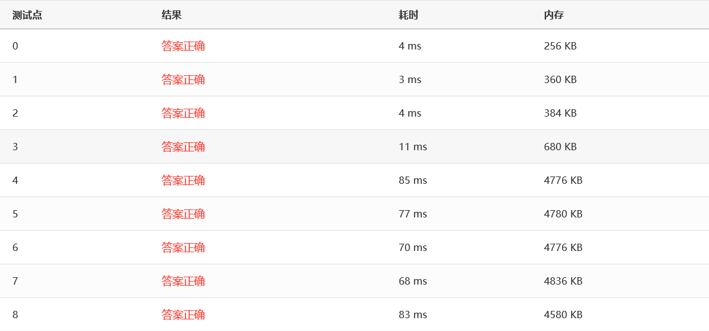

可以看到，似乎和快排他们表现差不多，原因应该是优化得不好，有大量的指针指来指去……

基数排序有一个致命的缺点：不好处理负数，更准确地说，是不好处理符号相反的数。这和它的原理有关，因为它不是比较大小而是把元素拆分成“基数”迭代进行桶排序。不过可以把基数排序改造一下，使它可以处理负数，但好像不怎么常用，也比较麻烦。所以我用了一种简单粗暴的方法：扫描一遍，有负数就用插入排序。哈哈哈……

### 另外两种排序

其实还有两种排序算法，分别是表排序和桶排序，如果加上这两种算法的话那就是所谓的“十大排序算法”了。这里简单说一下。

- 表排序：表排序适用于待排序元素特别大的情况下，比如每个待排序元素都是一部电影，那么把元素移来移去显然就会耗费很多时间，这个时候就换种思路，不移动元素本身，而移动元素的“索引”，把“索引”排序好后依照“索引”来看元素就是有序的了。
- 桶排序：桶排序其实就是低阶的基数排序。桶排序的原理就是给每个可能的待排序元素设置一个“桶”，然后扫描一遍，遇到的元素符合哪个“桶”就扔进去，最后把“桶”串起来就好了。

### 总结

最后，关于这八大排序算法的总结，可以用一张图来表示：


这篇文章看起来好长啊，不过如果把代码去掉还是挺短的，哈哈哈……

八大排序算法的全部代码我都上传到了GitHub上，请随意：[Sorting Algorithm](https://github.com/chen-qingyu/Data-Structure/tree/master/Sorting%20Algorithm)

以上。

---
