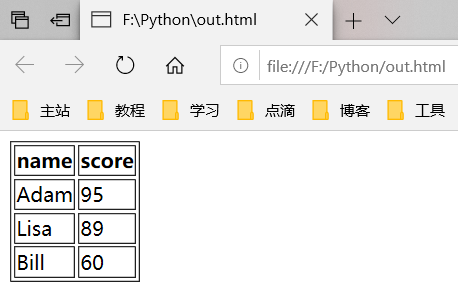

### 1. 进制格式化输出

代码：

```python
print("bin:{:6b},{:6b},{:6b},{:6b}".format(2, 4, 8, 16))
print("oct:{:6o},{:6o},{:6o},{:6o}".format(2, 4, 8, 16))
print("dec:{:6d},{:6d},{:6d},{:6d}".format(2, 4, 8, 16))
print("hex:{:6x},{:6x},{:6x},{:6x}".format(2, 4, 8, 16))
```

输出：

```
bin:    10,   100,  1000, 10000
oct:     2,     4,    10,    20
dec:     2,     4,     8,    16
hex:     2,     4,     8,    10
```

### 2. 序列倒序

代码：

```python
ch = "I LOVE YOU"
ls = [0, 1, 2, 3]
st = (0, 1, 2, 3)
print(ch[::-1])
print(ls[::-1])
print(st[::-1])
```

输出：

```
UOY EVOL I
[3, 2, 1, 0]
(3, 2, 1, 0)
```

### 3. \* 与 \*\* 参数

代码：

```python
def testTuple(*a):
    # *a 代表一个元组类型
    result = 0
    for i in a:
        result += i
    print(a)
    return result
def testDict(**b):
    # **b 代表一个字典类型
    result = ""
    for i in b:
        result += i
    print(b)
    return result
print(testTuple(1, 2, 3, 4))
print(testDict(m=1, n=2))
```

输出：

```
(1, 2, 3, 4)
10
{'m': 1, 'n': 2}
mn
```

### 4. this库

代码：

```python
import this
```

输出：

```
The Zen of Python, by Tim Peters

Beautiful is better than ugly.
Explicit is better than implicit.
Simple is better than complex.
Complex is better than complicated.
Flat is better than nested.
Sparse is better than dense.
Readability counts.
Special cases aren't special enough to break the rules.
Although practicality beats purity.
Errors should never pass silently.
Unless explicitly silenced.
In the face of ambiguity, refuse the temptation to guess.
There should be one-- and preferably only one --obvious way to do it.
Although that way may not be obvious at first unless you're Dutch.
Now is better than never.
Although never is often better than *right* now.
If the implementation is hard to explain, it's a bad idea.
If the implementation is easy to explain, it may be a good idea.
Namespaces are one honking great idea -- let's do more of those!
```

### 5. keyword库

代码：

```python
import keyword
print(keyword.kwlist)
print(len(keyword.kwlist))
```

输出：

```
['False', 'None', 'True', 'and', 'as', 'assert', 'async', 'await', 'break', 'class', 'continue', 'def', 'del', 'elif', 'else', 'except', 'finally', 'for', 'from', 'global', 'if', 'import', 'in', 'is', 'lambda', 'nonlocal', 'not', 'or', 'pass', 'raise', 'return', 'try', 'while', 'with', 'yield']
35
```

### 6. dis库

代码：

```python
import dis
def foo(a, b):
    return a + b
dis.dis(foo)
```

输出：

```
 55           0 LOAD_FAST                0 (a)
              2 LOAD_FAST                1 (b)
              4 BINARY_ADD
              6 RETURN_VALUE
```

### 7. os库

代码：

```python
import os
print(os.getcwd())
print(os.cpu_count())
print(os.getlogin())
print(os.urandom(10))
print(os.system("echo Hello World!"))
```

输出：

```
F:\Python
8
YU
b'\xd1c_?{2\xf9\xb7\x12G'
Hello World!
```

### 8. Unicode码

代码：

```python
ch = "0123456789\x00abcd\x00编程喵\x00(●'◡'●)"
print(list(map(ord, list(ch))))
# Python3中map()返回的不再是list而是iterators
```

输出：

```
[48, 49, 50, 51, 52, 53, 54, 55, 56, 57, 0, 97, 98, 99, 100, 0, 32534, 31243, 21941, 0, 40, 9679, 39, 9697, 39, 9679, 41]
```

### 9. 皮卡丘~

代码：

```python
print("""
　　 へ　　　　　／|
　　/＼7　　　 ∠＿/
　 /　│　　 ／　／
　│　Z ＿,＜　／　　 /`ヽ
　│　　　　　ヽ　　 /　　〉
　 Y　　　　　`　 /　　/
　ｲ●　､　●　　⊂⊃〈　　/
　()　 へ　　　　|　＼〈
　　>ｰ ､_　 ィ　 │ ／／
　 / へ　　 /　ﾉ＜| ＼＼
　 ヽ_ﾉ　　(_／　 │／／
　　7　　　　　　　|／
　　＞―r￣￣`ｰ―＿　
""")
# ' 或 " 不能包含换行符
```

输出：

```
　　 へ　　　　　／|
　　/＼7　　　 ∠＿/
　 /　│　　 ／　／
　│　Z ＿,＜　／　　 /`ヽ
　│　　　　　ヽ　　 /　　〉
　 Y　　　　　`　 /　　/
　ｲ●　､　●　　⊂⊃〈　　/
　()　 へ　　　　|　＼〈
　　>ｰ ､_　 ィ　 │ ／／
　 / へ　　 /　ﾉ＜| ＼＼
　 ヽ_ﾉ　　(_／　 │／／
　　7　　　　　　　|／
　　＞―r￣￣`ｰ―＿　
```

### 10. 列表生成式

代码：

```python
print([x * x for x in range(10) if x % 2])
d = {'Adam': 95, 'Lisa': 89, 'Bill': 60}
table = ["<tr><td>%s</td><td>%s</td></tr>" % (name, score) for name, score in d.items()]
with open("out.html", "w") as fo:
    fo.write('<table border="1"><tr><th>name</th><th>score</th></tr>' + "\n".join(table) + "</table>")
```

输出：

```
[1, 9, 25, 49, 81]
```



### 11. switch

代码：

```python
case = input("Please input a case: ")
switch = {'1': 'case 1', '2': 'case 2', '3': 'case 3'}
print(switch.get(case,'Invalid input'))
```

输出：

```powershell
PS F:\Python> .\test.py
Please input a case: 1
case 1
PS F:\Python> .\test.py
Please input a case: 2
case 2
PS F:\Python> .\test.py
Please input a case: 3
case 3
PS F:\Python> .\test.py
Please input a case: 4
Invalid input
```

### 12. 提取每一位数字

代码：

```python
print(list(map(eval, list(str(2333)))))
```

输出：

```
[2, 3, 3, 3]
```

---
