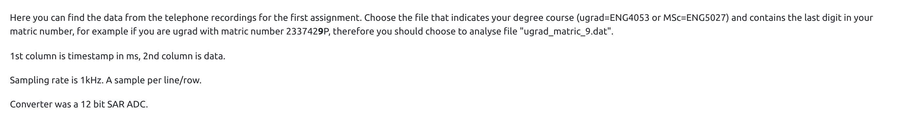
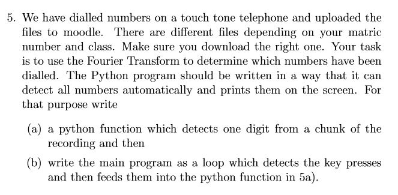
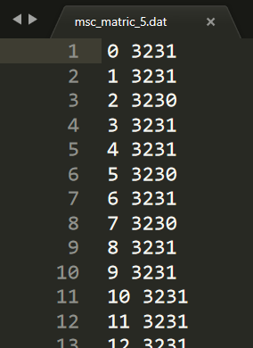
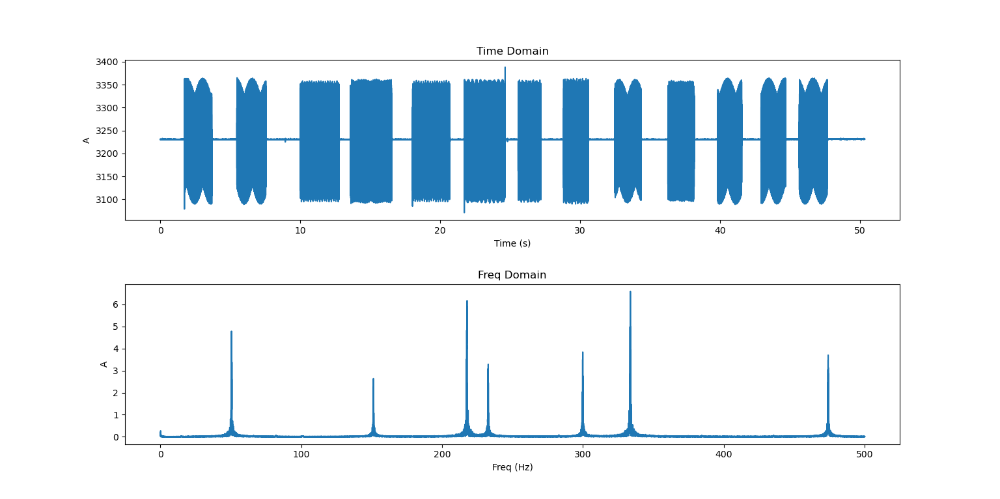
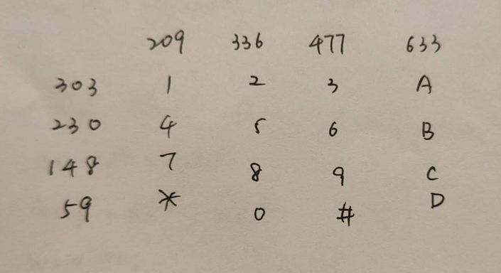
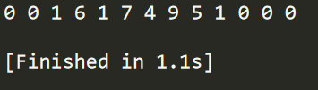

### 前言

我这标题起得怎么这么像课程论文呢……

啊，放心啦，这不是课程论文，这只是一个有趣（且值钱）的程序。

起因是这样的。我加了几个软件兼职群，前几天我发现其中有一个项目，是利用FFT识别信号啥的，报价700，性价比对于我来说我觉得挺高的了，看样子好像也不难，我就接了。

---

### 过程

#### 1. 理解题意

题目要求是这样的：





然后有一个五百多KB的dat文件和一个频号对应表。就是说，要用傅里叶变换把dat文件里具体有哪些号码给识别出来。

看着还有点难度，看看PDF，噢，原来这是格拉斯哥大学工程系的一个Assignment……

以前有个新闻是说南京有个大学生通过分析采访视频里面的拨号音知道了周鸿伟的手机号码，大概就是这么回事儿。

#### 2. 读取数据

打开dat文件看一下，是这样的：



大概有五万多行。吭哧吭哧搞出来了数据读取模块：

```python
def read_data(file):
    ''' 读取数据 '''

    data = []

    with open(file, encoding='utf8') as fo:
        # 读取文件的每一行
        lines = fo.readlines()
        for line in lines:
            # 处理得到采样数据
            data.append(int(line.split()[1]))

    return data
```

OK，准备工作到此结束。

#### 3. 频谱图

要识别信号，首先得看一下信号大概长啥样子。这肯定要用到numpy和matplotlib咯。

学习了一下numpy的语法，参考了一下网上的代码吭哧吭哧搞出了频谱图：

```python
def calc_fft(data):
    ''' 计算频谱 '''

    # 采样长度
    length = len(data)

    # 根据采样率和采样长度生成时间序列
    t = np.linspace(0, length/SAMPLE_RATE, length)

    # 将采样数据转换成numpy的array格式
    xt = np.array(data)

    # 利用np.fft.rfft()进行FFT计算
    xf = np.fft.rfft(xt) / length

    # 根据采样率和采样长度计算出每个下标对应的真正频率
    freqs = np.linspace(0, SAMPLE_RATE/2, length//2+1)

    # 取绝对值表示幅值
    xfa = np.abs(xf)

    return (freqs, xfa)


def plot_diagram(data):
    ''' 绘制数据的时域和频域图像 '''

    length = len(data)
    t = np.linspace(0, length/SAMPLE_RATE, length)
    xt = np.array(data)

    (freqs, xfa) = calc_fft(data)

    # 作图
    plt.subplot(2, 1, 1)
    plt.title("Time Domain")
    plt.xlabel("Time (s)")
    plt.ylabel("A")
    plt.plot(t, xt)

    plt.subplot(2, 1, 2)
    plt.title("Freq Domain")
    plt.xlabel("freq (Hz)")
    plt.ylabel('A')
    plt.plot(freqs[1:], xfa[1:])  # [1:]去掉f=0的直流信号

    plt.subplots_adjust(hspace=0.4)  # 拉宽上下子图距离，不然会挡住字
    plt.show()
```

画出来是这个样子：



嗯……还挺好看的？

#### 4. 检测频率

要识别号码，首先得知道频率和号码之间的对应关系。查了查，这应该是一个DTMF，所谓的双音多频。

这里他们的对应表并不是国际标准推荐的，但是基本原理一样（个鬼啊！后面就会有坑。我怀疑这是格大专门搞来坑人的）。



然后参考了一下网上的代码吭哧吭哧搞出了频率：

```python
    # 计算频谱
    (freqs, xfa) = calc_fft(data)

    # 寻找高频和低频
    local = []
    for i in np.arange(1, len(xfa)-1):
        if xfa[i] > xfa[i-1] and xfa[i] > xfa[i+1]:
            local.append(xfa[i])
    local = sorted(local)
    loc = np.where(xfa == local[-1])
    high_freq = freqs[loc[0][0]]
    loc = np.where(xfa == local[-2])
    low_freq = freqs[loc[0][0]]
    # 查看具体频率，调试很有用
    # print('high_freq, low_freq = {:.2f}, {:.2f}'.format(high_freq, low_freq))
```

#### 5. 识别号码

找到高低频之后，接下来只需要把频率送到一个函数里进行判断就行了：

```python
'''
    209 336 477 633
303 1   2   3   A
230 4   5   6   B
148 7   8   9   C
59  *   0   #   D
'''
FREQ_ROW = (303, 230, 148, 59)
FREQ_COL = (209, 336, 477, 633)
# 频率号码对应表
FREQ_TABLE = {
    (FREQ_ROW[0], FREQ_COL[0]): '1',
    (FREQ_ROW[0], FREQ_COL[1]): '2',
    (FREQ_ROW[0], FREQ_COL[2]): '3',
    (FREQ_ROW[0], FREQ_COL[3]): 'A',

    (FREQ_ROW[1], FREQ_COL[0]): '4',
    (FREQ_ROW[1], FREQ_COL[1]): '5',
    (FREQ_ROW[1], FREQ_COL[2]): '6',
    (FREQ_ROW[1], FREQ_COL[3]): 'B',

    (FREQ_ROW[2], FREQ_COL[0]): '7',
    (FREQ_ROW[2], FREQ_COL[1]): '8',
    (FREQ_ROW[2], FREQ_COL[2]): '9',
    (FREQ_ROW[2], FREQ_COL[3]): 'C',

    (FREQ_ROW[3], FREQ_COL[0]): '*',
    (FREQ_ROW[3], FREQ_COL[1]): '0',
    (FREQ_ROW[3], FREQ_COL[2]): '#',
    (FREQ_ROW[3], FREQ_COL[3]): 'D',
}


def judge_char(high_freq, low_freq):
    ''' 判断字符 '''

    p = ''
    delta = 10  # 频率识别允许误差半径

    for row in range(len(FREQ_ROW)):
        for col in range(len(FREQ_COL)):
            row_check = FREQ_ROW[row]-delta < low_freq < FREQ_ROW[row]+delta
            col_check = FREQ_COL[col]-delta < high_freq < FREQ_COL[col]+delta
            if row_check and col_check:
                p = FREQ_TABLE[(FREQ_ROW[row], FREQ_COL[col])]

    return p
```

用了一个字典，看起来优雅一些。

#### 6. 分离单音

慢着！这号码是有顺序的，即要识别出正确的拨号顺序，而这是时域的信息，所以，光是频域还不行，得时域和频域结合起来看。

而从全局频谱图来看，时域信号显然不是等间隔的，所以没法等间隔提取单音。

一开始我想是检测时域拨号上升沿，即把一次拨号当成一次触发，触发flag上升沿检测识别，持续一段时间，如此循环就能把时域给走一遍然后把每一次拨号都检测到。

最后用了个比较复杂的方式写出来了。我没想到我有一天居然会用软件实现一个信号上升沿触发机制……

燃鹅，误差很大，好多位都没有识别出来。识别出来的数字倒是对了。怎么看对不对呢？我用的笨办法，用magic number截取时域信号看频谱然后人工查表识别。

我以为是上升沿检测的问题，毕竟在Python里面实现一个上升沿检测并且触发信号是“检测到号码”确实于我而言有点复杂，而一旦程序复杂就容易出错。

后来换了一种思路，检测一段时间内的时域信号峰值的最大值，大于一个阈值就判定为拨号中，也写出来了：

```python
def detect_all(data):
    ''' 识别所有号码 '''

    length = len(data)
    result = []  # 结果
    digit = []  # 待处理的一位拨号音频数据

    # 最少连续取样间隔，保证间隔内至少有一个完整的最低频率信号周期
    # 通过采样率除以最低频率向上取整计算得出
    # 对于msc_matric_5.dat，间隔是17
    interval = int(np.ceil(SAMPLE_RATE / min(min(FREQ_ROW), min(FREQ_COL))))
    # print(interval)

    # 检测开启阈值，大于此阈值才识别信号
    # 通过 (平均值 + (最大值-平均值)*比例) 计算得出
    # 比例值不能太大也不能太小，这里取0.2
    # 对于msc_matric_5.dat，阈值是3261
    threshold = int(np.mean(data) + (np.max(data) - np.mean(data))*0.2)
    # print(threshold)

    for i in range(length - interval):
        # 用了个列表生成式，根据阈值和间隔判断是否是有效信号
        if np.max([data[i] for i in range(i, i + interval)]) > threshold:
            digit.append(data[i])
        else:
            if len(digit) != 0:
                p = detect_one(digit)
                result.append(p)
                digit = []

    return result


def detect_one(data):
    ''' 识别一位号码 '''

    # 绘制每一位号码的时域和频域图像
    # plot_diagram(data)

    # 计算频谱
    (freqs, xfa) = calc_fft(data)

    # 寻找高频和低频
    local = []
    for i in np.arange(1, len(xfa)-1):
        if xfa[i] > xfa[i-1] and xfa[i] > xfa[i+1]:
            local.append(xfa[i])
    local = sorted(local)
    loc = np.where(xfa == local[-1])
    high_freq = freqs[loc[0][0]]
    loc = np.where(xfa == local[-2])
    low_freq = freqs[loc[0][0]]
    # 查看具体频率，调试很有用
    # print('high_freq, low_freq = {:.2f}, {:.2f}'.format(high_freq, low_freq))

    # 判断字符
    p = judge_char(high_freq, low_freq)

    return p
```

但是还是不对！误差仍然很大，和之前的方法似乎差不多。

正在我焦头烂额之际，我重新把每个频率打印出来仔细查看了一遍，发现……原来高频群的频率并不是真的都比低频群的频率高啊！显而易见，这不符合标准的DTMF信号定义，但是这个信号编码的方式又确实是DTMF……只能说，我大意了。

所以，其实只需要在判断字符那里加几行就行了：

```python
    # 判断字符
    p = ''
    p1 = judge_char(high_freq, low_freq)
    p2 = judge_char(low_freq, high_freq)
    if p1 != '' or p2 != '':
        p = p1 + p2

    return p
```

#### 7. 测试

OK，测试一下。

啊啊啊终于对了！



---

### 尾声

好！交货，拿钱！

客服抽成20%，所以我只能拿560。

欸？财务人员呢？

啊，最终还是拿到钱了哈哈哈~

第一次做几百块的项目，钱不算多，但是对我来说算是一个新的起点吧。

---

