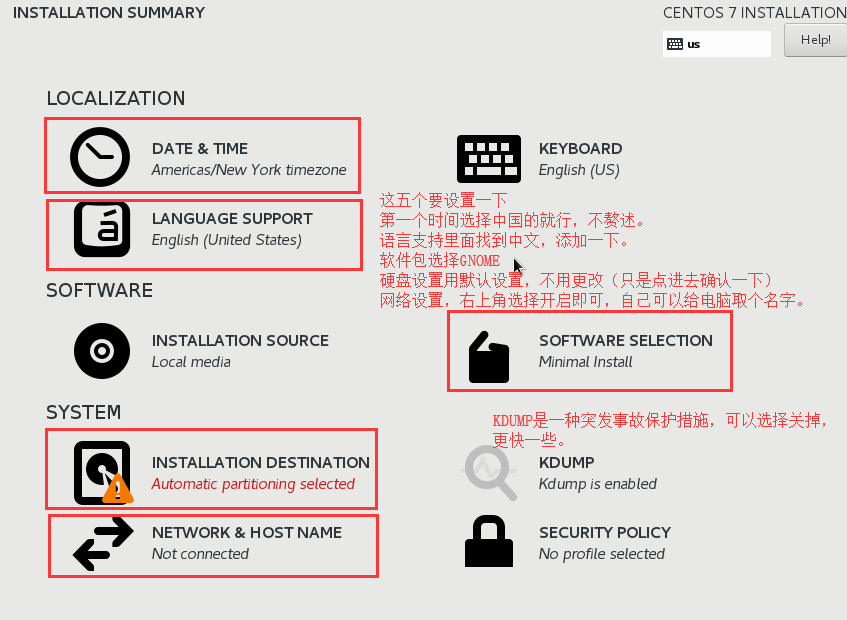

Linux发行版有很多，我们这里选择CentOS（以最新版 CentOS 7 为例），CentOS 属于 RedHat 系，服务器运行较稳定。

CentOS 下载地址：[Download CentOS](https://www.centos.org/download/)（下载 DVD ISO 文件）

VirtualBox 下载地址：[Download VirtualBox](https://www.virtualbox.org/wiki/Downloads)

都下载好之后，先把VirtualBox安装好，然后按照安装示例操作。

注意：别打开.iso文件，因为.iso文件相当于一个光盘，虚拟机直接加载整个光盘。随意改动会破坏其完整性。

---

多图预警

如果长时间黑屏的话请检查电脑是否开启了虚拟化支持

也可以选择最小化安装（默认）虽然没有图形界面，但很快，而且可以从头开始配置属于自己的Linux，很Geek！ 

---

另外，Ubuntu也是常用的一个Linux发行版。

Ubuntu下载地址：[Download Ubuntu](http://releases.ubuntu.com/)

安装过程与CentOS大同小异，不再赘述。

---

彩蛋：WindowsXP虚拟机

Windows XP Professional with Service Pack 3 (x86) - CD VL (Chinese-Simplified)

- 文件名：`zh-hans_windows_xp_professional_with_service_pack_3_x86_cd_vl_x14-74070.iso`
- SHA1：`D142469D0C3953D8E4A6A490A58052EF52837F0F`
- 文件大小：601.04MB
- 发布时间：2008-05-02
- 官方正版下载链接：`ed2k://|file|zh-hans_windows_xp_professional_with_service_pack_3_x86_cd_vl_x14-74070.iso|630237184|EC51916C9D9B8B931195EE0D6EE9B40E|/`
- 官方正版激活序列号：`MRX3F-47B9T-2487J-KWKMF-RPWBY`

---
