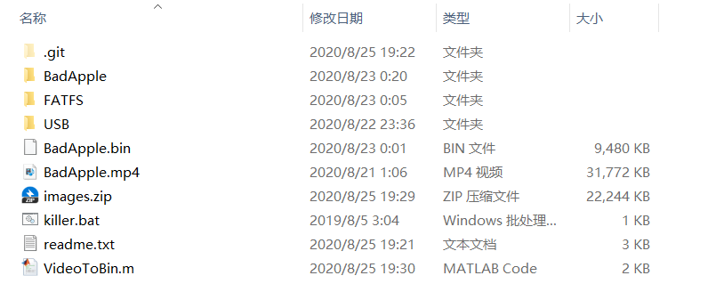

---
title: 有屏幕的地方就有Bad Apple之STM32+OLED版本
date: 2020-08-25 18:49:19
categories: Others
---

Bad Apple - STM32 OLED版本

<video src="./有屏幕的地方就有BadApple之STM32+OLED版本/video.mp4" controls="controls">您的浏览器不支持播放该视频</video>

MCU: STM32F103

OLED: 7-Pin SPI SSD1306

所有文件已上传至GitHub：[Bad-Apple-STM32-OLED](https://github.com/chen-qingyu/Bad-Apple-STM32-OLED)

---

整个工程文件如下：

BadApple.mp4是原版高清视频

VideoToBin.m是处理视频/处理图片的MATLAB代码

images.zip是视频抽帧后保存的图片压缩包

BadApple.bin是处理图片后保存的bin文件

FATFS是将W25Q128格式化为FATFS的工程

USB是将bin文件写入W25Q128的工程

BadApple是让OLED显示动画的工程

killer.bat是删除多余的工程中间文件的批处理代码

readme.txt是说明文本

---

使用步骤：

1. 用FATFS工程将W25Q128格式化为FATFS文件系统（如果W25Q128已经有FATFS了则跳过此步骤）

2. 用USB工程将bin文件从电脑导入W25Q128

3. 连接好电路，运行BadApple工程

---

开发步骤：

0. 今年寒假因为项目相关原因，借了同学一个32板子，准备开学还的，没想到因为疫情原因，借了整整一个学期。为表示感谢，整点事情。搞一个OLED版的BadApple吧，先买一个OLED模块，然后找到一个Bad Apple宽屏版的原版高清视频（找了好久，终于找到了一个原版高清视频，结果抽帧之后发现图片比例不对，宽高比是4：3的话resize成128x64之后就看起来太胖了。前面的白做了……于是又重新找，又找了好久终于在B站找到了宽屏版的视频，然后要下载的话比较麻烦，最后是用Python的一个第三方库：you-get通过命令行来下载的。没想到第零步就花了这么多时间）

1. 用VideoToBin.m抽取每一帧保存为128x64的BMP格式图片（然后就可以把视频处理部分的代码注释了，以后再用就只需处理图片了，比如《有屏幕的地方就有Bad Apple之ASCII版本》，处理视频实在是有点耗时）

2. 用VideoToBin.m把图片转换成bin文件（核心就是二值化，这样每个像素占用空间从原来的 3通道 x 8bit = 24bit 降低到了 1通道 x 1bit = 1bit，于是约222MB的图片就能压缩成一个约9.25MB的文件，而W25Q128有16MB的容量，足够了。然后再把图片压缩成一个压缩包，毕竟两百多M传输太慢）

3. 用FATFS工程将W25Q128格式化为FATFS文件系统（如果W25Q128已经有FATFS了则跳过此步骤）

4. 用USB工程将bin文件从电脑导入W25Q128（USB协议真的好复杂啊……）

5. （划掉）用FATFS工程计算bin文件的物理地址（原理是在W25QXX的读取函数内部嵌入一句发送地址的语句，然后用FATFS读取bin文件的第一个字节，将地址通过串口打印即可。文件地址一般是连续的，于是就可以直接用内部SPI通过绝对地址来读取数据，这样比通过FATFS来读取速度快很多）

6. 连接好电路，运行BadApple，大功告成~（咦？怎么是上下颠倒的？改代码，不行，OLED的GRAM很奇怪，不是线性顺序的。于是吭哧吭哧查资料查datasheet，在OLED初始化里设置COM扫描方向那里试了半天，终于弄好了。咦？怎么播放到最后一小段是乱码？视频/图片/bin文件都没有问题，难道是传输过程中出错了？不应该，USB有校验的。推测可能是9.25MB的文件对于FLASH来说太大了，FATFS把它分成了两部分储存，所以读连续地址就不管用了。改用FATFS的读取函数试试，终于对了……所以，前面的又白做了）

---
