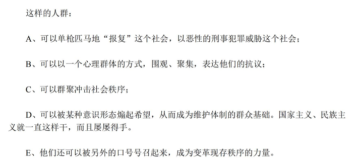

《后浪》一出，阶级矛盾被进一步放大。B站上《韭浪》、《非浪》等讽刺作品层出不穷，且有向娱乐化发展的趋势。许多人讨论这件事，或激进，或戏谑，或讽刺，或感叹。这不妨看作是一种“发泄”，而“发泄”是暂时的，影响也有限。再之后就是沉闷，因为心理能量都“发泄”完了。

“翼装飞行女大学生不幸身亡”的新闻一出，知乎上有部分答案阴阳怪气地说这个女大学生家里有钱如何如何，抛开仇富心理不说，这位女大学生并没有做错任何事，无非就是安全措施没做到位导致了这个事件的发生。此事件为何会引发这么多的讨论？一说是死者亲属花钱买的热搜，目的是给景区压力以此加大赔偿/报复心理。我看还有另一部分原因，这个原因和《后浪》事件一样：阶级矛盾。若要仇富，那么真正该把矛头对准的，应该是“财产可以继承”这件事以及背后的法律条文。这个才是核心。

“权力不得继承”已是共识，那么下一步就是实现“财产不得继承”，这是阶级差异的源头之一。

---

“疫情使俄罗斯倒退了四十年”的笑话，让我想到了那个曾经的苏联。

奴隶主与奴隶、地主与农民、资本家与工人，阶级矛盾从未消失，以至于人们似乎已经默认这一切是正确的。直到十月革命一声炮响，一个本着为所有劳苦大众而创立的、没有剥削没有压迫的乌托邦，从文字描绘中，来到了现实。

然而，这个理想的实践最终失败了。

但这并不能否认那理想的崇高，更不能熄灭埋藏在每一个人心底最深处的那一颗火苗。

星星之火，可以燎原。

---

《国际歌》，全世界无产阶级最嘹亮的战歌，曾经响彻在巴黎、在冬宫、在柏林、在首尔、在东京、在井冈山，在延安……

> 从西伯利亚穿过伏尔加河向西
>
> 从高加索的雪山渡过里海往南
>
> 从烟囱森立的城市到一望无际的田地
>
> 整个欧亚大陆都沸腾起来了

如今，还有工人会唱这首歌吗。

---

看了《共产党宣言》之后，除了“全世界无产者，联合起来！”这句口号外，印象最深的还有这句话：

“代替那存在着阶级和阶级对立的资产阶级旧社会的，将是这样一个联合体，在那里，每个人的自由发展是一切人自由发展的条件。”

是的，“每个人的自由发展是一切人自由发展的条件”，这就是人类命运共同体。那时候，工作将不再是为了生存，而是为了体现自身价值。

---

要是学校里的《马克思主义基本原理》课程教材直接用《资本论》就好了，《马克思恩格斯文集》也行啊。《毛泽东思想和中国特色社会主义理论体系概论》课程教材直接用《毛泽东选集》和历届党和国家最高领导人的文集就好了啊。

---

我曾经是憧憬小资生活的，至少是精神上的小资。一杯咖啡，岁月静好，但那只是一厢情愿。有一面墙上用白底红漆写了八个字：“放弃幻想，准备战斗”，我觉得很合适。

我也曾经是社会达尔文主义的崇拜者，认为人分三六九等，认可优胜劣汰。但内心总有一种感觉，感觉这是不对的，感觉本末倒置了。

---

我能扯这些有的没的，想来也是因为还能吃饱穿暖，以及一点想要改变什么的愿望。若是出生在穷苦人家，不辛勤劳作就吃不饱饭的话，我还有时间想这些吗？

---

狼在吃羊时，羊群不是一起愤怒地拿角去攻击狼，而是麻木甚至内讧。

若是每一只羊都能明白自己的处境并且团结起来，有组织有纲领有行动，那将是一股巨大的力量。

---

---

“我相信这不是我一个人的经历：傍晚时分，你坐在屋檐下，看着天慢慢地黑下去，心里寂寞而凄凉，感到自己的生命被剥夺了。当时我是个年轻人，但我害怕这样生活下去，衰老下去。在我看来，这是比死亡更可怕的事。”——《沉默的大多数》

若是在革命年代，能为了理想而抛头颅洒热血，那样的话，没有衰老，没有疾病，没有贫困，有的只是坚定的信仰和一颗赤子之心，也是一种幸福吧。

---

在日复一日的生存压力下，在现代都市的欲望中，十年后，可还记得这些中二的理想？

---

