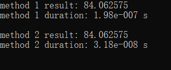
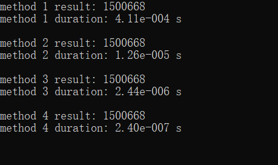
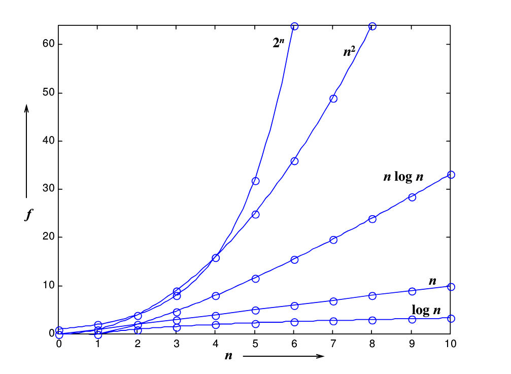

还记得我十个月前写的那篇文章：[浅谈计算圆周率](https://chen-qingyu.github.io/2019/01/12/浅谈计算圆周率/)吗？

在那篇文章里我用的是这种方法计算耗时：

```c
clock_t start, end;

start = clock();
// method_1(N);
// method_2(N);
// method_3(I);
method_4(I);
end = clock();

printf("time: %.2lf s\n", (double)(end - start) / CLOCKS_PER_SEC);
```

显然，这种方法很不方便，因为要比较不同的算法耗时的时候，只能一个一个注释再运行。如果要想要一次运行就把所有算法耗时都显示出来就需要把上面这段代码封装成为一个函数，该函数的入口参数是被测函数的地址，就需要用到函数指针。当时想到了这一点，但是~~因为懒~~没有去实现它。该来的总会来，在向IT行业转型的时候肯定需要用到这些东西，今天就把它搞定！（其实早就搞定了，只是今天才写文章）

一共有两个例子，并由这两个例子引出比较算法时间复杂度的模板。话不多说，首先来看第一个例子。

### 计算多项式

比较不同的计算多项式的算法的时间复杂度。

给定多项式：

$$
f(x)=a_{0}+a_{1} x+\cdots+a_{n-1} x^{n-1}+a_{n} x^{n}
$$

计算当 $x$ 等于某一值时 $f(x)$ 的值。

#### 暴力算法

一个很直接很暴力的算法就是按照定义来算：

```c
// n是最高幂次，a[]是升幂排列的多项式系数，x是要计算的那一点
double method_1(int n, double a[], double x)
{
    double y = 0;
    for (int i = 0; i <= n; i++)
    {
        y += a[i] * pow(x, i);
    }
    return y;
}
```

这种算法的时间复杂度是 $O(N^2)$ 。

#### 秦九韶算法

除此之外，还记得高中学过的一个计算多项式的算法——**秦九韶算法**吗？

将多项式化成如下形式：

$$
f(x)=a_{0}+x\left(a_{1}+x\left(\cdots\left(a_{n-1}+x\left(a_{n}\right)\right) \cdots\right)\right)
$$

因此代码可以简化为：

```c
double method_2(int n, double a[], double x)
{
    double y = 0;
    for (int i = n; i >= 0; i--)
    {
        y = a[i] + x * y;
    }
    return y;
}
```

这种算法的时间复杂度降到了 $O(N)$ 。

---

怎么直观地看出区别呢？写个时间测试函数吧：

```c
void time_test(pfun_t method)
{
    clock_t start, end;
    static int i = 0;
    i++;

    int loop = 1e7; // 多次运行取平均值
    double a[] = {0, 1, 2, 3, 4, 5, 6, 7, 8, 9}; // 升幂排列的多项式系数
    double result; // 计算结果

    start = clock();
    for (int i = 0; i < loop; i++)
    {
        result = method((sizeof(a) / sizeof(a[0]) - 1), a, 1.1); // 计算f(1.1)的值
    }
    end = clock();

    printf("method %d result: %lf\n", i, result);
    printf("method %d duration: %.2e s\n\n", i, (double)(end - start) / CLOCKS_PER_SEC / loop);
}
```

其中 `pfun_t` 是在开头定义的函数指针类型：

```c
typedef double (* pfun_t)(int n, double a[], double x);
```

好啦，这时候就可以在主函数里面直接调用测试函数了，想测几个就测几个。

```c
int main(void)
{
    time_test(method_1); // 暴力算法
    time_test(method_2); // 秦九韶算法
    getchar();
    return 0;
}
```

运行结果：


可以看到，在只有十项的时候耗时就已经差了一个数量级，如果是一百项，一千项呢？

### 计算最大子列和

什么是最大子列和问题？就是说，给定N个整数序列：

$$
\left\{A_{1}, A_{2}, \dots, A_{N}\right\}
$$

求函数

$$
f(i, j)=\max \left \{0, \sum_{k=i}^{j} A_{k}\right \}
$$

的最大值，其中 $1 \le i \le N, 1 \le j \le N$ 。

#### 暴力算法

首先，最直接的就是暴力循环，求出所有可能的连续子列和：

```c
int method_1(int n, int a[])
{
    int thisSum, maxSum = 0;
    for (int i = 0; i < n; i++)
    {
        for (int j = i; j < n; j++)
        {
            thisSum = 0;
            for (int k = i; k <= j; k++)
            {
                thisSum += a[k];
            }
            if (thisSum > maxSum)
            {
                maxSum = thisSum;
            }
        }
    }
    return maxSum;
}
```

这种算法的时间复杂度是 $O(N^3)$ 。

#### 改进的暴力算法

很显然上面的算法中，在计算子列和时，可以利用前一步的计算和的结果，并不需要每次从头累加，因此得到改进的暴力算法：

```c
int method_2(int n, int a[])
{
    int thisSum, maxSum = 0;
    for (int i = 0; i < n; i++)
    {
        thisSum = 0;
        for (int j = i; j < n; j++)
        {
            thisSum += a[j];
            if (thisSum > maxSum)
            {
                maxSum = thisSum;
            }
        }
    }
    return maxSum;
}
```

这种算法的时间复杂度是 $O(N^2)$ 。

俗话说，一个专业的程序员在看到一个算法的时间复杂度是 $O(N^2)$ 的时候都要下意识的想办法把它优化到 $O(N\log N)$ ，因此有了下面这个算法（这些算法当然不是我想出来的）：

#### 分治法

顾名思义，分治法就是将问题一分为二，缩小问题规模，递归求解。通常这种算法都是最快的了。快速排序算法也是基于这种思想。

```c
int divideAndConquer(int a[], int left, int right)
{
    int maxLeftSum, maxRightSum;
    int maxLeftBorderSum, maxRightBorderSum;
    int leftBorderSum, rightBorderSum;
    int center, i;

    if (left == right)
    {
        if (a[left] > 0)
            return a[left];
        else
            return 0;
    }

    center = (left + right) / 2;

    maxLeftSum = divideAndConquer(a, left, center);
    maxRightSum = divideAndConquer(a, center + 1, right);

    maxLeftBorderSum = 0;
    leftBorderSum = 0;
    for (i = center; i >= left; i--)
    {
        leftBorderSum += a[i];
        if (leftBorderSum > maxLeftBorderSum)
            maxLeftBorderSum = leftBorderSum;
    }

    maxRightBorderSum = 0;
    rightBorderSum = 0;
    for (i = center + 1; i <= right; i++)
    {
        rightBorderSum += a[i];
        if (rightBorderSum > maxRightBorderSum)
            maxRightBorderSum = rightBorderSum;
    }

    return MAX(maxLeftSum, maxRightSum, maxLeftBorderSum + maxRightBorderSum);
}

int method_3(int n, int a[])
{
    return divideAndConquer(a, 0, n - 1);
}
```

其中 `MAX()` 是我定义的一个宏：

```c
#define MAX(A, B, C) ((A) > (B) ? (A) > (C) ? (A) : (C) : (B) > (C) ? (B) : (C))
```

原来是一个函数，改成宏能快一点（点点点……）。

这种算法的时间复杂度是 $O(N\log N)$ 。

#### 在线处理算法

事实上所有你能想到和想不到的算法基本都已经有了，比如这个在线处理算法：

```c
int method_4(int n, int a[])
{
    int thisSum = 0, maxSum = 0;
    for (int i = 0; i < n; i++)
    {
        thisSum += a[i];
        if (thisSum > maxSum)
        {
            maxSum = thisSum;
        }
        else if (thisSum < 0)
        {
            thisSum = 0;
        }
    }
    return maxSum;
}
```

根据问题的定义，结果必定是一个非负数。因此可以通过抛弃负子列，来保证最大子列和是递增的。当扫描一遍，最大子列和不再递增时，当前的最大子列和即为解。

太优雅了有木有！

这种算法的时间复杂度是 $O(N)$ ！

---

同样的，时间测试函数如下：

```c
void time_test(pfun_t method)
{
    clock_t start, end;
    static int i = 0;
    i++;

    int loop = 1e5; // 多次运行取平均值
    int size = 100;
    int a[size];
    srand(0);
    for (int i = 0; i < size; i++)
    {
        a[i] = rand(); // 给定的整数序列
    }
    int result; // 计算结果

    start = clock();
    for (int i = 0; i < loop; i++)
    {
        result = method(size, a); // 计算最大子列和
    }
    end = clock();

    printf("method %d result: %d\n", i, result);
    printf("method %d duration: %.2e s\n\n", i, (double)(end - start) / CLOCKS_PER_SEC / loop);
}
```

只需要改一下函数指针和参数，就可以了。

主函数如下：

```c
int main(void)
{
    time_test(method_1); // 暴力循环法 O(N^3)
    time_test(method_2); // 改进的暴力循环法 O(N^2)
    time_test(method_3); // 分治法 O(NlogN)
    time_test(method_4); // 在线处理算法 O(N)
    getchar();
    return 0;
}
```

运行结果：


大概就是这种感觉。


---
