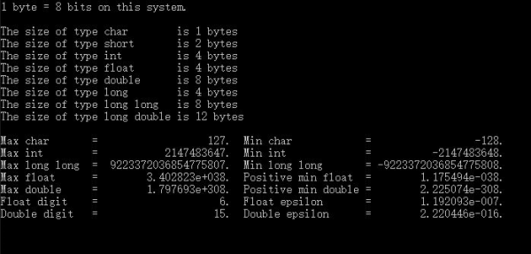
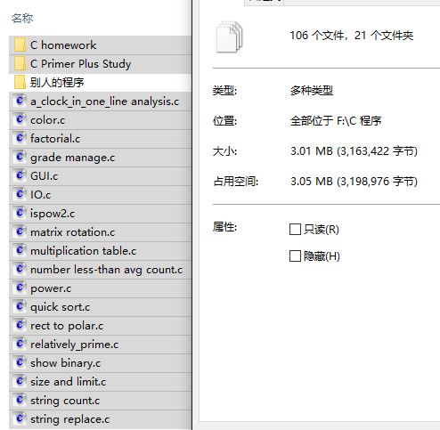
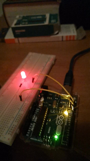
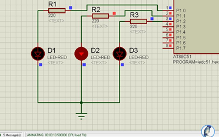

update 2024.06.24: 插入更新补充，斜体表示。

---

这篇文章的来源是我上大学以来写的学习日记，那个日记已经有半年没有更新了，估计以后也不会更新了，知识越来越庞杂，我也越来越懒，日记删了又舍不得，就精简成一篇文章分享出来吧。

### C 语言

大一上学期第一节电气概论课上电子科大的博士，柴松老师，给我们演示了一遍编程，很简单的程序，估算圆周率。那是我第一次见到编程，之后在老师的推荐下买了谭浩强那本书（顺便买了四级英语单词书，但把编程书看完了单词书也没翻到一半 ╮(╯﹏╰)╭），照着书上例子敲了人生中第一段代码，然后不知道怎么运行。当时还根本不懂什么编译、链接，也不懂 VC6.0 怎么用，最后折腾了半天莫名其妙地运行成功了，那一瞬间的激动和喜悦无以言表。

编程软件和帮助文档都是英文的，英语渣渣如我，只能拿着翻译 APP 挨个查单词意思，然后记下来。所幸这方面的英文单词也不算太多，不然我真的要考虑下中文补丁了。

开学两三个月左右，嵌协组织新生 C 语言比赛，学了点皮毛的我也去报名了。后来听说有计算机科学与技术学院（简称计院）的学生也会参加。和计院不同，我们电气工程学院（简称电工院）大一上学期并不开设编程相关的课程，所以我估计能混个优秀奖就行了，结果，最后成绩是二等奖，挺开心的。

上网查了资料，知道了 IDE 是个什么东西，然后从微软官网上下载了 VS2017，安装折腾了半天，最后终于打开了。从打开到运行一个 Hello World 程序用了我好几分钟……可能是这台电脑已经硬件老化了。09 年买的，用了快十年，让她运行最新的 VS2017 实在是有点难为她了。于是卸载 VS 下载 Code Blocks，明显好多了。

有个“国际 C 语言混乱代码大赛”，简称 IOCCC，画风简直鬼畜。其中有个获奖代码是这样的：

```c
main(_){_^448&&main(-~_);putchar(--_%64?32|-~7[__TIME__-_/8%8][">'txiZ^(~z?"-48]>>";;;====~$::199"[_*2&8|_/64]/(_&2?1:8)%8&1:10);}
```

问题是这段代码直接复制粘贴运行就输出了当前时间！看不懂怎么来的……C 语言果然是强大而灵活。QAQ

学完《C 程序设计》之后买了传说中的 C 语言入门神书《C Primer Plus》，八十九元……好厚一本，可以当砖头用了。客观来说，这本书确实严谨了许多且语言风趣。从头开始啃。章节后面的复习题和编程题逐一做完之后对照答案，让我想起了一句话：“学习知识最大的价值在于愉悦自己的大脑。”

利用头文件宏定义给这个陪了我多年的本本做了个环境检测，如图：



这个寒假还要自学 Arduino、仿真……大学的意思其实是“大不了自己学”吧 ╮(╯﹏╰)╭ 不管怎样，还要继续努力啊！

快过年了，学习了一下文件重定向。写了一个函数：

```c
void get_char(void)
{
    int ch;
    while((ch = getchar()) != EOF)
        putchar(ch);
}
```

这段代码堪称 C 语言文件操作的鼻祖，寥寥几行代码生成的程序，仅仅通过最简单的重定向之后就能进行读取文本文件、创建文本文件以及复制文本文件等一系列操作，感觉有点厉害。

许久没写这个记录了，现在已经是大一的暑假了，过了暑假我就成为学长了……感觉好快，新生都还没当够呢。

这期间，发生了许多事，好的坏的，总的来说好的事占大多数，每天都比较充实。

这期间，我看完了《C Primer Plus（第六版）》中文版，最后一章的 ADT 和二叉树实现有点难，准备看第二遍。看了看《C 语言点滴》，挺不错的。准备看《The C Programming Language》这本 Bible 级的白皮书。

这期间，在电脑上写了一些有意思的小程序，如图所示：



当然，上图中占用空间很大一部分是 homework 中那该死的实验报告 Orz。源代码差不多 100 个按每个 2KB 来算也就 200KB。

_更新补充：后来这个文件夹演变成了[C-Code](https://github.com/chen-qingyu/C-Code)_

这期间，分析了开头提到的那个鬼畜的程序，代码重构，递归化循环，目前分析到这一层：

```c
#include <stdio.h>
int main(void)
{
    for (int i = 447; i >= 0; i--)
        if (i % 64)
        {
            char a = -~7[__TIME__ - i / 8 % 8][">'txiZ^(~z?" - 48];
            char b = ";;;====~$::199"[i * 2 & 8 | i / 64] / (i & 2 ? 1 : 8) % 8;
            char c = a >> b;
            if (c % 2)
                putchar('!');
            else
                putchar(' ');
        }
        else
            putchar('\n');
    return 0;
}
```

我还没完全搞明白，深感自己知识不够。

_更新补充：后来完全搞明白了并写了一篇文章：[一段鬼畜的代码](https://zhuanlan.zhihu.com/p/60607289)_

探究了一下 C 语言的隐式转换，像

```c
if (-1 > 0U)
    printf("???\n");
else
    printf("Good!\n");
```

这种代码运行之后会输出???，因为-1 被隐式转换成了无符号类型的数，计算时就被解释为 UINT_MAX 了。用 strlen()函数时也要注意这种情况。

探究了一下浮点数的精度问题。浮点数比较时一般情况下最好不要用==直接判断相等，因为可能精度不够。

```c
if (fabs(f1 - f2) < FLT_EPSILON)
    printf("Equal\n");
```

最好用这种比较靠谱。

### Arduino

2018.01.09

安装好 IDE，连好电路，依葫芦画瓢敲完代码，烧录程序，点亮 LED，完成人生中第一次单片机实验。可能从小没见过什么大世面，看见个小灯闪烁就觉得很神奇。



完成“Hello World”实验、小灯闪烁实验。

2018.01.11

完成模拟值实验、流水灯实验。

2018.01.13

专门从某宝上买了一扎面包板跳线，结果好多坏的……

完成按键控制实验、有源蜂鸣器实验、无源蜂鸣器实验、PWM 调光实验、光控声音实验、热感灯实验，并将光控、热感与模拟值实验和小灯、蜂鸣器结合，实现了简易报警器。

2018.01.16

8x8 点阵的引脚太不规则了，和键盘一样……

红外接收器很奇怪，为什么电流从负极进正极出，难道有内置可充电源吗？

完成倾斜开关实验、火焰报警实验、一位八段共阴数码管实验（四位同理）、74HC595 实验、做舵机控制实验时 IDE 出了点问题，遂罢。

2018.01.20

原来数字接口的 PWM 复合接口可以直接用 analogWrite();函数实现模拟功能，并且不需要 setup

一个典型例子：呼吸灯，loop 代码如下：

```c
for(int i = 0; i <= 255; i++)
{
    analogWrite(pin, i);
    delay(10);
}
for(int i = 255; i >= 0; i--)
{
    analogWrite(pin, i);
    delay(10);
}
```

这样就用数字接口比较方便地实现了模拟输出功能

完成呼吸灯实验、舵机控制实验。

### Proteus

2018.01.24

部长给了我两个关键词：仿真、Proteus。于是下载了这个软件，结合 Keil 折腾了半天最后终于成功完成了第一次仿真实验：流水灯



2018.03.04

重温了一下 Keil 和 Proteus 的联调。再次做流水灯时发现延时函数的时长与晶振频率成反比关系：$delay(t)∝\frac{1}{f}$

### Linux

第一次装 Win10 + Ubuntu 双系统装崩了。

后来再写这个日记时， bash 已经换成 zsh 了。

---

_更新补充：我的大学时光啊……_
