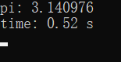
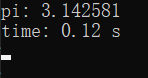
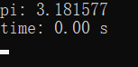
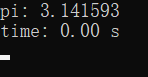

利用程序计算圆周率有很多方法，这里我们举四个小例子。

---

### 1. 统计方法

本质是随机撒点，也叫蒙特·卡罗法（Monte Carlo method）。

源代码：

```c
void method_1(int N)
{
    double x, y, hits = 0;
    for (int i = 0; i < N; i++)
    {
        x = (double)rand() / RAND_MAX;
        y = (double)rand() / RAND_MAX;
        if (x * x + y * y < 1.0)
            hits++;
    }
    printf("pi: %lf\n", (hits / N) * 4);
}
```

运行结果（N = 4000 * 4000）：



这里的 time 是在 `main()` 函数中调用的计时功能，后面会介绍。

`N` 取这么小是因为这里只是一个demo，真正要计算圆周率的话不可能这么小的。

---

### 2. 统计方法

如果说蒙特卡罗法本质是随机撒点，那么这个本质就是均匀撒点。

源代码：

```c
void method_2(int N)
{
    double x, y, hits = 0;
    for (x = 0; x < sqrt(N); x++)
        for (y = 0; y < sqrt(N); y++)
            if (x * x + y * y < N)
                hits++;
    printf("pi: %lf\n", (hits / N) * 4);
}
```

运行结果（N = 4000 * 4000）：



虽然结果精确度和蒙特卡罗法差不多，但快了许多，因为蒙特卡罗法每次循环都要调用 `rand()` 函数来产生伪随机数（不引入特殊设备的话，计算机是无法产生真正的随机数的）。

---

### 3. 数学方法

数学是一个强有力的工具，利用级数展开的公式可以快速估算圆周率。

$$
\frac{\pi}{4}=\sum_{i=0}^{\infty}\frac{(-1)^i}{2i+1}
$$

源代码：

```c
void method_3(int I)
{
    double pi = 0, k = 1;
    for (int i = 0; i < I; i++, k = -k)
        pi += k / (2 * i + 1);
    printf("pi: %lf\n", pi * 4);
}
```

运行结果（I = 25）:



因为数学方法和统计方法本质不一样，所以这里不再是循环次数 `N` 而是迭代次数 `I` （iteration）。

---

### 4. 数学方法

上面那个公式效果似乎不尽人意。当然我们可以增加迭代次数，但是否有收敛更快的公式呢？看看下面这个怎么样：

$$
\frac{\pi}{2}=\sum_{i=0}^{\infty}\frac{i!}{(2i+1)!!}
$$

源代码：

```c
void method_4(int I)
{
    double pi = 1, n = 1;
    for (int i = 1; i < I; i++)
    {
        n *= (double)i / (2 * i + 1);
        pi += n;
    }
    printf("pi: %lf\n", pi * 2);
}
```

运行结果（I = 25）:



Nice！

可以看到，仅仅25次迭代，就有如此高的精度，且耗费时间小于0.01秒，很不错呢。

---

对了，关于计时，其实很简单：

```c
clock_t start, end;

start = clock();
// method_1(N);
// method_2(N);
// method_3(I);
method_4(I);
end = clock();

printf("time: %.2lf s\n", (double)(end - start) / CLOCKS_PER_SEC);
```

`clock_t` 类型和 `clock()` 函数在 `time.h` 头文件中，`clock()` 调用一次即记录此时的程序已运行时间，两次调用做差，即得中间过程的运行耗时。

想查看完整的代码请访问我的 [GitHub](https://github.com/chen-qingyu/C-Programs)

---
