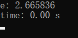
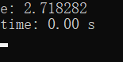
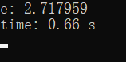

利用程序计算自然常数有很多方法，这里我们举三个小例子。

还是用之前计算圆周率的那个框架，Let's go!

---

### 1. 数学方法

这里我们用 e 的定义直接算：

$$
e=\lim_{i\rightarrow \infty }(1+\frac{1}{i})^i
$$

源代码：

```c
void method_1(int I)
{
    printf("e: %lf\n", pow(1 + 1.0 / I, I));
}
```

运行结果（I = 25）：



一行代码搞定(￣▽￣)"

Oh……似乎精度不够？毕竟这只是定义式，我们接下来换个收敛较快的公式。

---

### 2. 数学方法

这是一个很优美的公式：

$$
e=\sum_{i=0}^{\infty}{\frac{1}{i!}}
$$

源代码：

```c
void method_2(int I)
{
    double e = 1, n = 1;
    for (int i = 1; i < I; ++i)
    {
        n *= 1.0 / i;
        e += n;
    }
    printf("e: %lf\n", e);
}
```

运行结果（I = 25）：



可以看到，同样的迭代次数，精度明显提高了许多。

---

### 3. 统计方法

这种方法是 [@Milo Yip](https://www.zhihu.com/people/miloyip/) 在他的文章中写出来的，有点深奥。

源代码：

```c
void method_3(int N)
{
    unsigned i, j, k = 0;
    for (i = 0; i < N; i++)
        for (j = 0; j <= RAND_MAX; j += rand())
            k++;
    printf("e: %lf\n", (double)k / N);
}
```

运行结果（N = 4000 * 4000）：



背后的数学原理请参考：

[Uniform Sum Distribution](http://mathworld.wolfram.com/UniformSumDistribution.html)

[The Irwin-Hall Distribution](https://www.randomservices.org/random/special/IrwinHall.html)

---

想查看完整的代码请访问我的 [GitHub](https://github.com/chen-qingyu/C-Programs)

---
