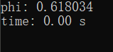
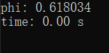

利用程序计算黄金分割率有很多方法，这里我们举两个小例子。

还是用之前计算圆周率的那个框架，Let's go!

---

### 1. 数学方法

源代码：

```c
void method_1(int I)
{
    int t1 = 1, t2 = 1;
    for (int i = 0; i < I; ++i)
    {
        int next = t1 + t2;
        t1 = t2;
        t2 = next;
    }
    printf("phi: %lf\n", (double)t1 / t2);
}
```

运行结果（I = 25）：



这里用的是斐波那契数列（Fibonacci sequence）来计算黄金分割率。

$$
\begin{equation} \begin{array}{l}{t_{n}=1,1,2,3,5,8,13,21,34, \ldots} \\ {\frac{1}{1}=1.000, \frac{1}{2}=0.500, \frac{2}{3} \approx 0.667, \frac{3}{5}=0.600} \\ {\frac{5}{8}=0.625, \frac{8}{13} \approx 0.615, \frac{13}{21} \approx 0.619, \frac{21}{34} \approx 0.618}\end{array} \end{equation}
$$

可以看到，随着项数增大，前一项与后一项的比值越来越接近黄金分割率，即 

$$
\lim_{n \rightarrow \infty} \frac{t_{n-1}}{t_{n}}=\frac{\sqrt{5}-1}{2}
$$

---

### 2. 数学方法

这里要用到连分数（continued fraction）。

第一次看到连分数时是阅读关于拉马努金（Srīṉivāsa Rāmāṉujan）的文章时看见的。此人天赋异禀，堪称鬼才，发现了许多画风奇特的数学公式，比如：

$$
\sqrt{\frac{1+\sqrt{5}}{2}+2}-\frac{1+\sqrt{5}}{2}=\frac{\mathrm{e}^{-\frac{2 \pi}{5}}}{1+\frac{\mathrm{e}^{-2 \pi}}{1+\frac{\mathrm{e}^{-4 \pi}}{1+\frac{\mathrm{e}^{-6 \pi}}{1+\cdots}}}}
$$

把黄金分割率 φ 、自然常数 e 和圆周率 π 联系在了一起。

还有很多我就不一一展示了，总之那些公式看得我头皮发麻……

连分数就像是一台数学显微镜，它能把放进去的数字的内部构造展现出来，让我们得以一窥精妙的造物之痕。现在，让我们把黄金分割率放进去...

$$
\frac{\sqrt{5}-1}{2}=\frac{1}{1+\frac{1}{1+\frac{1}{1+...}}}
$$

化为连分数后，整个式子只有数字1！

All in one, beautiful !

源代码：

```c
double sub(int I)
{
    if (I == 0)
        return 0.618;
    else
        return 1.0 / (sub(I - 1) + 1);
}

void method_2(int I)
{
    printf("phi: %lf\n", sub(I));
}
```

运行结果（I = 25）：



我用的递归来计算这个式子。

值得一提的是，递归基例我不知道是多少，一开始设置成1，结果是0.618034，对的。我又试了试0.5，结果还是0.618034，我有点摸不着头脑了。我再试了一下0.0，结果还是一样！有点方，稳住。我把输出的位数调大，调到了14位，因为double有效位数至少15位，再把迭代次数调小，这样就能明显地比较每个基例的收敛速度，于是我发现似乎在0.6左右时收敛最快……0.618！它的基例，正是它自己本身！这和它的连分数似乎有某种内在的联系，都是“1”……

Σ(っ °Д °;)っ

---

想查看完整的代码请访问我的 [GitHub](https://github.com/chen-qingyu/C-Programs)

---
