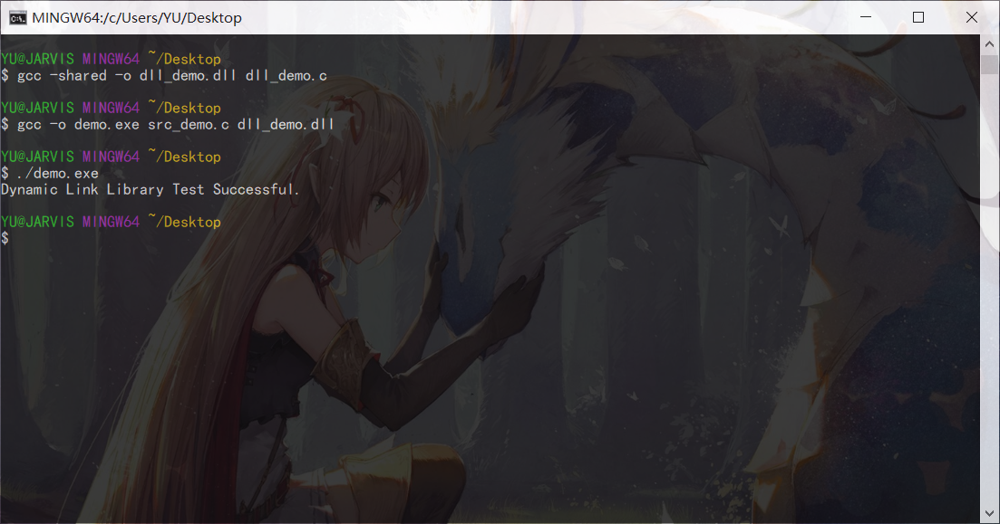

### 先简单讲一下DLL

在Windows下，DLL（Dynamic Link Library，动态链接库）是一个被编译过的二进制程序，但与.exe文件不同，.dll文件不能独立运行，必须由其他程序调用。

为什么有这东西呢？当然有其存在的好处啦：

1. 不限语言

   我们可以用自己熟悉的语言写DLL，然后由其他语言写的可执行程序来调用这些DLL。例如，可以用Python写程序的主界面，然后调用C写的实现一个具体功能的DLL模块。

2. 增强功能

   我们看到许多产品都提供了界面插件功能，允许用户动态地更换程序的界面，这就可以通过更换界面DLL来实现。 

3. 简化管理

   在一个大型项目开发中，通常都是由多个项目小组同时开发。我们可以将项目细分，将不同功能交由各项目小组以多个DLL的方式实现，这样，各个项目小组就可以同时进行开发了。

4. 节省空间

   如果多个应用程序需要同样的功能，那么可以将该功能以DLL的形式提供，这样在机器上只需要存在一份该DLL文件就可以了。另外，如果多个应用程序使用同一个DLL，该DLL只需要放入内存一次，所有的应用程序就都可以共享它了。

至于坏处嘛，就是写起来稍微麻烦一点。

在Linux环境下没有.dll文件，但也有类似的，对应的文件后缀名一般是.so（Share Object），可以看作同一个东西的不同称呼。

---

### GCC导出DLL示例

代码：

```c
/* src_demo.c */
#include <stdio.h>
extern char * test(void);
int main(void)
{
    printf("%s\n", test());
    return 0;
}
```

```c
/* dll_demo.c */
char * test(void)
{
    char * str = "Dynamic Link Library Test Successful.";
    return str;
}
```

命令：

```bash
gcc -shared -o dll_demo.dll dll_demo.c
gcc -o demo.exe src_demo.c dll_demo.dll
```

结果：



---
