update 2024.06.24: 增加彩蛋 Redox。

---

## 前言

Linux 发行版有很多，我们这里选择 CentOS Linux（以目前最新版 CentOS Linux 7 为例）。

CentOS Linux 下载地址：[Download CentOS](https://www.centos.org/download/)（下载 DVD ISO 文件）

VirtualBox 下载地址：[Download VirtualBox](https://www.virtualbox.org/wiki/Downloads)

都下载好之后，先把 VirtualBox 安装好，然后按照安装示例操作。

注意：别打开.iso 文件，因为.iso 文件相当于一个光盘，虚拟机直接加载整个光盘。随意改动会破坏其完整性。

## 步骤

多图预警

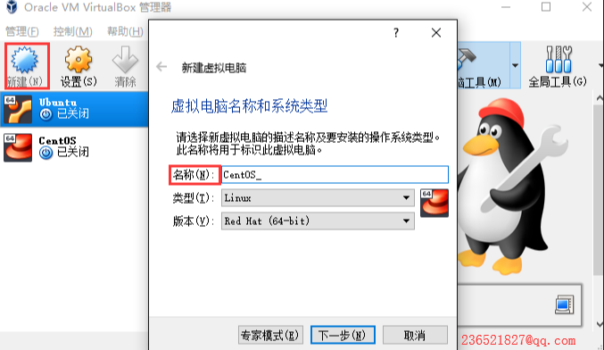

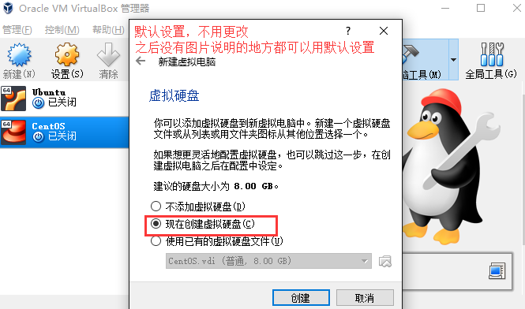

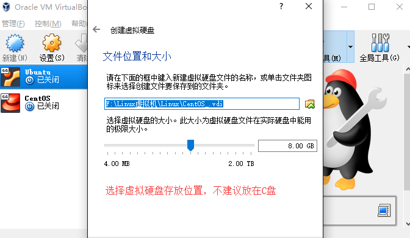

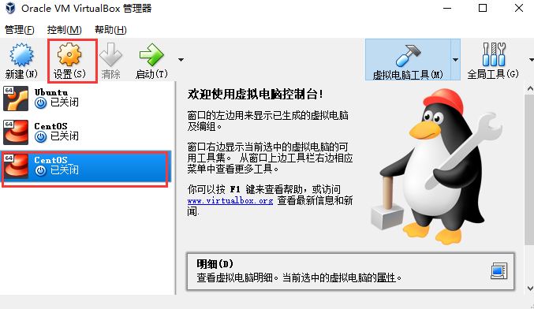

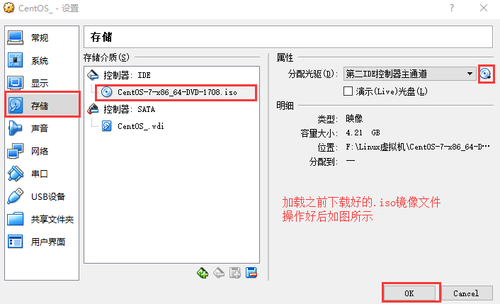

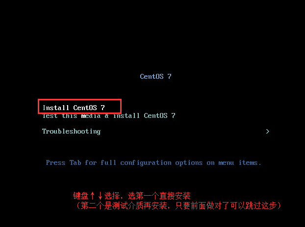

如果长时间黑屏的话请检查电脑是否开启了虚拟化支持

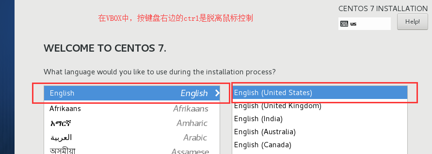

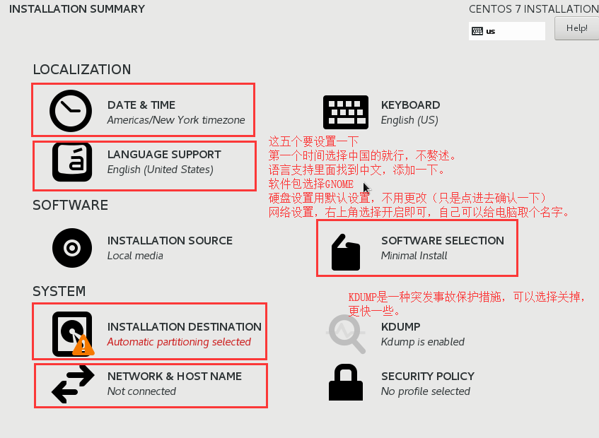

也可以选择最小化安装（默认）虽然没有图形界面，但很快，而且可以从头开始配置属于自己的 Linux，很 Geek！

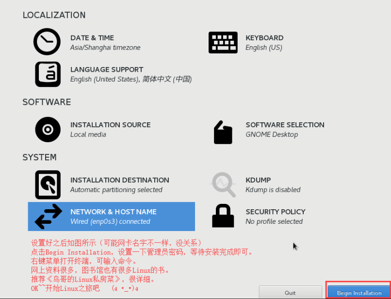

## 其他

市面上有很多 Linux 发行版，这里举例几个较为常用的：

- [Ubuntu](https://ubuntu.com)
- [Linux Mint](https://www.linuxmint.com)
- [Kali Linux](https://www.kali.org)

安装过程与 CentOS 大同小异，不再赘述。

## 彩蛋

1. WindowsXP

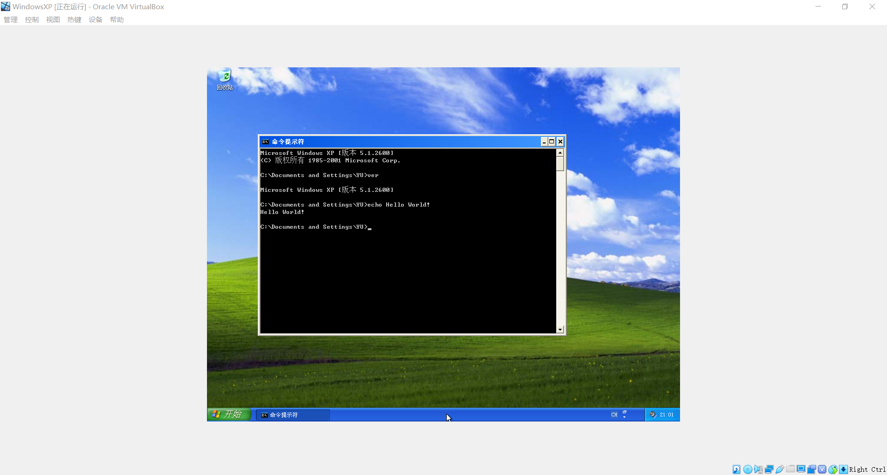

Windows XP Professional with Service Pack 3 (x86) - CD VL (Chinese-Simplified)

- 文件名：`zh-hans_windows_xp_professional_with_service_pack_3_x86_cd_vl_x14-74070.iso`
- SHA1：`D142469D0C3953D8E4A6A490A58052EF52837F0F`
- 文件大小：601.04MB
- 发布时间：2008-05-02
- 官方正版下载链接：`ed2k://|file|zh-hans_windows_xp_professional_with_service_pack_3_x86_cd_vl_x14-74070.iso|630237184|EC51916C9D9B8B931195EE0D6EE9B40E|/`
- 官方正版激活序列号：`MRX3F-47B9T-2487J-KWKMF-RPWBY`

2. Redox

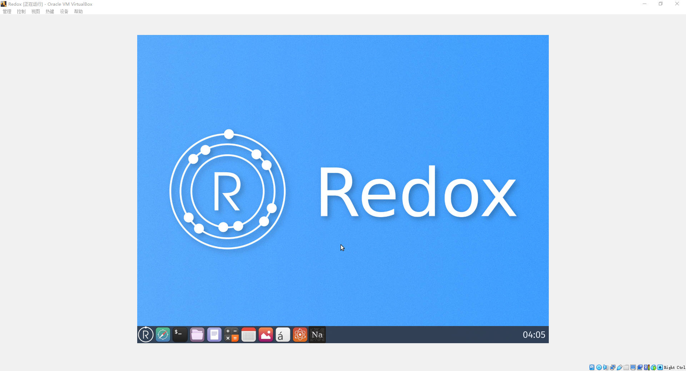

[Introduction](https://doc.redox-os.org/book/)
