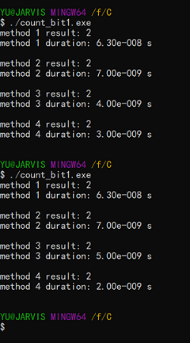

### 框架

用四种方法算算一个整数中位 1 的个数，关键词：位运算、效率。

首先把整个框架给出来，用上次我写的那个[比较算法时间复杂度的模板和例子](https://chen-qingyu.github.io/2019/11/14/比较算法时间复杂度的模板和例子/)：

```c
/*
比较不同的计算位1的个数的算法的时间复杂度
*/

#include <stdio.h>
#include <stdlib.h>
#include <math.h>
#include <time.h>
#include <limits.h>

#define INT_BIT (CHAR_BIT * sizeof(int))

typedef int (*pfun_t)(int x);

void time_test(pfun_t method);

int main(void)
{
    return 0;
}

void time_test(pfun_t method)
{
    clock_t start, end;
    static int i = 0;
    i++;

    int loop = 1e6; // 多次运行取平均值
    int result;     // 计算结果

    start = clock();
    for (int i = 0; i < loop; i++)
    {
        result = method(9); // 计算9中位1的个数 => 2
    }
    end = clock();

    printf("method %d result: %d\n", i, result);
    printf("method %d duration: %.2e s\n\n", i, (double)(end - start) / CLOCKS_PER_SEC / loop);
}

```

---

### 循环右移

要计算一个整数中位 1 的个数，最简单的就是循环右移然后取最低位就好啦~

代码：

```c
// 平均循环（INT_BIT）次
int method_1(int x)
{
    int cnt = 0;

    for (int i = 0; i < INT_BIT; i++)
    {
        cnt += (x >> i) & 1;
    }

    return cnt;
}
```

这个就不多说了，学过 C 语言的应该都能想到。平均循环（INT_BIT）次。

### 优化的循环右移

事实上，如果一个数只是低位有几个 1，高位都是 0，那么每次都循环 INT_BIT 次显然太浪费了，可以优化一下。

代码：

```c
// 平均循环（INT_BIT - N）次，N=前导零个数分布均值
int method_2(int x)
{
    int cnt = 0;

    if (x < 0)
    {
        // 去掉最高位方便逻辑右移，可移植
        x &= ~(1 << (INT_BIT - 1));
        cnt++;
    }

    while (x != 0)
    {
        cnt += x & 1;
        x >>= 1;
    }

    return cnt;
}
```

核心就是一个 while 循环，前面的 if 主要是处理负数的。因为 C 语言没有逻辑右移（不管是不是负数都补零）只有算术右移（如果是负数就补一），我试了一下确实没找到逻辑右移，所以只好在前面处理一下负数了，`x &= ~(1 << (INT_BIT - 1))`在我的电脑上其实就等价于`x &= 0x7fffffff`，这样做可移植性比较好（看起来比较高级而已，估计也没其他人运行这个程序）。

平均循环（INT_BIT - N）次，N=前导零个数分布均值。想不到在这里居然会碰上前导零……话说我还是在 STM32 的 uC/OS-III 内核里第一次看到前导零这个东东。理论上来说，N 应该可以算出一个确定的数值，具体涉及到有符号整数的二进制补码形式的前导零的概率分布，听起来似乎有点复杂，懒得算了……

### x &= x - 1 消去最右边的 1

原谅我实在是不知道这个方法该取什么名字，索性就这样叫吧……顾名思义，核心就是这个位运算：`x &= x - 1`，它可以消去`x`最右边的一，举个栗子：

```
  1010 (x=10)
& 1001 (10-1=9)
-------
  1000

  0111 (x=7)
& 0110 (7-1=6)
-------
  0110
```

我觉得这个栗子很清楚明白了，所以直接上代码：

```c
// 平均循环（INT_BIT/2 - N）次
int method_3(int x)
{
    int cnt = 0;

    while (x != 0)
    {
        x &= x - 1;
        cnt++;
    }

    return cnt;
}
```

平均循环（INT_BIT/2 - N）次，这里假设整数是均匀分布的，这样每一位是 0、1 的概率各为 50%，如果是其他分布的话就不是/2 了。到底要不要减去前导零个数分布均值我没有想明白，应该是要吧，大概，因为循环次数也和前导零有关系……

### 查表

最后出场的方法通常是最厉害的，这次……也不例外。
顾名思义，查表嘛，你要问我怎么查？请看代码：

```c
// 平均循环（INT_BIT/M - N）次，M=log2(sizeof(table))，N=前导零个数分布均值
int method_4(int x)
{
    // 0-15 位1的个数(M=4)
    static int table[] = {0, 1, 1, 2, 1, 2, 2, 3, 1, 2, 2, 3, 2, 3, 3, 4};

    int cnt = 0;

    if (x < 0)
    {
        // 去掉最高位方便逻辑右移，可移植
        x &= ~(1 << (INT_BIT - 1));
        cnt++;
    }

    while (x != 0)
    {
        cnt += table[x & 0xf];
        x >>= 4;
    }

    return cnt;
}
```

因为涉及右移，所以还是需要处理一下负数，然后查表。

平均循环（INT_BIT/M - N）次，M=log2(sizeof(table))，N=前导零个数分布均值。

---

### 总结

结果：



在算法的精简程度和时间复杂度之间需要有一个平衡，我觉得第三种方法取得了一个不错的平衡，核心代码就一个 5 行的 while 循环，因为是直接位运算也不需要考虑负数的情况。

如果需要更高的速度那么整一个 M=5 甚至 M=6 的查表法，如果还觉得想要更刺激一些，其实还有一些很变态的位运算方法，我从网上看到的，至今不太明白。那种方法不需要循环也不需要判断，直接几行位运算就得到结果了，估计怕是只有游戏核心引擎里才需要那么快的速度吧。

---
