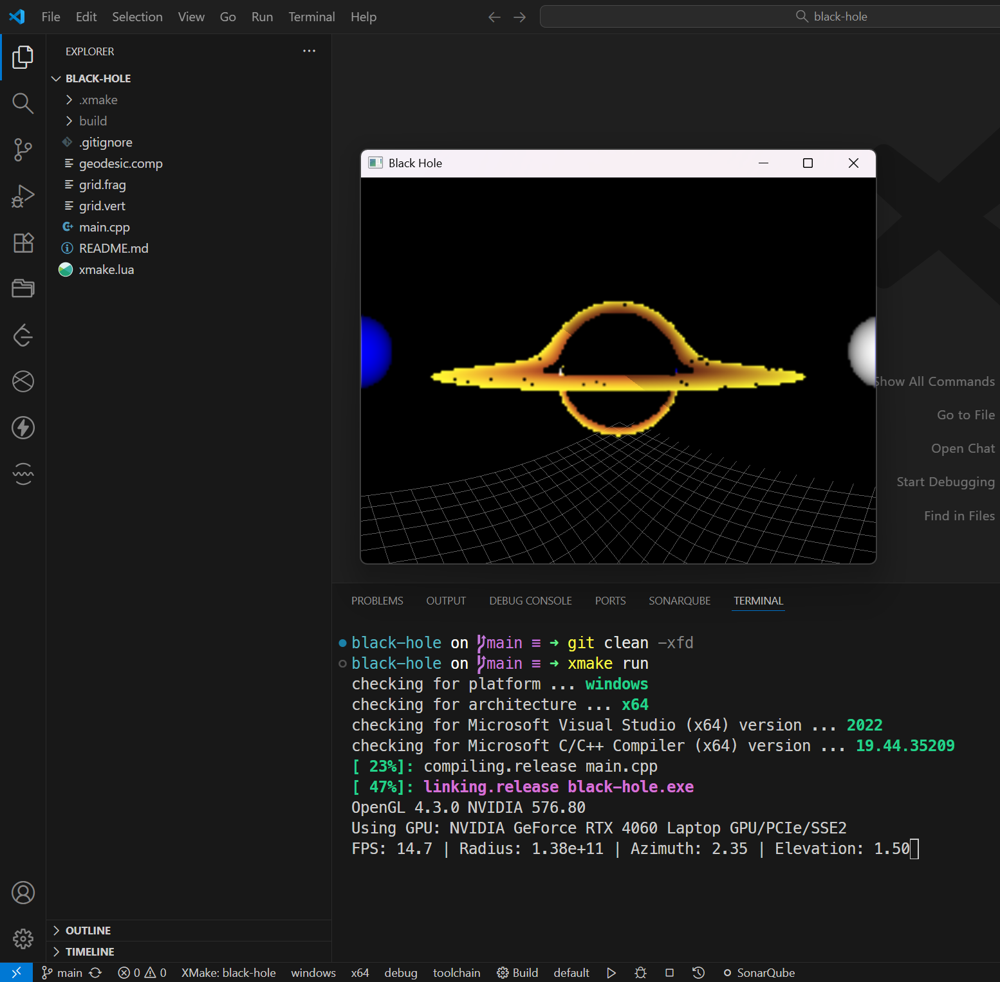

作为一个 C++开发者，我一直觉得 CMake 总能用各种诡异的方式折磨你。

直到我遇见了 XMake，才知道原来构建工具可以这么好用。

# CMake 的跨平台童话

先说个真事儿。

前段时间在华为搞一个 C++项目，团队四个人，开发环境可谓百家争鸣：两位用 Windows+Clion，一位用 Windows+VS/macOS+Xcode，我用 Windows+VSCode，最后还要部署到 Linux 服务器上跑。项目不大，但依赖不少，运行时还要读各种 json schema 文件。

**我一开始用 XMake 起项目，半小时搞定**。`set_rundir(".")`一行代码，不管用哪个 IDE，什么编译器，输出目录叫`build`还是`build-cmake-debug`，运行时的当前目录永远是项目根目录。读文件？相对路径一把梭，完事儿。

但悲剧来了——这个内部平台 C++框架和规范用的是 CMake，迭代了 N 年，根深叶茂，没法改。好，我改，改用 CMake。

**这一改，就是两天的噩梦。**

## 一：运行时文件路径

CMake 没有`set_rundir`这玩意儿。你的 exe 在哪，读文件就从哪开始。VS 可能是在`build/Debug/`，Clion 可能是`cmake-build-debug/`，我用的 VSCode 又是在`build/`，天知道服务器上又会配成什么样。

怎么办？写 Custom Target 吧，build 完之后把文件 copy 到 exe 旁边。听着就麻烦，写着更麻烦：

```cmake
add_custom_command(TARGET app POST_BUILD
    COMMAND ${CMAKE_COMMAND} -E copy_directory
    ${CMAKE_SOURCE_DIR}/assets
    $<TARGET_FILE_DIR:app>/assets
)
```

输出目录稍不注意就要 debug，CI/CD 上还得特殊处理。优雅？不存在的。XMake 那边直接`set_rundir(".")`，一行搞定，这才叫优雅。

## 二：编码

万恶的编码问题，每种编译器都得特殊照顾。MSVC 要加`/utf-8`，GCC/Clang 要加`-finput-charset=utf-8 -fexec-charset=utf-8`，每个编译器语法不一样，你还得检测当前是啥编译器：

```cmake
if(MSVC)
    add_compile_options(/utf-8)
else()
    add_compile_options(-finput-charset=utf-8 -fexec-charset=utf-8)
endif()
```

更绝的是，有些 IDE（对，就是 VS）还会自己偷偷设本地编码，跟编译器选项打架，调得你怀疑人生。

XMake 呢？直接`set_encodings("utf-8")`一行搞定，跨平台跨 IDE 跨编译器。

## 三：包管理

内部开发不太好直接联网下载依赖库，需要用本地审计后的，所以依赖得在本地编译好。CMake 配置起来堪比长征，每个都得折腾一下。CI 上更要命，一个缓存冲突就得重来。一大堆的`find_package`、`target_link_libraries`差一个字符就没完没了的 undefined reference。

XMake 的包管理是什么体验？就像 Rust 的 Cargo：`add_requires("spdlog", "fmt", "nlohmann_json", "catch2", ...)`，自动跨平台跨编译器处理链接、include，优雅。

# 实战对比：黑洞模拟项目

拿这个[黑洞模拟项目](https://github.com/chen-qingyu/black-hole)举栗子。这个项目是一个开源项目，模拟黑洞视觉效果的，依赖 OpenGL、GLFW、GLM、GLEW，我这周末抽空 fork 后用 XMake 魔改了一番玩玩。

来，看一下分别要怎么把项目跑起来：

**CMake 版本**

```bash
# 0. Install CMake&vcpkg
winget install Kitware.CMake
git clone https://github.com/microsoft/vcpkg.git
cd vcpkg
./bootstrap-vcpkg.bat

# 1. Clone the repository
git clone https://github.com/kavan010/black_hole.git
cd ./black_hole

# 2. Install dependencies with Vcpkg
vcpkg install

# 3. Get the vcpkg cmake toolchain file path
vcpkg integrate install # This will output something like : `CMake projects should use: "-DCMAKE_TOOLCHAIN_FILE=/path/to/vcpkg/scripts/buildsystems/vcpkg.cmake"

# 4. Configure project with CMake
mkdir build
cmake -B build -S . -DCMAKE_TOOLCHAIN_FILE=/path/to/vcpkg/scripts/buildsystems/vcpkg.cmake # Use the vcpkg cmake toolchain path from above

# 5. Build the project
cmake --build build

# 6. Run the program
./build/BlackHole3D # The executables will be located in the build folder
```

**XMake 版本：**

```bash
# 0. Install XMake
winget install Xmake-io.Xmake

# 1. Clone the repository
git clone https://github.com/chen-qingyu/black-hole.git
cd black-hole

# 2. Build & Run
xmake run
```

步骤差了三倍，心智负担大大减少。



# 有人说"XMake 只适合玩具项目"

玩具项目？我实际用下来，XMake 对 Windows/Linux/macOS、Clion/VS/VSCode/Xcode、g++/msvc/clang 的支持都很完善，用到的各种依赖写上直接就能跑，生产环境完全没问题。

真要说缺点，主要就是**生态惯性**。CMake 发展了几十年，很多大项目、大公司已经深陷其中，迁移成本太高。XMake 作为后来者，在这方面确实吃亏。

但这不代表 XMake 本身不行。相反，至少我个人认为它的设计哲学更现代、对开发者更友好。

有人说"CMake 才是行业标准"，我只想说我个人的感觉，好用就是好用，不好用就是不好用，踩了那么多坑难道还不能吐槽一下了。

# 总结：工具是为人服务的

CMake 功能繁多但用起来总有一堆"为什么这么麻烦"的感觉。XMake 就像 Python 的 uv 一样正在慢慢赢得开发者的心。虽然目前企业级渗透率不如 CMake，但其开发体验的优势会慢慢吸引更多开发者。就像 Rust 的 Cargo 改变了包管理生态一样，“convention over configuration”的理念或许会推动 C++构建工具向更好用的方向发展。

CMake 我不会放弃，毕竟存量项目太多。但新项目？XMake 真香。

---

ps: XMake 官网的名称叫做 Xmake，但这里为了和 CMake 格式看起来一致，写为 XMake。

声明：这不是广告，纯粹是被 CMake 折磨后的感悟和分享。我现在个人开源项目全都切到 XMake 了，比如[pyincpp](https://github.com/chen-qingyu/pyincpp)（像 Python 的内置类型一样好用的 C++ 库），已经进了 XMake 官方仓库。
