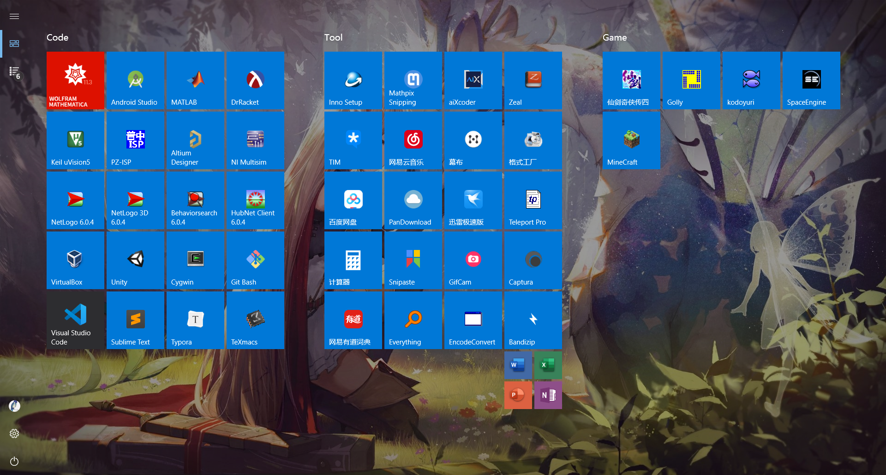

时光荏苒，白驹过隙，接触编程正好两年了。总结一下我用过的一些软件吧。

### 编程之路

#### C

*Microsoft Visual C++ 6.0 -> Visual Studio 2017 -> Code::Blocks 17.12 -> Sublime Text / Visual Studio Code*

一开始当然是受了谭浩强那本“经典”教科书的影响，用的VC6。我不想再吐槽VC6的落后了，毕竟是上个世纪的IDE，不过我不后悔用过VC6，因为没有对比就没有现在的思考嘛，并且我用VC6的时间也不长。如果现在还有谁用VC6写C，那么我不得不怀疑他/她的C水平。

之后用了一段时间的VS2017，不得不说VS2017比较臃肿，而且对于一个刚开始学C的人来说，大部分功能都用不上。

后来我又找到了CodeBlocks，这个IDE还算不错，开源跨平台，代码高亮、自动补全也还行，最主要的是比较轻量（年轻的我尚且还不知道Sublime）。

#### Java

*Eclipse -> Sublime Text / Visual Studio Code*

Eclipse相信是很多初学Java的人的第一个IDE，我也不例外。但启动还是不够快，有时候写个测试类我用记事本+命令行都比它快。

#### Python

*IDLE -> PyCharm -> Sublime Text / Visual Studio Code*

IDLE是Python附带的一个简单的IDE，如果现在还有谁用IDLE写Python，那么我不得不怀疑他/她的Python水平。当然，有一种情况下是很适合用IDLE的，那就是初学Python的时候。IDLE简单的功能和直白的界面能让初学者专注于Python本身。

之后用了一段时间的PC，同VS2017一样，比较臃肿，而且对于一个刚开始学Python的人来说，大部分功能都用不上。

#### HTML + CSS + JavaScript

*DreamWeaver -> Sublime Text / Visual Studio Code*

不知道为什么，我就是不习惯那些大而全的IDE，比如VS2017，比如PC，比如这里的DW。根本原因在于我还只是处于入门的阶段，很多的功能我都用不上，写程序的主要目的是练习而不是工程性质的开发。当务之急是学习更多编程语言本身的知识乃至计算机的基础理论而不是怎么用工具。

如你所见，以上的编程语言（HTML和CSS不算）最后我都是用的Sublime Text / Visual Studio Code，原因很简单：轻巧、快捷。小的、临时的、测试性的程序我用Sublime写，大的、长期的、工程性的程序我用VS Code写，这两个严格来说都只是编辑器，但可以配合各种插件达到和IDE差不多的效果而且高度定制化，美滋滋。

---

### 软件之道

这是我现在电脑上全部的软件：

Code是编程或专业相关的，Tool是工具类，Game是游戏类。我觉得我在说废话。

注意那个红色背景的和黑色背景的，不一般。

下面我逐一介绍一下，软件名加粗的是我喜欢的。

#### Code

- **Wolfram Mathematica**：神器。请看[Mathematica——万物皆理](https://chen-qingyu.github.io/2019/05/08/Mathematica——万物皆理/)
- Android Studio：写Android的。
- MATLAB：写MATLAB的。说到MATLAB，我不得不吐槽一下它那像是大一新生才能写出来的函数命名，不过MATLAB的精髓不在于写程序而在于它那（据说）很强大的工具箱。
- DrRacket：写Scheme的。

这第一排都是IDE。

- Keil uVision5：开发51单片机和STM32的。
- PZ-ISP：普中烧录软件。用Keil写好程序后用这个烧录进51单片机里。
- Altium Designer：画原理图和PCB的。
- NI Multisim：电路仿真的。

这第二排都是和嵌入式开发相关的软件。

- **NetLogo 6.0.4**：请看[NetLogo建模之美](https://chen-qingyu.github.io/2019/08/08/NetLogo建模之美/)
- NetLogo 3D 6.0.4：同上。
- Behaviorsearch 6.0.4：同上。
- HubNet Client 6.0.4：同上。

这第三排都是和计算机模拟复杂系统相关的软件。

- **VirtualBox**：轻巧但强大的虚拟机软件。
- Unity：开发游戏的（虽然我下载了下来就没动过……打算有空了玩玩）。
- Cygwin：Windows下的Linux shell工具。
- Git Bash：同上，不过比较轻量，专注Git。

这第四排都是和“虚拟”这个概念相关的软件。

- **Visual Studio Code**：我常用的编辑器之一。
- **Sublime Text**：我常用的编辑器之一。
- **Typora**：写Markdown的利器（虽然我经常用Sublime写）。主要是它的即时预览很不错，还能在Markdown、PDF、HTML、LaTeX、Word甚至图像之间进行转换。
- TeXmacs：请看[TeXmacs：一个真正“所见即所得”的排版系统](http://www.yinwang.org/blog-cn/2012/09/18/texmacs)。

这第五排都是文本编辑器。

#### Tool

- Inno Setup：制作安装包的。
- Mathpix Snipping：这个就厉害了，能够通过神经网络识别手写的数学公式然后给出LaTeX源码，某些时候非常方便。
- aiXcoder：一款利用AI自动补全代码的插件。
- Zeal：函数手册大全，什么语言都有。

这第一排都是编程相关的小工具。

- TIM：QQ的精简版，比QQ轻聊版还精简。
- 网易云音乐：听歌的。
- 幕布：记笔记、写提纲的（虽然我习惯用Sublime或者Typora）。
- 格式工厂：进行格式转换的小工具。

这第二排都是实用软件。

- 百度网盘：不解释。
- **PanDownload**：百度网盘下载太慢了就用这个。
- **迅雷极速版**：没有广告的早已绝版的迅雷（我保存了安装包哈哈哈）。
- Teleport Pro：爬网站的，有这个还写啥爬虫啊。

这第三排都是和下载相关的软件。

- 计算器：Windows 10 自带的计算机，还可以。
- **Snipaste**：截图神器，比Windows或者TIM自带的截图好用多了。
- GifCam：录gif的。
- Captura：录屏的。

这第四排后三个都是演示会用到的。

- 网易有道词典：翻译的，划词翻译比较方便。
- Everything：找文件的。
- EncodeConvert：批量编码转换的。
- Bandizip：解压/压缩。

这第五排都是比较实用的小工具。

- Word、Excel、PowerPoint、OneNote：Office2016正版。

话说pdf转word怎么做？直接右键->打开方式->Word。

#### Game

- **仙剑奇侠传四**：情怀。
- Golly：玩元胞自动机的。
- **kodoyuri**：百合文字游戏。
- SpaceEngine：太空引擎，偶尔看看还是不错的。
- **MineCraft**：情怀。

都是广义上的游戏。

---

啊，终于介绍完了，不容易啊，写了一天……

这篇文章应该算是我的一个心血了……

这些软件都是很好用的，能大大提升效率，此即为“软件之道”。

---
