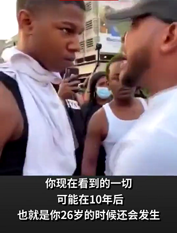
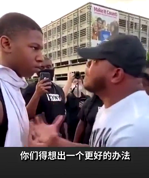
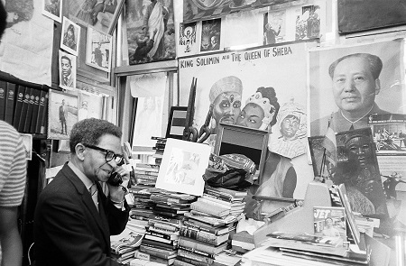
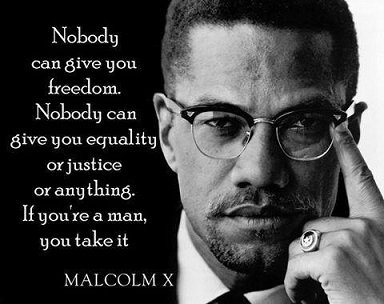

那一天，他 45 岁，面对心底再一次被激起的怨愤，而无处发泄；

那一天，他 31 岁，看着满街打砸抢烧的人群，空有满腔怒火却深感无力；

那一天，他 16 岁，听着面前这位大哥的怒吼亦或是恳求，眼神逐渐坚定了起来；

---

那一天，苍山如海，残阳如血，当他第一次看见这本红色封面的书本之时，他还不知道这代表了什么。

虽然有些词语他还不太懂，比如“communism”这个词语，他脑海里浮现的是在电视和网络上接收到的与之相关的红色暴政，暴力侵略，独裁统治……但他觉得，事情不该是这样，绝不该是这样。

他的脑海里一直有个声音在喃喃低语——“你们得想出一个更好的办法”

---

了解黑豹党的历史。

于中东与某黑豹党幸存党员亲属会晤。

回到美国，在细致而深入的调查之后写了一篇《明州黑人运动考察报告》，报告中明确指出“种族歧视是阶级矛盾的外在表现之一”。

组织群众，联合受压迫的白人，宣传共产主义思想，暂时不碰武器，不组建军队，以免重蹈黑豹党的覆辙。建党，前期闷声发展地下党员，注意低调行事。时机成熟后，建军，成立地下革命根据地，低调训练军队，同时注意统一战线。

联合一切可以联合的进步力量，如被发现，必要时战略转移到亚洲，不和美国军队硬刚。

在非洲、南美洲、东南亚和中东建立革命根据地，使美国依赖的一些低端产业链掌握在党的手中。
……
……
……

---

许多年之后，美共中央党校。

这里是一个暂时用来作仓库的房间，当他处理完一天的政务之后，他常常喜欢来这里坐坐。

这里的东西不久之后都要放到革命历史博物馆里去展览了，虽然是他下令这样做的，但他还是有些不舍——想要在最后再单独陪陪它们。

他眼前放着那杆他第一次使用的武器，一支半自动步枪，虽然现在只剩下因高温而变形的枪管了；

旁边柜子上的盒子里，放着一个缺了一角的徽章，看起来十分破旧，但其上承载着他最好的朋友、同时也是他最怀念的战友的不屈的意志；

在一堆像是老旧书店买回来的二手书籍中，还有一本残破的红色书籍，他轻轻拿起来，拂了拂上面的灰尘，打开了它，又看到了那个改变了他一生，也改变了整个世界的单词——“communism”。

他看着这个单词，想起了许多往事，他还记得，记得第一次看见这本书的那一天，苍山如海，残阳如血。

---
